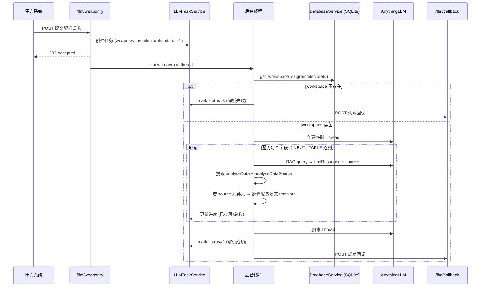

# 武器装备知识谱系解析接口 — 最终实施方案 (v2)

> 基于两轮设计讨论的所有决策，本文档为最终实施蓝图。

---

## 一、功能概述

甲方发送 `architectureId`（知识谱系类别）+ `weaponryTemplateFieldList`（待提取字段列表），我方：
1. 从 SQLite 查找 `architectureId` 对应的 AnythingLLM Workspace
2. 在该 Workspace 中创建临时 Thread，逐字段进行 RAG 检索
3. 从返回的 `textResponse` + `sources` 中提取结果并构建溯源证据链
4. 检索完成后**删除 Thread**（保留 Workspace 及其文档/向量不受影响）
5. 组装回调 Payload，通过 `/llm/callback` 返回甲方

---

## 二、整体架构

### 2.1 异步任务流程

沿用项目既有的 **Blueprint → Worker Thread → Task Service → Progress Hub → Callback** 模式：



### 2.2 任务标识

| 项 | 值 |
|---|---|
| `businessType` | `"weaponry"` |
| `business_key` | `str(architectureId)` |
| 防重逻辑 | 同一 `architectureId` 任务在 status 0/1 时拒绝新请求（409） |
| 存储表 | `llm_tasks` (`.runtime/llm_tasks.sqlite3`) |

---

## 三、核心设计

### 3.1 RAG 查询策略：逐字段独立查询

对 `weaponryTemplateFieldList` 中的每个字段，向对应 Workspace 的临时 Thread 发起独立的 RAG 查询：

```
Prompt 示例（INPUT 字段）:
"请从文档中提取以下信息：{fieldName}。
 {fieldDescription}
 只需回答该字段的值，如果文档中找不到相关信息请回答'未找到'。"
```

- 每个字段独立获取 `sources`，溯源证据精确对应
- 单字段失败时该字段返回空值（`analyseData=""`，`analyseDataSource=[]`），**不影响其他字段**
- 进度计算：`progress = 已处理字段数 / 总字段数`

### 3.2 TABLE 类型字段：逐列查询 + 按来源分组

TABLE 字段的 `tableFieldList` 在请求时只包含列定义模板（1行），需要产出多行结果。

**处理策略**：

1. **逐列查询**：对 TABLE 模板中的每个列字段（如"身高"、"体重"）分别发起 RAG 查询
2. **按来源分组**：同一来源文献的数据归入同一行

```
示例：TABLE 有两列 [身高, 体重]

第1次查询 → "身高":
  LLM 回答: "来源A: 180cm, 来源B: 170cm"
  sources: [{text:"身高180...", title:"文献A"}, {text:"身高170...", title:"文献B"}]

第2次查询 → "体重":
  LLM 回答: "来源A: 65kg, 来源B: 55kg"
  sources: [{text:"体重65...", title:"文献A"}, {text:"体重55...", title:"文献B"}]

组装结果 → tableFieldList:
  Row 0 (来源A): [{fieldName:"身高", analyseData:"180cm", ...}, {fieldName:"体重", analyseData:"65kg", ...}]
  Row 1 (来源B): [{fieldName:"身高", analyseData:"170cm", ...}, {fieldName:"体重", analyseData:"55kg", ...}]
```

> [!NOTE]
> TABLE 的 Prompt 需特别指示 LLM 区分不同来源的数值，并在回答中标注来源。这是 Prompt 工程的关键点。

### 3.3 Thread 生命周期管理

1. 在目标 Workspace 中创建临时 Thread（命名 `weaponry-{architectureId}-{timestamp}`）
2. 在该 Thread 中完成所有字段的 RAG 查询
3. 查询全部完成后，调用 AnythingLLM API **删除该 Thread**
4. Workspace 以及其中的文档和向量数据不受影响

> [!IMPORTANT]
> `AnythingLLMClient` 当前没有删除 Thread 的方法，需要新增 `delete_thread(workspace_slug, thread_slug)` 方法。

### 3.4 翻译策略

利用现有的 `LLMTranslationService.translate_text_only()` 方法：
- 对每个 `analyseDataSource` 中的 `content` 字段检测语言
- 若内容为英文（或非中文）：`content` 保持原文，`translate` 填充中文翻译
- 若内容为中文：`translate` 留空 `""`

### 3.5 `analyseDataSource` 字段映射

| 回调字段 | 数据来源 | 说明 |
|---------|---------|------|
| `content` | AnythingLLM `sources[].text` | chunk 原文内容 |
| `source` | AnythingLLM `sources[].title` | 来源文件名 |
| `time` | `""` | 留空，后续与甲方对接 |
| `translate` | 翻译服务 | 英文内容的中文翻译，中文内容为空 |

---

## 四、修改清单

### 4.1 修改已有文件

---

#### [MODIFY] [anythingllm_client.py](file:///c:/Files/Codes/DocSense/anythingllm_client.py)

**改动 1** — 修改 `send_prompt_to_thread()` 返回值类型：
- 从 `Optional[str]` 改为 `Optional[Dict[str, Any]]`
- 返回 `{"textResponse": "...", "sources": [...]}` 结构
- 在 SSE 流式响应的 `close` 事件中提取 `sources` 数组

**改动 2** — 新增 `delete_thread()` 方法：
```python
def delete_thread(self, workspace_slug: str, thread_slug: str, ...) -> bool:
    """删除 workspace 下的指定 thread"""
    # DELETE /workspace/{slug}/thread/{thread_slug}
```

---

#### [MODIFY] [pipeline.py](file:///c:/Files/Codes/DocSense/pipeline.py)

适配 `send_prompt_to_thread()` 新返回类型：
- `run_anythingllm_rag()` 返回值从 `Optional[str]` 改为 `Optional[str]`（提取 dict 中的 `textResponse`）

---

#### [MODIFY] [chat_service.py](file:///c:/Files/Codes/DocSense/app/services/chat_service.py)

> 归档说明（2026-03-21）：`chat_service.py` 属于历史前端对话链路文件，当前仓库精简后已移除。本段仅保留当时实施记录。

适配 `send_prompt_to_thread()` 新返回类型：
- `send_chat_message()` 从返回的 dict 中提取 `textResponse`

---

#### [MODIFY] [llm.py](file:///c:/Files/Codes/DocSense/app/blueprints/llm.py)

**改动 1** — 新增 `/llm/weaponry` 路由：
- 校验 `businessType == "weaponry"`
- 校验 `params.architectureId` 和 `params.weaponryTemplateFieldList`
- 防重检查 → 创建任务 → 启动后台线程 → 返回 202

**改动 2** — 扩展 `/llm/check-task`：
- `businessType` 校验：`{"file", "report"}` → `{"file", "report", "weaponry"}`
- weaponry 的 `business_key` 从 `params.architectureId` 提取

**改动 3** — 扩展 `/llm/progress` WebSocket：
- `_extract_progress_key()` 和 `_parse_progress_command()` 支持 `"weaponry"`
- weaponry 的 key 从 `params.architectureId` 提取

---

#### [MODIFY] [llm_task_service.py](file:///c:/Files/Codes/DocSense/app/services/llm_task_service.py)

- 新增 `create_weaponry_task(architecture_id, request_payload)` 便捷方法
- `should_replay_callback()` 中的 `completed_statuses` 增加 `"weaponry": {"2", "3"}`

---

### 4.2 新增文件

---

#### [NEW] [llm_weaponry_service.py](file:///c:/Files/Codes/DocSense/app/services/llm_weaponry_service.py)

主处理逻辑 `run_weaponry_task()`，职责：
1. 从 SQLite 查 workspace_slug（不存在 → 失败）
2. 创建临时 Thread
3. 展开字段列表（INPUT 直接查，TABLE 逐列查）
4. 逐字段 RAG 查询，提取 `analyseData` + `analyseDataSource`
5. 检测语言，英文 source 调用翻译服务
6. TABLE 字段按来源分组组装多行
7. 逐步更新进度
8. 删除 Thread
9. 组装回调 payload → POST callback

---

#### [NEW] [llm_weaponry_prompts.py](file:///c:/Files/Codes/DocSense/app/services/llm_weaponry_prompts.py)

Prompt 构建工具：
- `build_input_field_prompt(field_name, field_description)` — INPUT 字段的 RAG Prompt
- `build_table_column_prompt(field_name, field_description, table_context)` — TABLE 列字段的 RAG Prompt

---

## 五、配套接口适配汇总

| 接口 | 当前状态 | 改动 |
|------|---------|------|
| `/llm/weaponry` POST | 不存在 | **新增**路由和请求校验 |
| `/llm/check-task` POST | 仅支持 file/report | 增加 `"weaponry"` 支持，key 为 `architectureId` |
| `/llm/progress` WebSocket | 仅支持 file/report | 增加 `"weaponry"` 支持，key 为 `architectureId` |
| `/llm/callback` POST | 通用 | 无需改动，weaponry 构建好 payload 直接调用 |

---

## 六、错误处理规则

| 场景 | 处理 |
|------|------|
| `architectureId` 对应的 Workspace 不存在 | 整个任务标记 status=3（解析失败），回调失败 payload |
| 单个字段 RAG 提取失败 | 该字段 `analyseData=""`，`analyseDataSource=[]`，继续处理后续字段 |
| AnythingLLM API 调用异常 | 捕获异常，任务标记 status=3 |
| 翻译服务失败 | `translate` 留空 `""`，不影响主流程 |
| Thread 删除失败 | 仅记录日志，不影响任务结果 |

---

## 七、验证计划

### 自动化测试
- `tests/test_llm_weaponry_service.py`：Prompt 构建、结果映射、TABLE 分组组装的单元测试
- 扩展 `tests/test_llm_routes.py`：weaponry 路由的校验逻辑
- 命令：`python -m pytest tests/ -v`

### 集成测试
- 使用 `scripts/mock_callback_server.py` 接收回调
- 向 `/llm/weaponry` 发送接口文档中的示例请求
- 验证 check-task 查询、progress WebSocket 推送是否正常
- 验证回调 payload 格式与接口文档一致

### 手动验证
- 确保 AnythingLLM 中存在至少一个 `architectureId` 对应的 Workspace 且包含文档
- 发送真实 weaponry 请求，验证 RAG 检索结果的准确性和溯源证据
