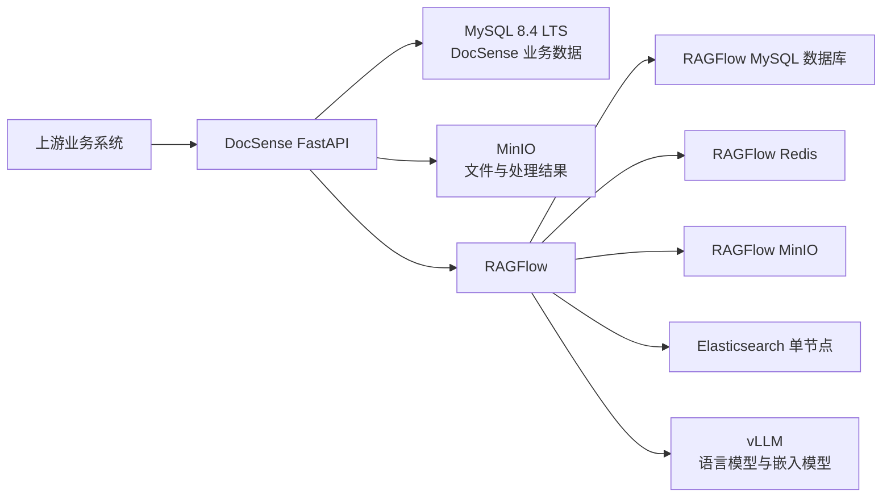

[TOC]

# 技术选型建议

## 1. 文档目的

本文档用于从企业级部署和长期演进的视角，审视 DocSense 当前以 AnythingLLM 为核心的 LLM RAG 后端架构，并给出完整的目标技术选型与迁移建议。

文件处理、安全、任务调度、实时进度、监控、备份和单服务器部署治理等内容有待讨论。

本文档中的结论全部来自此前围绕 DocSense 进行的技术讨论，重点回答以下问题：

- 当前技术选型为什么无法充分满足要求。
- 各层应当替换为什么技术，以及替换后的主要收益。
- 哪些组件是目标架构所必需的，哪些组件当前没有必要引入。
- 在只有一台服务器、研发和运维人力有限的条件下，如何获得尽可能高的并发能力、稳定性和可维护性。
- 从当前项目迁移至目标架构时，需要修改哪些模块和业务流程。

## 2. 项目背景与核心要求

### 2.1 当前定位

DocSense 是一个面向文档分析、知识检索和 AI 对话的业务后端。当前项目以 AnythingLLM 作为 RAG 框架，并通过 Ollama 在本地部署语言模型和嵌入模型。

项目当前承担的主要业务能力包括：

- 批量文件分析。
- 文档分类与分类节点变更。
- 基于文档生成报告。
- 从文档中提取知识谱系和事实数据。
- 基于指定文档进行 AI 对话。
- 保存任务状态、文档信息和对话历史。
- 向上游业务系统发送处理结果回调。
- 向调用方提供任务查询和实时进度。
- 对文档进行解析、OCR、翻译和双语结果生成。

### 2.2 未来目标

目标系统需要满足以下要求：

1. **支持大批量文件上传和处理**
   - 能够接收大量文档任务，同时限制任务进入速度，避免任务瞬间压垮服务或服务器。
   - 能够对积压任务进行排队、查询、重试和恢复。
2. **支持高并发**
   - 文件下载、文档解析、向量化、AI 对话、报告生成、知识抽取和回调发送可以并行运行。
   - 不同类型任务能够分别设置并发额度。
   - AI 对话等实时请求不应被大批量文件处理完全阻塞。
3. **具备高稳定性**
   - API 进程重启或任务执行进程异常后，未完成任务不能直接丢失。
   - 外部服务短暂不可用时，任务能够自动重试。
   - 任务状态、处理结果和回调记录能够可靠保存。
   - 系统能够识别并恢复长时间无心跳的异常任务。
4. **适配复杂文档**
   - 文档类型包括 PDF、DOCX、MHTML、图片等，包含图片、表格和复杂排版。
   - 检索需要同时兼顾关键词、事实数据和语义相似度。
5. **满足本地化部署要求**
   - 语言模型和嵌入模型均在本地部署，以在本地并行运行文件解析和 AI 对话等功能。
   - 文档、向量、任务信息和对话历史均保存在本地基础设施中。
6. **控制研发和运维成本**
   - 当前人力不足，不适合自建一套高度模块化的 RAG 管线。
   - 当前只有一台独立服务器，不具备部署多机集群的条件。
   - 技术选型应优先使用经过大量实践检验的主流方案。
7. **具备企业级安全和运维能力**
   - 对大文件下载、恶意文件、任意外部 URL、内部服务暴露等风险进行控制。
   - 提供监控、告警、日志、备份和恢复能力。
   - 对任务调用、回调和调试接口进行安全控制。

## 3. 总体选型结论

目标架构的核心技术选型如下：

| 架构层 | 当前选型 | 目标选型 | 结论 |
|---|---|---|---|
| 大模型部署推理 | Ollama | vLLM | 生产环境替换 |
| 模型统一网关 | 无 | 暂不引入 LiteLLM | 当前不需要 |
| RAG 框架 | AnythingLLM | RAGFlow | 整体替换 |
| 文档解析 | AnythingLLM Document Processor、MinerU、OCR 和本地解析代码混合 | 以 RAGFlow 文档解析能力为主 | 验证后逐步简化本地解析 |
| 向量和检索存储 | AnythingLLM 内置 LanceDB | Elasticsearch 单节点 | 替换 |
| Web 框架 | Flask | FastAPI + Uvicorn | 替换 |
| HTTP 客户端 | requests 为主 | HTTPX 为主 | 随异步改造替换 |
| Python 版本 | Python 3.12 | 最新 Python 3.12.x | 保持 3.12 |
| 关系型数据库 | 三个 SQLite 文件 | MySQL 8.4 LTS | 替换 |
| 对象存储 | 本地临时目录、AnythingLLM 内部文件存储 | MinIO | 引入并统一管理大文件 |

目标架构中不建议在当前阶段引入：Kubernetes、服务网格、LiteLLM、Qdrant 或 Milvus 的 RAGFlow 自定义适配、在同一台服务器上部署伪多节点 Elasticsearch 集群。

## 4. 目标总体架构

虽然所有组件初期运行在同一台服务器上，但仍需要进行清晰的进程、容器、数据库和账号隔离。单机部署不能消除整机故障和磁盘损坏风险。

## 5. 大模型部署推理选型

### 5.1 当前选型：Ollama

Ollama 的主要优势是：

- 本地部署简单，模型下载、加载和启动方便，能够快速让 AnythingLLM 或其他应用连接本地模型。
- 适合开发、验证、个人使用和低到中等并发场景。

Ollama 适合当前项目早期验证，但不适合作为目标企业级架构中的唯一生产推理服务，存在以下不足：

- 面向易用性和本地运行，生产级高并发吞吐能力不是其主要优势。
- 在大量文档解析、知识抽取、翻译、报告生成和 AI 对话同时运行时，难以提供足够精细的并发和资源控制。
- 当语言模型和嵌入模型同时承载高并发调用时，容易成为整个系统的性能瓶颈。

### 5.2 目标选型：vLLM

vLLM 是本项目目标生产环境中更合适的推理引擎。选择 vLLM 的主要原因：

- **是目前主流、经过大量实践检验的生产级大模型推理方案之一。**
- **原生提供 OpenAI 兼容 API，AnythingLLM、RAGFlow 和 DocSense 均可以直接连接。**
- 能够更有效地利用 GPU 资源，更适合高并发请求和高吞吐场景。
- 可以分别部署语言模型服务和嵌入模型服务，并针对不同负载独立设置并发和资源限制。

在本项目中，本地部署同一款语言模型和嵌入模型后，文档解析、知识抽取、报告生成和 AI 对话可以直接连接对应的 vLLM 服务。

此前讨论过的其他推理方案包括：

- **SGLang**：同样值得进行性能测试，是高性能推理方案之一，但应用不如vLLM普遍。
- **TensorRT-LLM / Triton**：适合 NVIDIA 环境下进行更深度的性能优化，但部署和维护复杂度更高。

在有限人力和优先采用主流成熟方案的条件下，vLLM 是当前更合适的默认选择。

### 5.3 为什么当前不需要 LiteLLM

LiteLLM 是一种模型网关和统一代理层。vLLM 已经支持 OpenAI 兼容 API，因此在以下条件下不需要 LiteLLM：

- 仅使用本地部署的语言模型和嵌入模型。
- 模型提供方数量较少，暂时不需要跨多个模型服务进行动态路由
- RAGFlow 和 DocSense 可以直接连接 vLLM。

只有未来出现以下需求时，才有必要考虑 LiteLLM：

- 同时接入多个模型提供方，集中管理模型路由，或在多个模型之间进行故障转移。

## 6. RAG 框架选型

### 6.1 当前选型：AnythingLLM

AnythingLLM 为项目早期提供了以下能力：

- 工作区管理、文档上传和处理、文档嵌入、基于工作区和线程的对话、内置向量存储和本地文件存储。
- AnythingLLM 将 SQLite、本地文件、LanceDB 和 Document Processor 等能力隐藏在单一应用和存储目录中，因此使用者不一定能直接感知其内部使用的关系数据、对象文件和向量数据。

**但是，AnythingLLM 的 Document Processor 在并发和批量上传场景下表现脆弱。**

当前项目为了避免并发上传压垮 Document Processor，使用了单进程全局 `Semaphore(1)`，使文件分析和报告任务一次只能执行一个。这一处理能够暂时降低上传失败概率，但也带来了明显限制。

对 AnythingLLM 更准确的定位是：

- 适合交互式使用和小批量文档导入，不具备充分的持久化任务队列、背压、故障恢复和批处理调度能力。

此外，当前业务代码深度依赖 AnythingLLM 的 Workspace、Thread、文档路径和内部状态，增加了业务层与 RAG 实现之间的耦合。

### 6.2 目标选型：RAGFlow

RAGFlow 更符合本项目处理复杂文档和企业级 RAG 的需求。

选择 RAGFlow 的主要原因：

- 更专注于文档解析和 RAG，对文档处理、切分、检索和知识库管理提供更完整的封装。
- **支持使用 MinerU 和 Docling 作为解析器**，可用于提取PDF、DOCX等格式以及复杂版面、表格和图片中的内容，减少 DocSense 自行维护文档解析链路的工作量。

RAGFlow 不能替代 DocSense 的业务后端。它负责文档和 RAG 能力，而 DocSense 仍然需要负责：

- 面向上游业务系统的接口协议、业务任务状态和进度、回调和回调补发、文档分类业务、报告结果格式、知识谱系字段与来源映射、本地业务 ID 与 RAGFlow ID 的映射。

### 6.3 其他选项

**自建模块化 RAG 管线**：能够获得最大灵活性，但需要自行维护：

- 多格式文档解析、OCR、表格和图片处理、文档切分、嵌入、向量存储、全文检索、文档状态管理、解析失败恢复、RAG API 和会话管理等功能。

由于当前人力不足，自建方案的开发和长期维护成本过高，因此不作为首选。

**Dify**：本身是可用的企业级应用编排平台，但其 Workflow、Chatflow、模型管理、会话管理和知识库 API 等能力，与 DocSense 已经承担的业务编排存在较多重叠。

采用 Dify 可能导致：

- DocSense 与 Dify 同时承担流程编排职责。
- 需要决定任务、会话和业务状态究竟由哪一层负责。
- 增加业务流程与平台流程之间的映射成本。

RAGFlow 更集中于文档和 RAG，更适合作为 DocSense 下层能力平台。

## 7. RAGFlow 替换范围

将 AnythingLLM 替换为 RAGFlow，不仅是替换 `anythingllm_client.py`。

AnythingLLM 与当前业务代码之间存在较深耦合，因此实现迁移不是简单替换 API 客户端，实际工作量主要取决于复杂文档解析验证、现有业务接口兼容，以及本地文件处理和翻译链路的保留范围。

具体 Dataset 组织和数据映射方式应在实施设计阶段确定。

### 7.1 主要改动范围

需要重点调整：

- 将 AnythingLLM 客户端及其 RAG 流程封装替换为 RAGFlow 接口。
- 调整文档上传、处理状态、检索和对话等业务流程。
- 将 Workspace、Thread 和 AnythingLLM 文档 ID 等映射改为 RAGFlow 对应资源的映射。
- 更新相关配置、部署和测试。

业务服务不应继续直接依赖某个 RAG 平台的 Workspace、Thread、Dataset、Session 或内部路径。

建议通过统一的 RAG 后端接口封装知识库、文档、检索和对话能力，使 DocSense 业务逻辑与 RAGFlow 的具体资源模型保持隔离。

## 8. 文档解析与翻译代码处理

### 8.1 可以由 RAGFlow 替代的部分

RAGFlow 经过验证后，DocSense 中以下解析类能力可以逐步简化或删除：

- **MinerU 文档解析编排。**
- **OCR 预处理。**
- **多格式文档解析处理器。**
- 为 AnythingLLM 上传准备文档的逻辑。

但这些代码不能在切换 RAGFlow 后立即全部删除。必须使用项目中的真实复杂文档进行验证，确认 RAGFlow 对 PDF、DOCX、MHTML、图片、表格和复杂排版的处理结果满足要求。

MHTML 支持尤其需要验证。在确认 RAGFlow 能够稳定处理前，本地 MHTML 归一化能力应继续保留。

### 8.2 不能由 RAGFlow 替代的部分

当前 `translator` 中不仅包含文档解析，还包含业务所需的翻译能力。

RAGFlow 的跨语言检索能力不等同于完整文档翻译，因此以下能力仍然需要保留：

* 文档全文翻译、双语 HTML 生成、回调结果中的翻译字段、来源文本翻译、项目特定的翻译结果组织方式。

更合理的改造方向是：

- 让翻译模块消费 RAGFlow 已解析的文档内容，减少翻译模块再次解析原始文档。
- 将解析职责与翻译职责分离。

## 9. 向量数据库与检索存储选型

### 9.1 当前选型：LanceDB

AnythingLLM 在当前项目中隐藏了其内部向量存储和文件存储实现，LanceDB 作为其内置向量存储使用。

这一方式的优点是部署简单，但存在以下问题：

- 面对多进程高并发写入、跨实例扩展和统一资源治理时，不如独立服务化的搜索引擎。
- 对大量事实数据、关键词和复杂过滤的检索能力，不如完整的搜索引擎方案。
- 与 AnythingLLM 的生命周期深度绑定。

### 9.2 目标选型：Elasticsearch 单节点

RAGFlow 当前支持的文档引擎包括：Elasticsearch、OpenSearch、Infinity、OceanBase、SeekDB。

RAGFlow 的文档引擎并不只是保存向量，还承担：文档切片存储、向量检索、BM25 和全文检索、元数据过滤、混合检索、排序、分页、聚合和高亮等查询能力。

Elasticsearch 是当前项目更合适的检索存储选型。选择 Elasticsearch 的原因：

- RAGFlow 深度支持。
- 同时支持全文检索和向量检索，适合事实数据、关键词和语义相似度并存的文档。
- 相比只关注向量相似度的数据库，更符合复杂文档和事实检索的需求。

**Qdrant 和 Milvus** 是成熟的向量数据库，但不是 RAGFlow 当前可直接插拔使用的文档引擎，需要自行实现 RAGFlow 的 `DocStoreConnection` 适配层，并长期维护 RAGFlow 分支。

在当前人力不足的情况下，这一工作量不可接受，因此选择 RAGFlow 原生支持更成熟的 Elasticsearch。

### 9.3 为什么采用单节点

生产级 Elasticsearch 集群通常需要多台独立机器和独立 SSD，以实现副本、高可用和故障隔离。

当前只有一台服务器，因此不应在同一台服务器上部署多个 Elasticsearch 节点来模拟集群。因此当前采用：

- Elasticsearch 单节点。
- 明确设置 CPU、内存和磁盘资源限制。
- 监控磁盘空间和索引状态。

## 10. Web 框架选型

### 10.1 当前选型：Flask

Flask 并非完全不支持并发，但当前项目对 Flask 的使用方式不适合目标场景。

当前主要问题包括：

- 使用 Flask 内置服务器提供服务，每个后台任务直接创建 daemon 线程。
- 后台线程数量没有上限。
- 大量外部请求使用同步 `requests`。
- 实时进度存储在单进程内存中。
- WebSocket、SSE、长任务和普通 API 请求混合在同一进程模型中。
- 多进程部署后，进程间状态无法共享。

因此问题不仅是 Flask 本身，而是当前整体执行和并发模型。

### 10.2 目标选型：FastAPI + Uvicorn + HTTPX

选择 FastAPI 的原因：

- 基于 ASGI，更适合高并发 I/O 请求。
- 更适合 WebSocket 和 SSE。
- 可以使用异步 HTTP 客户端处理 RAGFlow、vLLM 和其他外部服务调用。
- 使用 Pydantic 进行请求和响应校验。
- 自动生成 OpenAPI 文档。
- 更适合建立清晰的依赖注入和应用生命周期管理。

配套使用：

- Uvicorn 作为 ASGI 服务器，HTTPX 作为异步 HTTP 客户端，以及共享的异步 HTTP 连接池。

### 10.3 FastAPI 不能独立解决的问题

将 Flask 替换为 FastAPI，不会自动解决以下问题：

- 长任务持久化、任务执行进程异常恢复、任务重试、跨进程进度通知、GPU 和解析任务并发控制、文件下载和解析背压。

FastAPI 的 BackgroundTasks 不适合承担需要可靠执行的长任务。

因此，长任务执行、跨进程进度通知和并发控制仍需要另行设计。本阶段只确定使用 FastAPI、Uvicorn 和 HTTPX 替换当前 Web 与 HTTP 调用方式，不在本文档中确定具体的任务调度和实时通知组件。

### 10.4 Python 版本

目标 Python 版本采用最新 Python 3.12.x。

选择原因：

- RAGFlow 已迁移至 Python 3.12。
- 项目包含 MinerU、Argos Translate 和其他编译或模型相关依赖，继续使用 3.12 风险更低。
- 在迁移期间不应同时承担 Python 大版本升级带来的兼容性风险。

Python 3.13 可以在未来单独验证，但当前不建议使用 Python 3.13 自由线程版本作为生产基础。

## 11. 关系型数据库选型

### 11.1 当前选型：SQLite

当前项目分别使用 SQLite 保存：

- LLM 任务状态、知识库映射、对话会话信息。

SQLite 适合单进程、低并发和轻量部署，但不适合目标企业级场景。

当前主要问题包括：

- 写操作容易被串行化。
- Python 进程锁只对当前进程有效。
- 多进程场景下无法依赖进程内锁保证一致性。
- 不支持任务并发领取所需的完整行级锁使用方式。
- 三个独立 SQLite 文件之间无法进行统一事务。
- 部分结构化数据以 JSON 文本形式保存。
- 难以支持可靠任务恢复和高并发会话写入。

### 11.2 PostgreSQL 与 MySQL 对比

PostgreSQL 的主要优势：

- JSONB 和 GIN 索引能力更强，支持更丰富的部分索引和表达式索引。
- 原生 UUID 支持良好。
- 异步 Python 驱动生态成熟。

MySQL 的主要优势：

- RAGFlow 默认使用 MySQL，对 MySQL 的使用路径更成熟。
- 当前单服务器只维护一种关系数据库，运维更简单。
- 对 DocSense 当前任务、文档、映射和会话数据已经足够。

RAGFlow 当前关系数据库实现中包括：

- MySQL、PostgreSQL、OceanBase。

虽然 RAGFlow 代码已经支持 PostgreSQL，但 MySQL 仍然是默认和更成熟的路径，RAGFlow 本身不会自动充分利用 PostgreSQL JSONB 的优势。

### 11.3 目标选型：MySQL 8.4 LTS

选择 MySQL 8.4 LTS 可以与 RAGFlow 默认技术栈保持一致，并降低单服务器和有限人力下的运维复杂度。

推荐部署方式：

- 在同一个 MySQL 实例中创建独立数据库，为两个数据库创建独立账号和权限。
- `ragflow` 数据库只供 RAGFlow 使用、`docsense` 数据库只供 DocSense 使用。
- DocSense 不直接写入 RAGFlow 内部表。

DocSense 建议使用：

- SQLAlchemy 2.x、`asyncmy`、Alembic、InnoDB、`utf8mb4`、显式事务、行级锁、必要索引。

重要业务字段应保存为独立列，完整请求体和完整结果可以保存为 JSON。

### 11.4 建议的数据表

DocSense 目标业务数据库至少包括：

- `tasks`：任务主表。
- `task_attempts`：任务执行尝试。
- `task_steps`：任务各处理阶段。
- `callback_deliveries`：回调发送记录。
- `documents`：业务文档信息和 RAGFlow 文档映射。
- `architecture_mappings`：分类节点和 Dataset 映射。
- `chat_sessions`：对话会话。
- `chat_turns`：对话轮次。

## 12. 对象存储选型

### 12.1 当前文件处理方式的问题

当前项目将下载文件保存到本地临时目录，AnythingLLM 也将内部文件保存在自身存储目录中。

这一方式存在以下问题：

- 文件生命周期分散，临时文件缺少统一清理机制。
- 文件名可能冲突或覆盖，难以统一保存原始文件、处理中间文件和结果文件。
- 应用扩展到多个进程或实例后，本地路径不一定可共享。
- 难以实施对象级生命周期和备份策略。

### 12.2 目标选型：MinIO

RAGFlow 默认需要对象存储，MinIO 是其默认方案之一。

DocSense 也应使用 MinIO 管理：

- 待处理原始文件、文件下载暂存、处理中间文件、最终结果文件、需要保存的翻译或报告文件。

DocSense 与 RAGFlow 可以运行在同一套 MinIO 服务上，但应使用不同 Bucket 和独立权限。DocSense 不应直接操作 RAGFlow 内部 Bucket。

推荐方式是：

- 上游系统通过预签名 URL 直接上传文件至 DocSense 对应 Bucket。
- DocSense 接收对象 Key 和文件哈希，通过 RAGFlow API 提交文档。

这样可以避免大文件流量全部经过 DocSense API 进程。

## 13. RAGFlow 所需基础设施

RAGFlow 不是像 AnythingLLM 那样将大部分存储能力隐藏在单一存储目录中。它将不同职责拆分给独立基础设施。RAGFlow 目标部署需要：

| 组件 | 用途 |
|---|---|
| MySQL | RAGFlow 关系数据 |
| MinIO | RAGFlow 对象文件 |
| Redis 或兼容服务 | RAGFlow 自身的任务队列和执行协调 |
| Elasticsearch | 文档切片、全文检索、向量检索和混合检索 |

这些组件对 RAGFlow 来说不是单纯的可选增强，而是其架构的一部分。

DocSense 可以与 RAGFlow 共享同一台服务器上的基础设施服务，但应当：

- 使用独立数据库和账号、使用独立 Bucket。
- 不直接修改 RAGFlow 内部数据。

此处的 Redis 或兼容服务是 RAGFlow 自身部署架构的一部分，不代表本文档已经为 DocSense 的任务调度、实时进度或缓存能力选定 Redis。

## 14. 迁移后的职责边界

| 组件 | 主要职责 |
|---|---|
| FastAPI | 接口协议、认证、校验、查询、实时对话 |
| MySQL | DocSense 任务、文档、对话、映射和回调记录 |
| MinIO | 原始文件、暂存文件和结果文件 |
| RAGFlow | 文档解析、知识库、切分、检索和 RAG |
| Elasticsearch | RAGFlow 文档、全文、向量和混合检索 |
| vLLM | 本地语言模型和嵌入模型推理 |

长任务调度、实时进度、缓存、统一 API 入口、监控和告警等能力的具体组件仍待评估。
