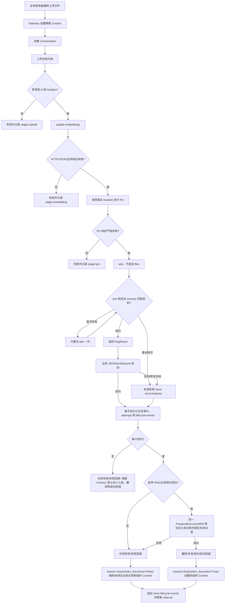

# AnythingLLM 低耦合与文件解析改造总计划

**日期：** 2026-07-03

**适用仓库：** DocSense

**计划性质：** 最终实施基线；后续新对话应以本文为唯一主计划

**当前基线：** `main`，编写计划时 HEAD 为 `8151863`
**执行限制：** 不启动 `run.py`；不执行依赖 AnythingLLM、模型、MinerU、翻译、回调服务器等后台服务的集成测试；允许在明确授权后执行完全 Mock/本地 SQLite 的离线单元测试。

---

## 1. 文档目的与最终结论

本文收敛此前对日志故障、AnythingLLM 文档生命周期、Pin、sources、路径核验、业务耦合和 Client 内聚性的全部讨论，提供一套可以由新对话直接执行的改造方案。

本计划最终确定以下技术决策：

1. `/llm/analysis` 的临时单文档 RAG 使用**纯方案 B**：

   ```text
   创建隔离会话
   → 上传全局文档
   → update-embeddings 加入临时 Workspace
   → 强制 Pin 并校验响应
   → 不查询 Workspace 文档列表
   → 不发送 files/docId
   → 显式使用 query 模式调用模型
   → 以随机 docsense_ref + 单文档隔离上下文双重校验 sources 归属
   → 校验业务 JSON
   → 先持久化交互审计
   → 审计成功后才允许永久知识库写入、翻译和成功回调
   → 再清理临时 Workspace
   ```

2. 删除临时 RAG 链路中以下脆弱逻辑：

   - 固定 `time.sleep(1)`；
   - `fetch_workspace_document()` 路径反查；
   - `docpath` 完全相等的一次性核验；
   - 上传 ID与 Workspace `docId` 的回退混用；
   - Thread 请求中的 `files`；
   - 猜测 `custom-documents/{doc_id}.json`；
   - 对本地 AnythingLLM storage 的文件系统轮询。

3. 不继续向现有 `AnythingLLMClient` 堆叠跨 API 工作流。目标结构采用：

   ```text
   业务 Port
   ← AnythingLLM Gateway 实现
   ← 原子 API Client
   ← HTTP Transport
   ```

4. 业务层不得知道 AnythingLLM 的以下协议细节：

   - `/workspace/...`、`/document/...` API路径；
   - `docpath`、`location`、`docId` 字段兼容；
   - Pin、update-embeddings 的 HTTP 响应结构；
   - `client.session`、Authorization Header、SSE 格式；
   - AnythingLLM 原始 sources 字段差异。

5. `architectureId` 缺失不能再静默等价为 `1`。必须区分：

   - 模型明确返回 `architectureId=1`：业务兜底；
   - 模型没有返回分类字段：协议失败；
   - 模型返回候选范围外 ID：协议失败。

6. Client、Transport 和 Gateway **不是全局单例**。全局只保存不可变配置、工厂和线程安全的并发限制器；每个后台任务/HTTP 流式请求创建独立的 Transport、`requests.Session`、原子 Client 和 Gateway。

7. 交互审计是业务成功的前置条件，必须满足“没有成功审计，就没有业务成功”。审计失败时任务进入失败语义，不得永久入库、翻译或发送成功回调；临时 Context 必须保留以供恢复。

8. 文件解析的所有 Document RAG 模型调用必须显式使用 `query` 模式。原子 Thread Client
   只接受 `chat/query` 白名单；新 Gateway 不允许依赖默认 mode。迁移期 Facade 可以继续
   为旧业务提供默认值，但必须把最终 mode 显式传给原子 Client。

9. source 的 title、URL、`sourceDocument` 和分片 ID 不构成文档身份证明。可信归属采用
   Session 随机 `docsense_ref` 与新建单文档隔离 Context/无历史 Conversation 的双重证据；
   任一证据缺失都以 `failure_stage=sources` 失败，不提供文件名或 title 降级路径。

---

## 2. 当前问题复盘

### 2.1 当前临时文件解析链路

现有 [rag_pipeline.py](../../app/services/utils/rag_pipeline.py) 大致执行：

```text
创建 llm-file-* Workspace
→ 创建 analysis-* Thread
→ upload_document
→ wait_for_processing（依赖本地 storage）
→ update_embeddings（内部 best-effort Pin）
→ 固定 sleep 1 秒
→ GET Workspace
→ 按 docpath 完全相等查文档
→ 找不到则使用 upload id
→ Thread query(files=[id])
```

改造前的文件解析入口显式传入 `mode="query"`，`run_anythingllm_rag()` 的默认值也为
`query`。旧 Facade 的底层方法虽然默认 `mode="chat"`，但 analysis 调用链显式覆盖了该
默认值，因此原文件解析实际使用的是 query；chat、weaponry 等其他业务应按各自入口另行
判断，不能由 Facade 默认值反推 analysis 的模式。

### 2.2 “工作区中未找到文档”的精确含义

日志并不直接证明向量化失败。它只表示客户端执行以下字符串比较时未命中：

```python
item_docpath == target_docpath
```

可能原因包括路径安全化、分隔符、字段/响应版本差异或查询可见性。更关键的是，当前代码在未命中后仍使用另一个 ID继续调用模型，因此该日志既不构成可靠失败，也不构成可靠成功。

### 2.3 `architectureId` 静默回退

`reason=no_candidate_name fallback=1` 表示模型解析结果中没有可用的顶层分类 ID/名称。当前业务继续把文档上传到 `architectureId-1`，将协议错误伪装为业务成功，可能污染永久知识库。

### 2.4 现有架构问题

1. [anythingllm_client.py](../../app/services/utils/anythingllm_client.py) 同时承担 HTTP、Workspace、Thread、SSE、文档上传、重试、本地文件轮询、Embedding、Pin、Metadata、向量检索和模型答案清洗，变化原因过多。
2. [weaponry_service.py](../../app/services/llm_service/weaponry_service.py) 直接访问 `client.session`、`client.config.base_url` 和私有 `_json_headers()`，存在明确 HTTP 边界泄漏。
3. [analysis_service.py](../../app/services/llm_service/analysis_service.py) 直接实例化 `AnythingLLMClient`，解析 `id/docId`、`location/docpath` 等供应商字段。
4. [llm.py](../../app/blueprints/llm.py) 在 reassign 路由中直接编排 Workspace 迁移和数据库更新，Controller 职责过重。
5. [rag_pipeline.py](../../app/services/utils/rag_pipeline.py) 名为工具模块，实际承担完整外部系统工作流。

---

## 3. 改造目标

### 3.1 功能目标

- `/llm/analysis` 能明确确认目标文档已加入临时 Workspace、成功 Pin、并实际出现在模型调用 sources 中。
- 失败发生在 upload、embedding、Pin、query、sources、JSON 或业务契约的哪个阶段必须可观察。
- 临时 Workspace 必须在交互审计成功后清理，不能为了清理丢失原始 response/sources。
- 交互审计必须先于永久知识库写入、翻译、任务成功落库和成功回调；审计失败按任务失败处理。
- 永久知识库写入只在临时分析和业务契约全部成功后发生。
- MHTML 归一化、扫描 PDF MinerU/OCR 预处理保持现有行为，Gateway 接收最终待上传文件路径。

### 3.2 架构目标

- 所有 AnythingLLM HTTP 调用收敛到 `app/integrations/anythingllm/`。
- 业务层只依赖 `app/ports/` 中的抽象接口和供应商无关 DTO。
- 原子 HTTP API与跨 API工作流分离。
- 支持通过 Fake Port 完整测试文件解析业务，不 Patch 具体 AnythingLLM 类。
- 每个任务使用独立 Session，避免跨线程共享 `requests.Session`。

### 3.3 质量目标

- 每个阶段均可独立测试、提交、回滚。
- 所有失败路径有稳定错误码/阶段名，而不是只返回 `None`。
- 不在日志中输出 API Key、完整文档正文或无上限响应体。
- 迁移期维持现有报告、对话、Weaponry 和 reassign 行为，避免大爆炸式重写。

---

## 4. 范围与非目标

### 4.1 本轮故障闭环必须完成（阶段 0～9）

- HTTP Transport 和原子 API Client 边界；
- 消除业务层直接 AnythingLLM HTTP；
- 业务 Port、DTO 和依赖装配；
- 临时文件解析纯方案 B Gateway；
- `/llm/analysis` 临时 RAG 迁移；
- 永久知识库索引 Port/Gateway；
- sources 校验；
- `architectureId` 缺失/越界保护；
- 交互审计作为业务成功前置条件，并保持审计、业务处理和清理顺序正确。

### 4.2 后续迁移（阶段 10～11）

- report、weaponry、chat、reassign 逐个迁移到相应 Port/Gateway；
- 删除旧兼容 Facade 和 legacy RAG pipeline。

### 4.3 非目标

- 不修改 AnythingLLM 服务端代码；
- 不改变甲方 HTTP 回调协议；
- 不重写 PDF/MHTML/MinerU/翻译算法；
- 不更换向量数据库或 LLM；
- 不在本轮引入通用任务队列；
- 不通过真实后台服务集成测试证明改造正确；
- 不在没有数据迁移方案时改名或删除 SQLite 现有列。

---

## 5. 目标目录结构

```text
app/
├─ __init__.py
├─ container.py
├─ blueprints/
│  └─ llm.py
│
├─ integrations/
│  ├─ __init__.py
│  └─ anythingllm/
│     ├─ __init__.py
│     ├─ errors.py
│     ├─ models.py
│     ├─ transport.py
│     ├─ policies.py
│     ├─ documents.py
│     ├─ workspaces.py
│     ├─ threads.py
│     ├─ rag_gateway.py
│     ├─ knowledge_gateway.py
│     └─ factory.py
│
├─ ports/
│  ├─ __init__.py
│  ├─ rag.py
│  └─ knowledge_index.py
│
├─ services/
│  ├─ core/
│  │  ├─ config.py
│  │  ├─ database.py
│  │  ├─ progress_hub.py
│  │  └─ settings.py
 │  └─ llm_service/
 │     ├─ analysis_service.py
 │     ├─ report_service.py
 │     ├─ weaponry_service.py
 │     ├─ chat_service.py
 │     ├─ interaction_audit_service.py
 │     └─ knowledge_index_operation_service.py
│
└─ services/utils/
   ├─ anythingllm_client.py   # 迁移期 Facade，最终删除
   └─ rag_pipeline.py         # 迁移期 legacy，最终删除

tests/
├─ test_anythingllm_architecture_boundaries.py
├─ test_anythingllm_transport.py
├─ test_anythingllm_documents.py
├─ test_anythingllm_workspaces.py
├─ test_anythingllm_threads.py
├─ test_anythingllm_rag_gateway.py
├─ test_anythingllm_knowledge_gateway.py
├─ test_rag_port_contract.py
└─ test_analysis_service.py
```

### 5.1 依赖方向

```text
blueprint/application service
        ↓
services.ports
        ↑ implements
integrations.anythingllm.gateway
        ↓
integrations.anythingllm atomic clients
        ↓
integrations.anythingllm.transport
        ↓
AnythingLLM
```

禁止：

```text
services.llm_service → integrations.anythingllm concrete class
services.llm_service → requests/httpx
services.llm_service → AnythingLLM URL/原始响应字段
```

---

## 6. 关键术语与数据模型

### 6.1 AnythingLLM 文档生命周期

```text
原始业务文件
→ POST /document/upload
→ AnythingLLM 全局解析 JSON（location）
→ POST /workspace/{slug}/update-embeddings
→ Workspace 文档记录 + Workspace 向量命名空间
→ POST /workspace/{slug}/update-pin
→ 固定上下文文档
```

`update-embeddings` 不是全局上传；全局上传是 `/document/upload`。`location` 是相对于 AnythingLLM `storage/documents` 的内部引用，例如：

```text
custom-documents/example.pdf-uuid.json
```

删除 Workspace 不会删除 `/document/upload` 产生的全局文档。失败补偿使用 AnythingLLM
开发者 API `DELETE /api/v1/system/remove-documents`，请求体为
`{"names": [location]}`。上游 `purgeDocument` 会同时删除源文档、向量缓存以及该文档在
所有 Workspace 中的关联，因此该操作只能用于当前任务刚上传且尚未完成所有权转交的
文档，不能根据文件名猜测位置，也不能对共享文档盲目重试。

上传成功并取得 `location` 后，Embedding、Pin、query、sources 或业务契约任一阶段失败，
Session 都必须标记该全局文档待补偿。为了满足审计硬前置，失败发生时不立即删除；失败
trace 审计成功后调用 `close(retain_document=False)`，先永久删除全局文档，再尽力删除
临时 Context。审计失败时不调用 `close()`，保留全部现场。

成功路径不得仅把全局文档留在 AnythingLLM 而不登记。`analyse()` 返回供应商无关的
`PreparedDocumentRef`；阶段 8 提供所有权转交能力，阶段 9 正式分析流程必须调用该能力，
把同一不透明文档位置加入永久知识集合并完成本地 `documents` 记录，成功完成所有权转交
后调用 `close(retain_document=True)`。这一路径不得
再次上传同一文件。若转交前失败则传 `False` 删除；转交已经提交后，即使后续回调失败也
必须传 `True`，避免删除永久知识库已经引用的文档。

### 6.2 适配层 DTO（供应商内部）

建议位于 `app/integrations/anythingllm/models.py`：

```python
@dataclass(frozen=True)
class AnythingLLMDocument:
    id: str
    location: str
    title: str
    document_ref: str


@dataclass(frozen=True)
class AnythingLLMWorkspace:
    id: str
    slug: str
    name: str


@dataclass(frozen=True)
class AnythingLLMThread:
    id: str
    slug: str


@dataclass(frozen=True)
class AnythingLLMSource:
    document_ref: str  # 仅供 legacy Facade 展示兼容；新 Gateway 禁止用于身份判定
    text: str
    source_marker: str | None = None
    id: str | None = None
    title: str | None = None
    url: str | None = None
    score: float | None = None
```

所有 `id/docId`、`location/docpath`、`slug/id` 兼容在适配层收敛。业务层不得自行读取别名。

上传文档的 `document_ref` 是适配层根据真实 `docId/documentId/id` 生成的稳定不透明
身份；当工作区记录同时包含本地行 `id` 和全局 `docId` 时必须优先使用 `docId`。真实
`location` 作为独立的不透明外部位置保存，用于绑定、Pin、删除和所有权转交。两者都不得
根据 title 或文件名猜测。

AnythingLLM 的 source 响应不提供跨向量库一致的“上传文档主键”：部分向量库返回的
`source.id` 是分片/向量 ID，不是 `/document/upload` 返回的文档 ID；`title`、URL、
`sourceDocument` 和不含上传 ID 的路径都可能重复或经过展示层转换。因此这些字段只能
作为日志、审计和故障诊断信息，**不得单独或组合后充当文档归属的成功证明**。特别是
禁止通过删除疑似 UUID 后缀、模糊文件名、单独 title 或 URL 回退来伪造精确匹配。

临时纯方案 B 使用“随机关联标记 + 隔离上下文”双重证明来源归属。Session 在上传前生成
至少 128 bit 随机值组成的 `docsense_ref`，通过 AnythingLLM 上传 API 允许的 `docSource`
元数据随文件一同提交；不得把标记写进正文、文件名或 title。适配层只从 source 的结构化
`docSource`/metadata 字段读取该标记，禁止从 `text/pageContent` 中解析，以免文档正文伪造
身份。上传响应缺少真实 location/ID、标记未被 source 原样返回、出现无标记 source 或出现
其他标记时，均必须以 `failure_stage=sources` 失败。

同时，Gateway 必须证明本 Session 创建了全新的空 Context 与 Conversation，只向其中绑定
并 Pin 当前上传的一份文档，不发送 `files`，使用 `query` 模式，并且在同一 Conversation
中没有更早的模型调用。只有随机标记精确相等且以上不变量全部由 lifecycle 证明时，
Gateway 才能把 sources 归属到当前上传文档，并为业务层填入该上传文档的
`document_ref`。不得提供“标记缺失但 title 相同”或“隔离上下文足以推断”的降级成功路径；
任一证明缺失都应失败关闭。

原始 source 的 `id/title/url/sourceDocument` 均允许缺失。迁移期间
`AnythingLLMSource.document_ref` 仅为旧 Facade 和向量检索展示结构保留，允许按原兼容规则
归一化，但新 Gateway 禁止读取它执行身份判定；阶段 11 删除兼容层时一并移除。可信链路
只把从结构化 `docSource` 精确提取的 `source_marker` 交给 Gateway；不符合
`docsense_ref:<随机值>` 格式的普通 `docSource` 只能作为诊断字段，不得成为 marker。
供应商无关 `RagSource` 携带 Gateway 完成随机标记和隔离双重校验后赋予的上传文档
`document_ref`。

### 6.3 业务 Port DTO（供应商无关）

建议位于 `app/ports/rag.py`：

```python
@dataclass(frozen=True)
class RagSource:
    document_ref: str
    text: str
    id: str | None = None
    title: str | None = None
    url: str | None = None
    score: float | None = None


@dataclass(frozen=True)
class RagAttempt:
    operation: str
    attempt: int
    prompt_kind: RagPromptKind
    raw_response: str | None
    sources: tuple[RagSource, ...]
    failure_stage: str | None
    error_message: str | None
    prompt_digest: str
    query_mode: str = "query"
    source_count: int = 0
    verified_source_count: int = 0
    missing_marker_count: int = 0
    mismatched_marker_count: int = 0
    source_marker_status: str = "not_returned"


@dataclass(frozen=True)
class RagLifecycleEvent:
    sequence_no: int
    operation: str
    attempt: int
    success: bool
    external_ref: str | None
    failure_stage: str | None
    error_message: str | None


@dataclass(frozen=True)
class RagExecutionTrace:
    context_name: str
    context_ref: str | None
    conversation_ref: str | None
    attempts: tuple[RagAttempt, ...]
    failure_stage: str | None
    error_message: str | None
    lifecycle_events: tuple[RagLifecycleEvent, ...]


@dataclass(frozen=True)
class PreparedDocumentRef:
    document_ref: str
    external_location: str


@dataclass(frozen=True)
class RagResult:
    text: str
    sources: tuple[RagSource, ...]
    prepared_document: PreparedDocumentRef
    trace: RagExecutionTrace


@dataclass(frozen=True)
class CleanupResult:
    success: bool
    already_closed: bool
    error_message: str = ""


class RagOperationError(Exception):
    def __init__(self, message: str, trace: RagExecutionTrace):
        super().__init__(message)
        self.trace = trace
```

Port DTO 中禁止出现 `AnythingLLM`、`workspace_slug`、`thread_slug`、`docpath`、`custom-documents`。现有 `llm_interactions` 表列名暂不迁移；最终一次调用仍映射到旧 `prompt/response/sources_json` 字段以保持兼容。新增子表 `llm_interaction_attempts` 保存完整 `RagAttempt` 序列，历史记录不回填。

`llm_interaction_attempts` 至少包含：`interaction_id`、`sequence_no`、`operation`、`attempt_no`、
`prompt_kind`、`prompt_digest`、`query_mode`、`raw_response`、`sources_json`、`source_count`、
`verified_source_count`、`missing_marker_count`、`mismatched_marker_count`、
`source_marker_status`、`failure_stage`、`error_message`，并对
`(interaction_id, sequence_no)` 建唯一约束。来源状态必须由结构化计数唯一推导，不允许
“零来源但 matched”等矛盾组合。

资源准备与补偿不是模型调用，不得伪装成 `RagAttempt`。新增
`llm_interaction_lifecycle_events`，至少包含：`interaction_id`、`sequence_no`、
`operation`、`attempt_no`、`success`、`external_ref`、`failure_stage`、`error_message`，并对
`(interaction_id, sequence_no)` 建唯一约束。Context/Conversation 创建、上传、Embedding、
Pin、打开失败回滚和全局文档删除均写入该表；模型 analyse/ask/修复只写 attempts。

必须先创建主交互记录，再在同一 SQLite 事务中批量写入初始 attempts 和 lifecycle
events；任一明细写入失败视为整次审计失败。`close()` 发生在初始审计之后，它新产生的
补偿/清理事件通过幂等追加入口按 `sequence_no` 写入，并与 cleanup 状态在同一事务更新；
追加失败不得改变已经确定的业务结果，但必须记录 critical 日志供补偿巡检。

审计设施应提供单一原子入口 `create_llm_interaction_with_trace()`，不得由
`analysis_service` 先调用旧
`create_llm_interaction()` 提交主记录、再逐条提交明细，否则中途失败会产生“主审计存在
但调用明细不完整”的假成功。入口必须接收当前任务的 `execution_id`；默认审计幂等键由
该执行身份生成。同一幂等键只有在业务身份、审计版本和完整 trace 摘要完全相同时才允许
复用，否则按冲突失败。主表完整 `prompt` 的 SHA-256 必须等于最终 `RagAttempt` 的
`prompt_digest`，防止主表保存首次 Prompt、response 却来自修复调用。

### 6.4 Port 接口

```python
class DocumentRagSession(Protocol):
    def analyse(
        self,
        file_path: str,
        prompt: str,
        *,
        require_sources: bool = True,
        max_attempts: int = 2,
    ) -> RagResult: ...

    def ask(
        self,
        prompt: str,
        *,
        prompt_kind: RagPromptKind = RagPromptKind.FOLLOW_UP,
        require_sources: bool = True,
        max_attempts: int = 1,
    ) -> RagResult: ...

    @property
    def trace(self) -> RagExecutionTrace: ...

    def close(self, *, retain_document: bool) -> CleanupResult: ...


class DocumentRagPort(Protocol):
    def open_isolated_session(
        self,
        *,
        context_name: str,
        conversation_name: str,
    ) -> DocumentRagSession: ...
```

`analyse()` 只允许调用一次，负责上传、加入、Pin 和第一次查询；`ask()` 用于在同一已准备
会话中执行 JSON 或 architecture 修复等后续查询，不重新上传。调用方必须在外部请求发生
前传入受控 `RagPromptKind`，自由文本或未知分类必须立即拒绝，不能在模型调用后才报错。

`close()` 的文档处置参数必须显式传入，不提供默认值。`retain_document=True` 表示同一
`PreparedDocumentRef` 已经由永久知识库完成所有权转交；`False` 表示转交前失败，必须
补偿删除全局文档。Session 内部已经记录 RAG 失败时，删除要求优先于调用方误传的保留
标志。具体 Session 是 Gateway 的内部实现，不从 `app.integrations.anythingllm` 公共入口
导出；外部只依赖 `DocumentRagSession` Protocol，避免绕过 Gateway 构造出缺少资源的不
完整 Session。

`open_isolated_session()` 在创建过程中可能出现“Context 已创建、Conversation 创建失败”的部分成功。此时 Gateway 必须在内部尝试回滚已创建资源，并抛出携带 `RagExecutionTrace` 的 `RagOperationError`。不得要求业务层对一个尚未成功返回的 Session 调用 `close()`。回滚失败时，异常 trace 必须保留已创建的外部引用和 cleanup 错误，使业务层即使没有拿到 Session 也能写入交互审计。

---

## 7. 对象生命周期、线程安全与依赖装配

### 7.1 当前 Client 不是单例

当前 `AnythingLLMClient(config)` 每次创建新对象和新 `requests.Session`。模块级共享的是配置，不是 Client。

### 7.2 改造后生命周期

全局/应用级：

- 不可变 `AnythingLLMConfig`；
- `AnythingLLMGatewayFactory`；
- `ApplicationServices`；
- 线程安全的上传并发限制器（若保留）。

每个后台任务/HTTP 流式请求：

- 一个 `AnythingLLMTransport`；
- 一个独立 `requests.Session`；
- 一组共享该 Transport 的 Document/Workspace/Thread Client；
- 一个 Gateway/Session。

任务结束必须关闭 Session/Transport。禁止把带 `requests.Session` 的 Gateway 作为全局单例跨线程共享。

`DocumentRagFactory.create()` 返回 `AbstractContextManager[DocumentRagPort]`。调用该方法只
创建惰性租约；进入 `with` 时才创建 Transport/Clients/Gateway，退出时关闭 Transport。
如果业务异常与 Transport 关闭异常同时发生，必须保留原始业务异常并记录关闭失败；正常
业务退出时的关闭异常不得静默吞掉。

重试策略按所有权分层：供应商无关的 `MAX_RAG_QUERY_ATTEMPTS` 及其校验函数保留在
`app/ports/rag.py`；AnythingLLM 特有的上传、退避和 Embedding 硬上限、默认值及校验函数
集中在 `app/integrations/anythingllm/policies.py`。禁止建立跨层通用 `constants.py`，也
禁止在 Client、Gateway 和 Factory 中复制相同数值。硬上限与默认值必须使用不同名称，
即使它们当前恰好相等。

### 7.3 依赖装配

新增 `app/container.py`：

```python
@dataclass
class ApplicationServices:
    document_rag_factory: DocumentRagFactory
    knowledge_index_factory: KnowledgeIndexFactory
    task_service: LLMTaskService
    kb_service: DatabaseService
    chat_db: ChatDatabaseService
    progress_hub: LLMProgressHub
    upload_task_limiter: UploadTaskLimiter
    llm_config: LLMIntegrationConfig
    anythingllm_config: AnythingLLMConfig
```

`knowledge_index_factory` 在阶段 8 实现前显式允许为 `None`；不得注入一个运行时必然失败的
伪实现。其余依赖必须在容器构造时完成非空与 Protocol 校验。容器数据类冻结依赖引用，
但不宣称数据库服务或进度 Hub 自身不可变。

`create_app()` 构建生产依赖并放入：

```python
app.extensions["docsense_services"] = services
```

Blueprint 从 `current_app.extensions` 取得 Factory，为每个后台任务创建独立 Gateway，并通过函数参数注入。测试注入 Fake Factory，不创建真实 AnythingLLM HTTP 对象。

阶段 6 先把 `DocumentRagFactory` 注入文件分析后台任务，但 legacy 分析代码不进入租约，
避免迁移完成前创建未使用的网络会话。阶段 9 正式切换时在任务线程内部使用
`with document_rag_factory.create() as document_rag`，再执行纯方案 B。Blueprint 不得进入
租约，因为请求线程只负责派发，真实工作发生在后台线程。

### 7.4 上传并发限制器

原 `_upload_semaphore` 是 AnythingLLM Document Processor 的集成限制，不应保存在
Blueprint。阶段 6 已将其封装为应用级 `UploadTaskLimiter` 并放入 `app/container.py`；
analysis 和 report 都迁移后，再评估是否进一步下沉到 AnythingLLM Factory。

---

## 8. 纯方案 B 的规范状态机



### 8.1 文件准备边界

MHTML 归一化、PDF 扫描判断、MinerU/OCR 仍在现有预处理层完成。Gateway 只接收最终实际上传的文件路径，并使用该文件的 basename 建立来源身份。

### 8.2 创建临时会话

- Context 名称继续使用 `llm-file-*` 语义，但业务 Port 只称 Context；
- Conversation 名称继续使用 `analysis-*`；
- 一次 `/llm/analysis` 单文件任务对应一个隔离会话和一个文档；
- 任一创建失败都不得继续上传。

### 8.3 全局上传

`DocumentClient.upload_document()` 必须返回真实 `id` 和 `location`。缺任一字段视为协议失败，不允许自行构造路径。

上传重试只针对已识别的 Document Processor 暂时不可用错误；保留现有指数退避语义，但重试策略应位于 Document Client/Gateway，而不是业务层。

### 8.4 update-embeddings

验证至少包括：

- HTTP 2xx；
- 响应是 JSON；
- 没有明确 `error`；
- 响应中的 `workspace` 必须是非空对象，不接受缺失或 `null`；
- 规范化后的 `workspace.slug` 必须与目标 Context 标识一致，不接受缺失或冲突。

日志语义使用“嵌入请求已接受/文档已加入 Context”，不要仅凭 `resp.ok` 记录笼统“嵌入成功”。

### 8.5 Pin

Pin 使用上传响应的真实 `location`。成功必须同时满足：

- HTTP 2xx；
- JSON合法；
- 没有 `error`；
- message 符合成功语义。

Pin 2xx 只证明 Workspace 文档记录存在并更新了 Pin 状态，不单独证明模型使用了文档。因此必须继续执行 sources 后置确认。

### 8.6 模型调用

- 不查询 Workspace 文档列表；
- 不取得 Workspace `docId`；
- 不发送 `files`；
- `ThreadClient.ask()` 仅在显式传入非空文件参数时才允许生成 `files` 字段，但纯方案 B不传。

### 8.7 sources 后置确认

第一次结果满足以下条件才成功：

```text
textResponse 非空
sources 是非空列表
每个 source 的结构化 docSource 标记都与本 Session 的随机 docsense_ref 精确相等
当前 Context 与 Conversation 均由本 Session 新建
当前 Context 从创建开始只绑定并 Pin 了一份目标文档
当前 Conversation 在本次 analyse 前不存在历史模型调用
请求显式使用 query 模式且不发送 files
```

满足以上关联标记与隔离不变量后，sources 的文档归属由双重证据证明，而不是由不稳定的
source 展示字段猜测。Gateway 将已经通过证明的每个 source 绑定到当前上传文档：

```text
adapted_source.document_ref = uploaded_document.document_ref
```

这不是对原始 source 身份字段的改写或猜测，而是先校验由本 Session 写入、并经过上传与
向量化链路返回的随机标记，再利用 Gateway 自己创建并控制的唯一文档上下文完成归属。
原始 `id`、`sourceDocument`、`docpath/location`、metadata title 和 URL 只保留在适配层
原始响应/诊断字段中，不参与成功判定。禁止使用 substring、文件名、疑似 UUID 后缀裁剪
或 title 回退；如果随机标记缺失/冲突、Context 不是本 Session 新建、可能包含第二份文档、
Conversation 存在历史调用，或者任何 lifecycle 证据不完整，必须拒绝结构化归属并失败。

`ThreadClient` 只接受 `chat` 与 `query` 两种 mode；Document RAG Gateway 的 analyse、来源
重试、JSON 修复和 architecture 修复必须显式传入 `mode="query"`，不得依赖 Client 默认值。

第一次 text/sources 不合格时，仅在同一会话中重试 `ask()` 一次；不重新上传、不重新嵌入、不重新 Pin。第二次失败即终止。

### 8.8 业务契约

Gateway 只保证文档上下文和标准 RagResult。以下规则仍属于 `analysis_service`：

- JSON 可解析；
- 必填顶层结构；
- `country/channel/maturity/format` 必须精确属于请求提供的候选值；禁止把范围外值静默裁剪、
  按字符串相似度替换，或者在没有文档证据时强行选择“最接近”的候选；
- 枚举字段允许为空还是必须失败，必须由现有 API 字段契约逐项固定。允许为空的字段在证据
  不足时返回空值；必填字段证据不足时以 `stage=business_contract` 失败，不得编造候选值；
- 枚举校验只能证明“值在候选集合内”，不能证明业务语义正确。审计应保留候选集合摘要与
  最终选择，像“文档来源为 Jane's、channel 却选择 714所”这类语义争议必须能够被业务
  复核，不能把通过枚举校验等同于内容准确；
- `architectureId` 候选合法性；
- 单候选直返；
- 数据标准特殊规则；
- 回调字段映射。

### 8.9 审计和清理顺序

交互审计采用硬前置语义，必须满足以下不变量：

> 没有成功审计，就没有业务成功。

成功路径必须保持：

```text
完成 analyse、必要重试/修复和业务契约校验
→ 在同一 SQLite 事务中写入 llm_interactions、全部 attempts 和初始 lifecycle events
→ 审计成功
→ 使用 PreparedDocumentRef 将同一全局文档写入永久知识库并提交本地 documents 记录
→ 翻译、任务成功落库和成功回调
→ session.close(retain_document=True)
→ 幂等追加 close 产生的 lifecycle events 并更新 cleanup 状态
```

RAG 或业务契约失败时，也必须先尝试持久化失败 trace。失败审计写入成功后，按既有失败
协议更新任务、发送失败回调，再调用 `session.close(retain_document=False)` 删除未转交的
全局文档和临时 Context。若永久知识库及本地文档记录已经提交，则文档所有权已经转交，
后续步骤失败也必须传入 `True`，不能破坏已提交记录引用的外部实体。

交互审计失败时必须立即终止成功路径：

- 不执行永久知识库写入；
- 不执行翻译；
- 不把任务标记为成功；
- 不发送成功回调；
- 尽力把任务标记为失败并发送失败回调，失败消息包含 `stage=audit`；
- 不调用 `session.close()`，保留临时 Context、Conversation 和上游 response/sources 供恢复；
- 输出包含 `business_key/context_ref/conversation_ref` 的结构化 critical 日志，但不得输出密钥、完整正文或完整 Prompt。

如果审计失败源于整个 SQLite 不可写，任务失败状态也可能无法落库；此时仍以“禁止继续成功路径、保留 Context、记录 critical 日志”为最低安全行为，禁止为了维持表面成功而继续永久入库或回调成功。

`close()` 必须幂等，多次调用不得重复删除。只有审计已经成功，才允许清理全局文档和
临时 Context；首次关闭的 `retain_document` 决策冻结，后续调用不得改变已执行的处置。

---

## 9. 失败语义与重试矩阵

| 阶段 | failure_stage | 是否重试 | 最终业务行为 |
|---|---|---:|---|
| 创建 Context | `context_create` | 否 | 任务失败 |
| 创建 Conversation | `conversation_create` | 否 | Gateway 内部清理已建 Context；异常 trace 保留引用和清理结果 |
| 上传网络/Processor 暂时不可用 | `upload` | 最多额外重试 3 次，指数退避 | 耗尽后失败 |
| 上传响应缺 ID/location | `upload_protocol` | 否 | 任务失败 |
| update-embeddings 4xx | `embedding` | 否 | 任务失败 |
| update-embeddings 已识别暂态 5xx | `embedding` | 总调用次数最多 3 次 | 耗尽后失败 |
| update-embeddings 缺失/空 `workspace` 或 slug 冲突 | `embedding_protocol` | 否 | 任务失败 |
| Pin 404 | `pin_not_found` | 不做路径 GET；可整体 embedding+Pin 重试一次，实施时固定策略 | 仍失败则终止 |
| Pin 非 JSON/显式 error | `pin_protocol` | 否 | 任务失败 |
| mode 缺失或不属于 `chat/query` | `query_contract` | 否；在发起 HTTP 前拒绝 | 任务失败，记录编程/配置错误 |
| 模型无响应 | `query` | 默认同会话 ask 一次，硬上限总计 3 次 | 仍失败则终止 |
| sources 为空、随机标记缺失/冲突、或隔离不变量不完整 | `sources` | 默认同会话 ask 一次，硬上限总计 3 次；不得改用 title 降级 | 仍失败则终止 |
| JSON 无法解析 | `response_json` | 可执行一次结构修复，不重新上传 | 仍失败则终止 |
| architecture 缺失/越界 | `architecture_contract` | 一次紧凑修复 ask | 仍失败则终止 |
| 永久知识库写入失败 | `knowledge_index` | 本轮不自动无限重试 | 任务失败，不成功回调 |
| 交互审计失败 | `audit` | 可对 SQLite 短暂锁执行有限重试；不得无限重试 | 任务失败；禁止永久入库、翻译和成功回调；尽力发送失败回调；保留临时 Context |
| 未转交全局文档删除失败 | `global_document_cleanup` | 本轮不自动重试 | 记录 location 和补偿失败，进入巡检 |
| 临时 Context 删除失败 | `cleanup` | 不覆盖业务结果 | 记录 cleanup failed |

实施前必须在测试中固定 Pin 404 的策略。推荐：重新调用一次 `update_embeddings` 后再次 Pin，仍 404 即失败；禁止回退到 GET 文档列表。

---

## 10. 分阶段实施计划

每个阶段应独立完成：代码、测试、静态检查、人工 diff 审查。除非用户明确要求，不自动提交 Git。

### 阶段 0：架构边界与行为基线

**新增：**

- `tests/test_anythingllm_architecture_boundaries.py`
- 本文档（已创建）

**工作：**

- AST/源码扫描业务层的 `requests/httpx`、`client.session`、私有 Header、URL 泄漏；
- 将当前 `weaponry_service` 两处违规作为待迁移基线；
- 为当前 RAG pipeline 补最小特征测试，记录现有调用顺序，不宣称其行为正确。

**验证：**

```powershell
venv\Scripts\python.exe -m unittest tests.test_anythingllm_architecture_boundaries -v
```

**完成标准：** 测试能精确定位边界违规，且不会把 callback/file downloader 等其他外部适配器误判为 AnythingLLM 泄漏。

### 阶段 1：HTTP Transport

**新增：**

- `app/integrations/__init__.py`
- `app/integrations/anythingllm/__init__.py`
- `app/integrations/anythingllm/errors.py`
- `app/integrations/anythingllm/transport.py`
- `tests/test_anythingllm_transport.py`

**工作：**

- 封装 JSON GET/POST/DELETE、multipart、SSE；
- 统一 Header、timeout、状态码和安全响应摘要；
- Transport 不包含 Workspace/Pin/RAG 概念；
- 不返回 `requests.Response` 到上层。

**验证覆盖：** 2xx JSON、2xx 非 JSON、400、404、500、timeout、SSE、User Header、密钥脱敏、Session close。

### 阶段 2：原子 API Client 与兼容 Facade

**新增：**

- `models.py`、`documents.py`、`workspaces.py`、`threads.py`
- 对应三个测试文件

**修改：**

- `app/services/utils/anythingllm_client.py`

**工作：**

- Document Client：upload、metadata；multipart upload 支持显式 metadata，并对序列化失败、
  非 Mapping 和上游不支持字段返回明确协议异常；
- Workspace Client：CRUD、embedding、Pin、文档列表、vector search；
- Thread Client：创建/删除、ask、stream、history、SSE/回答清理；原子 `ask/stream` 的 mode
  必须显式传入并校验为 `chat/query`，不得把空值或任意字符串静默改写成 `chat`；
- 旧 Client 变为委托 Facade，暂不删除。

**完成标准：** 原子 Client 不互相编排；原始字段别名只在适配层；现有调用方仍可工作；
multipart metadata 和 mode 白名单具有独立离线测试。阶段 2 初版已经完成后新增的这两项
要求，统一纳入阶段 7 前回补门禁，不改写已完成阶段的历史结论。

### 阶段 3：消除业务层直接 HTTP

**修改：**

- `weaponry_service.py`
- `test_weaponry_service.py`

**工作：**

- `_vector_search_with_top_n()` 改调公共 `vector_search(top_n=...)`；
- `_list_workspace_documents()` 改调 Workspace Client/Facade；
- 删除 `client.session/config.base_url/_json_headers` 访问。

**静态验收：**

```powershell
rg -n "client\.session|client\._json_headers|config\.base_url|/workspace/" app/services/llm_service
```

预期无 AnythingLLM HTTP 泄漏。

### 阶段 4：业务 Port、DTO 与 Fake

**新增：**

- `app/ports/__init__.py`
- `app/ports/rag.py`
- `app/ports/knowledge_index.py`
- `tests/fakes/__init__.py`
- `tests/fakes/rag.py`
- `tests/fakes/knowledge_index.py`
- `tests/test_rag_port_contract.py`

**工作：**

- 定义本文第 6 节 Port/DTO；
- 使用 `RagAttempt` 只表达模型调用，使用 `RagLifecycleEvent` 表达准备、回滚和补偿；
- `RagResult` 返回可向永久知识库转交的 `PreparedDocumentRef`；
- 在测试目录建立 Fake Session/Gateway，避免生产抽象包混入测试实现；
- 测试 Context lifecycle、逐次调用 trace、close 幂等；
- 测试 `open_isolated_session()` 部分成功时由 Gateway 内部回滚，并通过 `RagOperationError.trace` 暴露引用和清理结果；
- 添加边界测试：Port 中不能出现 AnythingLLM 协议词。

### 阶段 5：纯方案 B Gateway

**新增：**

- `app/integrations/anythingllm/rag_gateway.py`
- `tests/test_anythingllm_rag_gateway.py`

**阶段 7 前回补修改：**

- `app/integrations/anythingllm/documents.py`
- `app/integrations/anythingllm/models.py`
- `app/integrations/anythingllm/threads.py`
- `app/integrations/anythingllm/rag_gateway.py`
- `tests/test_anythingllm_documents.py`
- `tests/test_anythingllm_threads.py`
- `tests/test_anythingllm_rag_gateway.py`

**工作：**

- 实现第 8 节状态机；
- Gateway 编排原子 Client；
- 适配 sources 为 `RagSource`；
- 上传时写入 Session 级随机 `docsense_ref` 到允许的 `docSource` 元数据；上传结果使用真实
  全局文档 ID 生成稳定 `document_ref` 并保留真实 location；source 必须同时通过随机标记
  精确匹配和 Gateway 控制的单文档隔离上下文完成归属，禁止使用 title、URL、分片 ID 或
  猜测路径作为成功证明；
- 所有 Document RAG 模型调用显式使用 `query` 模式，实现 query/source 重试和逐次调用 trace；
- 上传、Embedding、Pin 等准备失败只形成 lifecycle event，不伪造 `RagAttempt`；
- 为上传、Embedding 和模型查询设置不可被配置突破的硬上限；
- Session 具体类保持模块私有，构造不变量由 Gateway 统一保证；
- `close(retain_document=False)` 调用官方全局删除 API 后删除临时 Context；
- `close(retain_document=True)` 保留已转交文档，只删除临时 Context；两条路径均幂等。

**必须测试：** 缺 ID/location、上传 multipart 正确携带随机 `docSource`、embedding 返回缺失/空 `workspace`、workspace slug 冲突、Pin 404、Pin 非 JSON、空 sources、source 可选字段缺失、正确标记、标记缺失、标记冲突、正文伪造标记但结构化 metadata 无标记、source 的分片 ID 与上传 ID 不同、同名 title、伪造/相似 `sourceDocument`、标记与单文档隔离双重归属成功、Context 含第二份文档时拒绝归属、Conversation 存在历史调用时拒绝归属、所有问答显式发送 `mode=query`、非法 mode 被 Client 拒绝、首次失败二次成功、重试耗尽和越界参数、准备失败 attempts 为空但 lifecycle 完整、失败审计前不删除、失败 close 删除全局文档、成功 close 保留全局文档、全局删除失败仍尽力删除 Context、部分创建回滚、无 `files`、无 GET/sleep、cleanup 幂等。

**阶段 7 前回补门禁：** 阶段 5 初版曾使用 source 展示字段生成 `document_ref`，且 Gateway
调用未显式覆盖 ThreadClient 的 `chat` 默认值。开始阶段 7 前必须先按本节完成随机
`docsense_ref` 双重归属、显式 `query` 和 mode 白名单校验，并通过上述新增离线测试；否则
不得继续后续阶段，更不得在阶段 9 切换真实 analysis。

### 阶段 6：依赖装配与任务级 Factory

**新增：**

- `app/integrations/anythingllm/factory.py`
- `app/integrations/anythingllm/policies.py`
- `app/container.py`
- `tests/test_dependency_container.py`

**修改：**

- `app/__init__.py`
- `app/blueprints/llm.py`
- `app/blueprints/debug.py`
- 路由测试

**工作：**

- 定义 `DocumentRagFactory`/`KnowledgeIndexFactory` 供应商无关 Protocol；
- 集成层共享的上传和 Embedding 硬上限、默认值及校验集中到 `policies.py`，供应商无关的 `MAX_RAG_QUERY_ATTEMPTS` 继续留在 Port；
- `create_app(services=...)` 支持显式注入，缺省时构建生产 `ApplicationServices`；
- Factory 的每个惰性租约创建独立 Transport/Clients/Gateway，并在退出时关闭 Transport；
- Blueprint 从 `current_app.extensions["docsense_services"]` 读取依赖，删除模块级可变服务单例；
- 上传并发限制器进入应用容器，并保证异常路径归还许可；
- Blueprint 把抽象 Factory 注入文件分析后台任务，不在请求线程进入租约；
- 当前 legacy 分析函数接收 Factory 过渡参数但不使用，阶段 9 正式切换分析链路时再将其
  变为必需依赖；
- 测试 App 可注入 Fake Factory，不加载生产依赖、不触发真实 HTTP。

**必须测试：** Factory 惰性创建、连续两个租约使用不同 Transport/Gateway、正常和异常退出
均关闭 Transport、关闭异常不覆盖业务异常、上传许可异常后可再次取得、显式容器注入不
构建生产依赖、路由把同一 Fake Factory 传入后台任务且不提前进入租约。

**完成标准：** `app/blueprints/llm.py` 不再在模块导入阶段创建数据库服务、进度 Hub、
AnythingLLM 配置或上传 Semaphore；Flask 应用容器中不存在 Transport、原子 Client、
Gateway 或 `requests.Session` 实例。

### 阶段 6 完成后的真实运行基线

阶段 6 完成后的真实文件验证确认：`/llm/analysis` 仍按计划运行 legacy 分析链路，新
Gateway 尚未接管生产请求。因此 `files=[document_id]`、上传日志 `metadata_keys=()`、
`marked_source_count=0`、成功后第二次上传以及“先标记任务成功、后写旧交互审计”均属于
阶段 9 前可观察到的迁移中间态。这些行为只允许在阶段 9 切换前存在，不能作为阶段 9 的
兼容降级路径，也不能被纳入最终完成定义。

真实环境同时确认 `POST /api/v1/document/meta` 返回 404。该接口在当前部署中不具备可用
契约，新 Analysis/Knowledge Gateway **禁止**继续按文档逐次调用或以 WARNING 方式长期
吞掉失败。后续元数据采用以下明确策略：

1. `docsense_ref` 等来源身份元数据必须在首次 `/document/upload` 时写入，并在所有权转交
   后保持不变；
2. `file_name/architecture_id/country/channel/maturity/format` 等分析后才能确定的业务元数据
   以本地 `documents` 与 `knowledge_index_operations` 记录为权威来源；
3. `store_prepared_document()` 不调用 `/document/meta`。若未来确需回写 AnythingLLM，必须
   先为当前部署提供经过独立验证的显式能力与原子 Client，不能运行时逐任务探测未知端点，
   也不能让业务层依赖供应商私有元数据更新；
4. 阶段 9 切换后，文件分析成功路径出现 `/document/meta` 404 或“更新文档元数据失败”日志，
   均视为迁移未完成或发生回归。

阶段 7 修复前，无有效回调地址的任务会保留默认 `callback_status=pending` 且
`callback_attempts=0`。阶段 7 已在现有 file/report/weaponry 终态路径和历史回调补偿入口中
把该场景幂等标记为 `skipped`；阶段 9 新编排必须继续遵守同一语义。

### 阶段 7：审计基础设施与切换前置门禁

本阶段只建设阶段 9 正式切换所需的持久化能力和业务门禁，不把 `/llm/analysis` 切换到
新 Gateway。这样可以先独立验证“审计是否真的原子、失败是否真的能阻断成功”，避免在
Knowledge Gateway 尚不存在时提前进入无法正确决定文档所有权的半迁移状态。

**修改/新增：**

- `task_service.py`
- `interaction_audit_service.py`
- `test_task_service.py`

**工作：**

- 新增 `llm_interaction_attempts` 与 `llm_interaction_lifecycle_events`，建立外键、顺序约束
  和必要索引；
- 为每次任务创建/主动重跑生成新的 `execution_id`；旧任务和旧交互使用带 `legacy-` 前缀
  的迁移标记，禁止把历史记录伪装成新版完整审计；
- 实现 `create_llm_interaction_with_trace()`，在同一 SQLite 事务中写入主交互、全部
  attempts 与初始 lifecycle events，任一明细失败时整体回滚；
- 新审计写入 `audit_schema_version`、`audit_idempotency_key` 和完整 `trace_digest`；完全
  相同的执行重放返回复用凭据，相同幂等键但内容变化必须失败；
- 审计事务加锁前完成 Prompt、sources、attempts 和 trace 的 JSON 序列化，缩短 SQLite
  写锁持有时间；主 Prompt 必须通过摘要与最终 attempt 精确对应；
- 对 SQLite `busy/locked` 只执行有硬上限的有限重试，其他数据库异常立即失败；
- 实现 close 后 lifecycle events 与 cleanup 状态的幂等追加接口，使用
  `(interaction_id, sequence_no)` 唯一约束防止重复写入；
- 定义并测试审计门禁结果：只有原子审计入口提交成功才能得到
  `audit_status=succeeded`；调用方不得根据“主记录 ID 已生成”推断审计成功；
- 定义 SQLite 整体不可写时的最低安全行为：返回明确 `stage=audit` 错误，禁止调用方继续
  永久入库、翻译、任务成功落库或成功回调；
- 新增独立 `rag_resource_leases` 租约。阶段 9 必须在创建 AnythingLLM Session 前登记
  `planned`，并在 Context、Conversation、全局文档出现后即时保存不透明引用；审计失败时
  标记 `audit_failed` 且保持开放，禁止普通清理路径关闭。这样即使审计事务失败或进程退出，
  运维仍可通过租约巡检现场；只有审计成功或显式人工恢复才能终结租约；
- 对完整 Prompt、单次原始响应、来源 JSON 和完整 Trace 设置持久化硬上限。超过上限按
  `stage=audit` 失败，禁止无界响应拖垮任务数据库；
- 扩展回调状态语义：`pending` 仅表示已配置回调但尚未完成，`success/failed` 表示实际调用
  结果，`skipped` 表示当前任务未配置回调；提供幂等的 `mark_callback_skipped()`，且
  `skipped` 不增加 `callback_attempts`；所有状态更新使用条件更新，`success/skipped` 终态
  不得被后到结果覆盖；
- 保留旧 `create_llm_interaction()` 供尚未迁移的 legacy 业务使用，但阶段 9 的 analysis
  禁止调用旧入口。

**必须测试：** 主记录/attempt/lifecycle 任一步失败均整体回滚、SQLite 锁有限重试后成功、
重试耗尽明确失败、非锁异常不重试、重复追加不产生重复事件、cleanup 状态与新增事件同一
事务提交、整体不可写时不返回审计成功、序号缺口和冲突被拒绝、未配置回调被标记为
`skipped` 且重复标记幂等、已实际执行的回调结果不能被 `skipped` 覆盖。

**完成标准：** 新审计接口可以在完全离线的 SQLite 测试中证明原子性、有限重试和幂等
追加；真实 `/llm/analysis` 的 RAG 编排仍保持 legacy 路径，阶段 7 只提前修正对现有接口
安全兼容的回调终态语义，不提前接入尚未完成的永久知识库 Gateway。

### 阶段 8：永久知识库 Gateway

**新增：**

- `app/integrations/anythingllm/knowledge_gateway.py`
- `app/services/llm_service/knowledge_index_operation_service.py`
- `tests/test_anythingllm_knowledge_gateway.py`

**修改：**

- `task_service.py`
- `app/services/core/database.py`
- 对应数据库服务测试
- Container/Factory

**Port 能力：**

```python
ensure_collection(spec: CollectionSpec) -> CollectionRef
store_document(collection, file_path, metadata, *, operation_context, idempotency_key) -> IndexedDocument
store_prepared_document(collection, document, metadata, *, operation_context, idempotency_key) -> IndexedDocument
detach_document(collection, external_location, *, operation_context) -> OperationResult
reconcile_document(collection, *, operation_context, idempotency_key) -> IndexedDocument | None
```

`CollectionSpec(architecture_id, name)` 同时携带本地权威业务身份与外部显示名称。Gateway
必须优先读取 `workspaces` 映射，并通过 `knowledge_index_collections` 创建预留协调跨进程
Workspace 创建；禁止通过同名 Workspace 反向猜测 architecture。文档参数统一使用
`KnowledgeDocumentMetadata(file_name, original_name, attributes)`，控制字段不得继续混入任意
metadata Mapping，也不得与 Collection 的 architecture 身份形成双重来源。

`operation_context` 是显式的 `KnowledgeOperationContext(execution_id, business_type,
business_key)`，不得从 metadata、文件名或集合名反向猜测。`detach_document()` 只解除集合
绑定，不永久删除可能被其他集合共享的全局实体；未转交全局文档的永久删除只能由持有
会话所有权的 `DocumentRagSession.close(retain_document=False)` 执行。

业务层仍负责 architecture ID到本地 `workspaces` 表的关系，但不解析外部 location。`IndexedDocument.external_location` 作为不透明引用保存到现有 `doc_path` 列。为现有
`documents` 表向前兼容地新增 `metadata_json TEXT NOT NULL DEFAULT '{}'`，保存经过业务契约
校验的 `country/channel/maturity/format` 及后续可扩展字段；`architecture_id` 继续使用现有
独立列。写入前必须验证 JSON 可序列化，读取时必须把非法历史值视为数据错误并记录日志，
不得静默返回空对象掩盖损坏。

阶段 9 的文件分析成功路径必须调用 `store_prepared_document()`，传入
`RagResult.prepared_document`，
使永久 Workspace 复用临时 RAG 已上传并解析的同一全局文档。该方法不得调用
`/document/upload` 或当前部署不支持的 `/document/meta`；它只负责幂等协调、永久
Workspace 绑定和本地记录。传入的业务 `metadata` 写入本地权威记录，不得通过一个未经
验证的 AnythingLLM 元数据端点回写；首次上传时已经写入的 `docsense_ref` 必须原样保留。
`store_document()` 保留给没有经过临时 RAG 的其他业务入口。

`store_document()` 必须具有业务幂等语义，默认幂等键使用
`file_name + storage_architecture_id + content_sha256`，其中摘要针对最终待上传文件计算，
避免同名文件内容更新时错误复用旧文档。Port 提供
`build_document_idempotency_key()` 生成版本化摘要键，避免完整文件名进入协调索引。返回值
除外部文档引用外，还需标明 `created` 或 `reused`。重试前先通过
`reconcile_document()` 查询并复用已完成的外部写入，禁止盲目再次上传。

`PreparedDocumentRef` 必须携带 `content_sha256`。摘要与 AnythingLLM multipart 上传必须
来自同一个任务私有不可变副本，禁止先摘要调用方路径、随后重新打开可能变化的源文件。

在本地任务库新增 `knowledge_index_operations` 协调表，至少保存：`idempotency_key`、
`execution_id`、`business_type`、`business_key`、`collection_ref`、`external_location`、`metadata_json`（本次操作的
不可变业务元数据快照）、`status`（`pending/uploading/document_ready/external_succeeded/
replacement_cleanup_pending/committed/superseded/detaching/external_detached/compensated/
compensation_failed`）、真实外部文档 ID、待清理旧版本位置、
`last_error`、`created_at`、`updated_at`。外部写入前创建 `pending` 记录，外部成功后写入不透明
引用，本地 `workspaces/documents` 提交成功后标记 `committed`。任务重试先读取该表并执行
reconcile，而不是直接再次上传；相同幂等键携带不同 metadata 时必须拒绝并记录冲突，不能
覆盖已开始操作的快照。唯一约束使用 `(collection_ref, idempotency_key)`；默认幂等键仍须
包含 architecture 和内容摘要，使其在正常业务调用中具有清晰、稳定的集合内语义。

上传型操作必须在 HTTP 请求前从 `pending` 原子转换到 `uploading`。进程重启后：

- `pending` 证明尚未进入上传边界，只有重新取得原文件的 `store_document()` 才能继续；
- `uploading` 无法证明服务端是否已经创建文档，必须阻断自动重传并进入人工恢复；
- `document_ready` 已保存真实文档引用，只继续绑定和 Pin；
- `external_succeeded` 只重试本地 SQLite 提交；
- `replacement_cleanup_pending` 只重试解绑已经被新版本替换的旧文档；
- `committed` 直接返回 `reused=True`；
- `superseded` 是旧版本被新版本替换后的不可重启终态；
- `compensated` 允许同键安全重启；`compensation_failed` 禁止自动重放。

同一 architecture 内同名文件的新内容采用“绑定新版本 → 本地原子切换 → 解绑旧版本”的
可恢复 Saga。旧位置必须在绑定新版本前写入协调记录；旧版本清理完成后把旧操作标记为
`superseded`。`documents` 表使用 `UNIQUE(architecture_id, file_name)`，并向前迁移旧版全局
`file_name` 主键。解绑使用 `detaching → external_detached → compensated` 状态链。

`AnythingLLMKnowledgeIndexFactory` 与 RAG Factory 一样按任务创建 Transport。Factory 在
应用级共享集合锁注册表，同一 architecture 串行、不同 architecture 可并行，避免使用一把
全局锁阻塞无关任务；跨进程一致性由 SQLite 唯一约束与比较并交换状态转换承担。阶段 8
完成后容器中的 `knowledge_index_factory` 为
必需依赖，不再使用 `None` 占位。

必须覆盖两类部分成功：

1. 外部 Workspace/文档写入成功，但本地 `workspaces` 或 `documents` 落库失败；
2. 外部上传成功，但 Embedding 或首次上传携带的身份 metadata 失败。

第一类失败必须保存可协调记录，后续重试优先复用外部资源；第二类失败由 Gateway 执行能力范围内的有限补偿，至少解除已建立的 Collection 绑定。只有适配层确认当前 API 支持全局文档删除时才能继续删除全局上传实体；否则必须保留外部引用并标记孤儿/补偿失败状态，供后续人工或补偿任务处理。不得仅依靠“本地 DB 在外部成功后更新”宣称事务完整。

PreparedDocument 一旦进入 `external_succeeded`，永久索引即取得恢复所需所有权。此后的本地
提交、旧版本清理或最终状态更新失败必须抛出 `KnowledgeIndexRetentionRequiredError`；阶段 9
捕获后即使任务失败也必须 `close(retain_document=True)`。只有 Gateway 已确认补偿成功的失败
才允许调用方全局删除文档。

**必须测试：** 首次创建、PreparedDocumentRef 转交不重复上传、转交不调用
`/document/meta`、`documents.metadata_json` 向前兼容迁移、业务 metadata 完整写入本地权威
记录、非法 metadata JSON 可观察地失败、协调记录保存不可变 metadata 快照、相同幂等键但
metadata 不同被拒绝、首次上传的 `docsense_ref` 不被覆盖、相同幂等键复用、外部成功后本地
DB 失败、任务重试协调复用、Embedding 失败补偿成功、补偿失败保留外部引用、并发相同
幂等键只产生一个有效操作。

**完成标准：** Knowledge Gateway、Factory 装配、协调记录、幂等复用和部分成功补偿均可
在不切换 `/llm/analysis` 的情况下独立验证；永久知识库重试不会盲目重复上传。阶段 8
结束时允许 analysis 继续运行 legacy 路径，但不得出现一半使用新 RAG、一半直接操作
AnythingLLM 的生产混合状态。

**阶段 8 实施记录（2026-07-05）：** 已新增正式 Knowledge Gateway、任务级 Factory、
`knowledge_index_operations` 协调服务、Port 稳定异常、默认幂等键构造器、本地 Workspace 与
文档原子提交能力，以及覆盖转交、上传、复用、外部成功/本地失败恢复、补偿、补偿失败、
并发同键和解绑语义的离线测试代码。生产容器已经装配
`AnythingLLMKnowledgeIndexFactory`，但 `/llm/analysis` 仍完全使用 legacy 入库流程；只有阶段
9 才允许业务编排进入新 Factory。本阶段遵循运行限制，仅完成 AST、模块导入和差异静态
检查，未执行依赖项目运行环境的测试套件。

**阶段 8 一致性复审补充（2026-07-05）：** Collection 已改为本地 architecture 权威身份，
并新增跨进程 Workspace 创建预留、PreparedDocument 所有权保留异常、不可变上传副本摘要、
`external_succeeded` 纯本地恢复、可恢复版本替换、可恢复解绑状态以及人工恢复查询/确认入口。
永久 Workspace 策略集中到集成层并由新旧链路共同使用；离线 Fake 改为跨任务租约共享后端。
集合协调记录同时保存 Workspace 策略版本；只有远程更新成功后才能推进版本，失败重试不得
因为本地记录已存在而跳过尚未生效的策略。

### 阶段 9：正式迁移 `/llm/analysis` 与 architecture 契约

**修改：**

- `analysis_service.py`
- `prompts.py`
- `test_analysis_service.py`
- `rag_pipeline.py`（标记 legacy，analysis 不再导入）

**工作：**

- 将 `run_file_analysis_task(..., document_rag_factory: DocumentRagFactory,
  knowledge_index_factory: KnowledgeIndexFactory)` 改为必需依赖；
- 每个文件任务在后台线程内部单独使用
  `with document_rag_factory.create() as document_rag`，批量任务不得跨文件复用租约；
- 创建外部 Session 前调用 `rag_resource_leases.begin()`；Session 和文档引用产生后立即调用
  `record_resources()`，审计结果和最终 close 结果分别推进租约状态；
- 预处理后创建全新的隔离 Session，调用 `session.analyse()` 并使用标准 `RagResult`；
- 所有 Document RAG 调用显式使用 `query` 模式；sources 只通过阶段 5 固定的随机
  `docsense_ref` 精确匹配与单文档隔离不变量双重完成归属，不使用 title、URL、分片 ID
  或猜测路径；
- 增加 `_validate_analysis_model_contract()`；
- 对 `country/channel/maturity/format` 执行精确候选校验，并遵守 8.8 的缺少证据策略；禁止
  通过“最相近候选”修复语义不匹配；
- 单候选直接使用唯一 ID；
- 多候选要求显式 ID；
- 缺失/越界通过同一 Session `ask()` 执行一次紧凑修复；
- 修复结果只允许 `{ "architectureId": ... }`；
- 修复 Prompt 必须显式携带候选 ID、失败原因和待修复的原始结果，不依赖隐含历史；
- analyse、sources 重试、JSON 修复和 architecture 修复分别写入独立 `RagAttempt`；
- 修复失败任务失败；
- 明确返回 1与字段缺失严格区分；
- 完成 sources、JSON 和 architecture 契约后，调用阶段 7 的原子审计入口；审计提交成功
  之前禁止调用 Knowledge Port、翻译、任务成功落库和成功回调；
- 审计失败时任务失败并记录 `stage=audit`，保留 Context、Conversation 和全局文档，
  禁止调用 `session.close()`；
- 审计成功且前序 RAG/业务契约失败时，发送失败语义后调用
  `session.close(retain_document=False)`，删除未转交文档并清理临时 Context；
- 审计成功且业务契约通过后，调用阶段 8 的 `store_prepared_document()` 转交同一份全局
  文档，使用 `PreparedDocumentRef.content_sha256` 构造幂等键，禁止重新读取源路径计算摘要，
  也禁止第二次上传；永久知识库与本地 documents 记录提交后冻结所有权为已转交；
- 未配置回调地址时，在审计成功且任务结果确定后幂等标记 `callback_status=skipped`；配置了
  回调时才进入 `pending → success/failed`，禁止用 `pending` 表示“无需回调”；
- 所有权转交前任一步失败调用 `close(retain_document=False)`；转交提交后即使翻译或回调
  失败也调用 `close(retain_document=True)`；
- 捕获 `KnowledgeIndexRetentionRequiredError` 时，即使 `store_prepared_document()` 没有正常
  返回，也必须按永久索引已接管处理并调用 `close(retain_document=True)`；其他知识库异常
  只有在 Gateway 已确认补偿完成时才允许 `retain_document=False`；
- close 后使用阶段 7 的幂等入口追加 lifecycle events 并更新 cleanup 状态；
- 删除 analysis 对 `AnythingLLMClient`、`load_anythingllm_config`、Workspace、Thread、Pin、
  `docpath`、`files`、`upload_document` 和 `update_embeddings` 的直接依赖。

**必须测试：** 单文件和批量文件各自使用独立租约、显式 query、隔离来源归属、JSON 与
architecture 修复分别留下 attempt、审计成功后才调用 Knowledge Port 和翻译、审计失败
不调用 Knowledge Port/翻译/成功回调且不 close、失败 trace 审计成功后删除未转交文档、
SQLite 整体不可写时不继续成功路径、PreparedDocumentRef 转交不重复上传、转交路径不调用
`/document/meta`、业务 metadata 本地持久化、永久知识库转交前失败删除文档、转交提交后
后续失败保留文档、知识库失败禁止成功回调、无回调配置标记为 `skipped`、枚举值无证据时
不强选、close 事件幂等追加、legacy analysis 路径不再被导入或调用。

**完成标准：** `analysis_service.py` 不再导入/实例化 AnythingLLM，不再自行
upload/update_embeddings，不含临时 RAG 的 Workspace、Thread、Pin、docpath、files 逻辑；
真实 `/llm/analysis` 同时满足审计硬前置、永久知识库所有权转交和 architecture 契约，
不存在阶段性混合实现。

**阶段 9 实施记录（2026-07-05）：** 已完成真实 `/llm/analysis` 切换。单文件状态机现在
依次执行资源租约、隔离 RAG、严格 JSON/枚举/architecture 契约、原子 trace 审计、同一
`PreparedDocumentRef` 的永久知识库转交、翻译/任务结果/回调以及审计化关闭；批量任务按
文件分别进入 RAG 与 Knowledge Factory 租约。JSON 语法修复和 architecture 修复使用不同
`RagPromptKind`，所有调用固定为 query 并进入 attempts。审计失败保留完整现场；审计成功
后的失败按类型化所有权结果决定全局文档删除或保留。`analysis_service.py` 已移除 legacy
Client、配置加载、`rag_pipeline`、Workspace/Thread/Pin、二次上传和嵌入更新依赖；路由同时
注入两个供应商无关 Factory。已补充离线 Fake 用例和静态检查，本次按运行环境约束未启动
`run.py`、真实后台服务或测试套件。

**阶段 9 Prompt 一致性修复（2026-07-05）：** 首次真实运行发现 Prompt 构造器保留末尾
换行，而 Gateway 在发送前执行 `strip()`，导致主审计 Prompt 与最终 `RagAttempt` 摘要
不一致。现已在供应商无关 Port 定义唯一规范化契约：`CRLF/CR → LF`、移除首尾空白、保留
正文内部换行和缩进；analysis、Gateway、Thread Client、Fake 与原子审计共同使用该函数。
审计库只保存实际发送的规范 Prompt，并增加携带首尾换行的回归用例。

### 阶段 10：其他业务逐项迁移

顺序：

1. report：隔离多文档 Gateway；
2. weaponry：Retrieval Port；
3. chat：Conversation Port；
4. reassign：迁移到 `DocumentReassignmentService` + Knowledge Port。

每项独立提交和验证，不与阶段 0～9 混成一次大改。

### 阶段 11：删除兼容层

全部业务迁移后：

- 删除旧 `anythingllm_client.py`；
- 删除 legacy `rag_pipeline.py`；
- 删除 `fetch_workspace_document()` 和本地 storage polling；
- 将上传并发限制器从 Blueprint 移到集成 Factory/Gateway；
- 全局扫描业务层供应商泄漏。

---

## 11. 测试与检查策略

### 11.1 测试分层

| 测试层 | 被测对象 | 下层替身 | 是否需要后台服务 |
|---|---|---|---|
| Transport | HTTP处理 | Mock Session/Response | 否 |
| 原子 Client | API语义/DTO | Fake Transport | 否 |
| Gateway | 纯方案 B编排 | Mock 原子 Clients | 否 |
| Business | 文件解析规则 | Fake Ports + SQLite 临时库 | 否 |
| Route | 参数/注入/任务派发 | Fake Factory | 否 |
| 集成 | 真实 AnythingLLM | 无 | 本计划默认不执行 |

### 11.2 阶段性命令

实施时按阶段执行对应 Mock 测试。最终离线回归建议：

```powershell
venv\Scripts\python.exe -m unittest `
  tests.test_anythingllm_architecture_boundaries `
  tests.test_anythingllm_transport `
  tests.test_anythingllm_documents `
  tests.test_anythingllm_workspaces `
  tests.test_anythingllm_threads `
  tests.test_anythingllm_rag_gateway `
  tests.test_anythingllm_knowledge_gateway `
  tests.test_rag_port_contract `
  tests.test_analysis_service `
  tests.test_routes `
  tests.test_task_service -v
```

原用户约束要求谨慎运行测试。新对话执行前应再次确认是否允许上述完全离线测试；未经允许时只编写测试并执行静态检查。

### 11.3 静态检查

```powershell
git diff --check
```

```powershell
rg -n "client\.session|client\._json_headers|config\.base_url" app/services/llm_service app/blueprints
```

```powershell
rg -n "time\.sleep\(1\)|fetch_workspace_document|attached_document_ids|document_ids=" app/services/utils/rag_pipeline.py app/integrations/anythingllm
```

```powershell
rg -n "AnythingLLMClient|load_anythingllm_config|docpath|update_embeddings|update_pin" app/services/llm_service/analysis_service.py
```

阶段 9完成后，最后一条应无匹配。

### 11.4 人工审查清单

- HTTP Response 是否泄漏到 Client 以上；
- 供应商原始字典是否泄漏到业务层；
- 是否仍存在猜路径；
- Pin 是否只检查 `ok` 而未检查 JSON/body；
- sources 是否只判断非空，却没有同时校验结构化 `docSource` 中的 Session 随机标记，
  以及 Context/Conversation 由当前 Session 新建、仅绑定一份目标文档且不存在历史调用；
- source 原始字段兼容是否泄漏到 Gateway/业务层；
- retry 是否可能重新上传造成重复文档；
- 永久知识库重试是否先按幂等键协调已有外部写入；
- 每次 analyse/ask/修复是否分别留下 `RagAttempt`；
- 审计成功前是否可能调用 Knowledge Port、翻译、任务成功落库或成功回调；
- 审计失败时是否错误调用 `session.close()`；
- cleanup 是否可能早于审计；
- Session 是否跨线程共享；
- 日志是否包含完整正文或密钥；
- 失败是否可能继续永久入库/翻译/成功回调。

---

## 12. 日志与可观测性规范

建议稳定字段：

```text
operation
business_type
business_key
context_ref
conversation_ref
attempt
stage
http_status
upload_id
location（可记录相对路径，不记录宿主绝对路径）
sources_count
query_mode
source_marker_status（matched/missing/conflict；不记录完整随机标记）
matched_document_ref
response_length
audit_status
cleanup_status
```

推荐日志事件：

```text
anythingllm.context.created
anythingllm.document.uploaded
anythingllm.embedding.accepted
anythingllm.document.pinned
anythingllm.query.completed
anythingllm.sources.verified
anythingllm.audit.persisted
anythingllm.audit.failed
anythingllm.session.cleanup
```

禁止记录：

- Authorization/API Key；
- 完整 Prompt（已有审计库除外）；
- 完整文档正文；
- 完整 `docsense_ref` 随机标记；只记录匹配状态或不可逆短摘要；
- 未截断的错误响应；
- 带敏感参数的外部 URL Query。

---

## 13. 兼容与迁移策略

### 13.1 不大爆炸重写

旧 `AnythingLLMClient` 先变 Facade，旧 report/chat/weaponry/reassign 可继续工作；新 Gateway 首先服务 analysis。每迁移一个业务，再删除相应旧方法。

### 13.2 数据库兼容

- 不修改 `documents.doc_path` 列；保存 Gateway 返回的不透明 external location；
- 向前兼容新增 `documents.metadata_json TEXT NOT NULL DEFAULT '{}'`，不重写历史业务结果；
- 不修改 `llm_interactions.workspace_*`/`thread_slug` 等现有列；最终调用继续映射到旧列；
- `llm_tasks` 向前兼容新增唯一 `execution_id`；每次主动重跑生成新值，历史任务回填
  `legacy-task:` 标记；
- `llm_interactions` 向前兼容新增 `execution_id`、`audit_schema_version`、
  `audit_idempotency_key` 和 `trace_digest`；历史交互只补 legacy 身份和版本 1，不伪造 trace；
- 新增 `llm_interaction_attempts` 子表保存逐次调用 trace，并保存 Prompt 摘要、query 模式和
  来源证明统计；历史交互不回填；
- 新增 `llm_interaction_lifecycle_events` 子表保存准备、回滚和补偿事件，历史交互不回填；
- 新增 `knowledge_index_operations` 协调表保存永久知识库幂等、业务 metadata 快照和部分成功
  状态；
- 新表均使用 `CREATE TABLE IF NOT EXISTS` 初始化，不重写、不删除现有数据；
- 不清理现有 AnythingLLM 文档或 Workspace；
- 不迁移历史记录。

### 13.3 API兼容

- `/llm/analysis` 请求/回调结构不变；
- `/llm/check-task`、`/llm/progress` 不变；
- `/llm/check-task` 的 `callbackStatus` 增加 `skipped` 值表示未配置回调；字段结构不变，调用方
  应把该值视为终态而不是失败或待重试；
- 失败状态仍按现有业务协议返回，但 message 应包含明确阶段；
- 审计失败使用文件任务失败状态，不新增甲方协议状态码；失败 message 明确包含 `stage=audit`，且不得发送成功回调；
- `architectureId=1` 仍支持，仅禁止“缺字段自动变 1”。

---

## 14. 风险与控制

| 风险 | 控制措施 |
|---|---|
| 拆分文件过多导致迁移失控 | 阶段化、旧 Facade 兼容、每阶段独立测试 |
| `requests.Session` 跨线程共享 | Gateway/Transport 按任务创建，Factory 全局 |
| Pin 200 但向量不可用 | update 响应校验 + Pin 校验 + sources 后置确认 |
| source 字段随版本变化、分片 ID 不是 upload ID、title 重名 | 上传时写入随机 `docsense_ref` 到结构化 `docSource`；只有 source 标记精确匹配且 Gateway 新建并独占一文档 Context/无历史 Conversation 时才归属；标记或隔离证据不完整则失败关闭，不回退 title |
| Pin 全文挤爆上下文 | 保留 AnythingLLM 80%限制；超长文档另行分段方案，不在本轮解决 |
| 重试产生重复上传 | sources/query 重试只重发 ask，不重新上传 |
| 清理导致审计丢失 | 审计成功后才 close；审计失败按任务失败处理并保留 Context |
| 审计失败但外部已收到成功 | 审计硬前置于永久入库、翻译、任务成功落库和成功回调；成功路径必须满足 `audit_status=succeeded` |
| SQLite 整体不可写导致任务状态也无法更新 | 禁止继续成功路径；保留 Context；输出带外部引用的结构化 critical 日志，待存储恢复后人工协调 |
| 永久库写入部分成功 | 使用业务幂等键、`reconcile_document()`、可协调记录和有限补偿；重试优先复用外部资源 |
| 当前部署 `/document/meta` 返回 404 | 新文件分析路径禁止调用该端点；身份 metadata 首次上传写入，分析后业务 metadata 以本地记录为权威 |
| 无回调配置却长期显示 `pending` | 终态显式标记为 `skipped`，不增加回调尝试次数 |
| 枚举值合法但语义明显不符 | 严格区分候选集合校验与语义正确性；无证据不强选，保留候选摘要供业务复核 |
| Session 打开过程部分成功 | Gateway 内部回滚；`RagOperationError.trace` 保留外部引用及清理结果 |
| 多次 ask/修复覆盖原始证据 | 每次模型调用单独记录 `RagAttempt`，审计时完整持久化调用序列 |
| 业务错误仍静默成功 | architecture 契约前置于永久入库和回调 |
| 迁移影响 report/chat | Analysis 优先，旧 Facade 保持其他业务 |

---

## 15. 回滚策略

每阶段应可通过单独提交回滚；禁止把阶段 1～9 压成一个不可分割提交。

1. Transport/Client 阶段：旧 Facade 仍提供原接口，可回退委托实现。
2. Gateway 阶段：未迁移业务前不会改变生产路径。
3. 审计基础设施阶段：新增表和接口只能使用向前兼容迁移；即使暂时恢复 legacy 业务调用，
   也不得删除已经产生的审计明细或协调记录。
4. Knowledge Gateway 阶段：阶段 9 切换前尚未改变 analysis 生产路径，可以停止装配新
   Factory；`knowledge_index_operations` 等协调表及已有记录必须保留，不能通过删表回滚。
5. Analysis 正式迁移阶段：保留 legacy `rag_pipeline.py` 作为短期代码回退点，但紧急恢复
   旧 RAG 调用时仍必须经过“审计成功后才允许业务成功”的外层门禁，不得恢复先成功回调
   后审计的旧顺序；若 architecture 兼容性问题导致失败率升高，只能调整修复 Prompt/重试，
   不应恢复缺字段静默入 1。
6. 审计硬前置属于数据安全不变量，不作为普通功能开关回滚；如果审计存储故障，应让任务失败并保留 Context，而不是降级为无审计成功。

任何回滚都不得执行 destructive Git 命令或删除用户运行数据。

---

## 16. 完成定义（Definition of Done）

阶段 0～9全部完成时，必须同时满足：

- [ ] `analysis_service.py` 不导入/实例化 AnythingLLM 具体类；
- [ ] 业务层不存在 AnythingLLM 直接 HTTP；
- [ ] 临时分析不调用 `fetch_workspace_document()`；
- [ ] 临时分析不存在固定 `sleep(1)`；
- [ ] 临时分析不猜测 internal location；
- [ ] Thread 请求不包含 `files`；
- [ ] update-embeddings 响应经过状态/JSON/error 校验，且 `workspace` 非空、slug 与目标一致；
- [ ] Pin 响应经过状态/JSON/error/message 校验；
- [ ] sources 非空，所有 source 的结构化 `docSource` 均精确返回 Session 随机
  `docsense_ref`，且其归属同时由当前 Session 新建的单文档 Context、无历史 Conversation、
  显式 query 和完整 lifecycle 证明；title、URL、分片 ID 不参与成功判定；
- [ ] sources/query 重试不重新上传；
- [ ] Session 打开部分失败由 Gateway 内部回滚，失败 trace 可审计；
- [ ] analyse、重试及修复调用分别持久化 `RagAttempt`；
- [ ] 每个 attempt 保存受控 `prompt_kind`、最终 Prompt 摘要、显式 `query` 模式和无矛盾的
  来源证明统计，主交互 Prompt 与最终 attempt 摘要一致；
- [ ] 上传、Embedding、Pin、回滚和补偿分别持久化 `RagLifecycleEvent`，不伪装成模型调用；
- [ ] 上传、Embedding 和模型查询的配置均不能突破硬重试上限；
- [ ] 任何永久知识库写入、翻译、任务成功落库和成功回调之前，交互审计均已成功；
- [ ] 审计失败按任务失败处理，不执行永久入库、翻译或成功回调，并保留临时 Context 与全局文档；
- [ ] 失败 trace 审计成功后，删除未转交的全局文档并清理临时 Context；
- [ ] 缺失 `architectureId` 不会进入 `architectureId-1`；
- [ ] 永久知识库操作通过 `KnowledgeIndexPort`；
- [ ] 所有永久知识库操作显式传入 `KnowledgeOperationContext`，协调记录可追溯到当前
  `execution_id`；集合解绑与全局文档永久删除使用不同能力，不存在含糊的 remove 语义；
- [ ] 永久知识库写入具备幂等键、协调复用与部分成功补偿策略；
- [ ] 文件分析使用 `PreparedDocumentRef` 转交同一全局文档，不执行第二次上传；
- [ ] 新文件分析及所有权转交路径不调用 `/document/meta`，运行日志不再出现该端点的 404
  或“更新文档元数据失败”；
- [ ] 来源身份 metadata 在首次上传时写入且转交后不被覆盖，分析后的业务 metadata 完整保存
  在本地权威记录中；
- [ ] 所有权转交成功后保留文档，转交前失败则调用官方 API 永久删除；
- [ ] 未配置回调的任务终态为 `callback_status=skipped` 且 `callback_attempts=0`，已配置回调
  才使用 `pending/success/failed`；
- [ ] `country/channel/maturity/format` 不存在范围外静默裁剪或缺少证据时强选候选的路径；
- [ ] 交互审计先于业务成功副作用和临时 Context 清理；
- [ ] cleanup 幂等并记录状态；
- [ ] Gateway/Transport 按任务创建，不跨线程共享 Session；
- [ ] Mock 离线测试覆盖主要成功/失败分支；
- [ ] `git diff --check` 通过；
- [ ] README/实施文档与代码一致。

全部业务完成阶段 10～11后，还必须满足：

- [ ] 删除旧 `anythingllm_client.py`；
- [ ] 删除 legacy `rag_pipeline.py`；
- [ ] Blueprint 不再承担 AnythingLLM 编排；
- [ ] 所有业务只依赖供应商无关 Port。

---

## 17. 新对话执行指引

新对话开始时建议直接提供本文路径，并要求：

1. 先完整阅读本文、README、相关现有代码；
2. 检查 `git status --short`，保护用户已有修改；
3. 从阶段 0开始，不跳过边界测试直接重写；
4. 每次只执行一个阶段；
5. 每阶段结束汇报：修改文件、设计决策、静态检查、测试结果、剩余风险；
6. 未经明确允许不启动 `run.py` 或真实后台服务；
7. 未经明确允许不提交、不推送、不创建 PR；
8. 如计划与实际 AnythingLLM 1.15.0 响应不一致，先更新适配层测试和本文，不把兼容判断泄漏回业务层；
9. 如遇阻塞，不得通过恢复路径反查、猜 docpath 或缺字段回退 1来绕过失败。

推荐执行顺序严格为：

```text
阶段 0 边界
→ 阶段 1 Transport
→ 阶段 2 原子 Client/Facade
→ 阶段 3 HTTP 收口
→ 阶段 4 Port/DTO
→ 阶段 5 纯 B Gateway
→ 阶段 6 装配
→ 进入阶段 7 前回补门禁（随机来源标记、显式 query、mode 白名单）
→ 阶段 7 审计基础设施与切换前置门禁
→ 阶段 8 永久知识库 Gateway 与幂等协调
→ 阶段 9 正式迁移 Analysis 与 architecture 契约
→ 再决定是否继续阶段 10～11
```

本文是实现基线。若后续需要改变关键决策，应先在文档中记录原因、替代方案、影响范围和新的验收条件，再修改代码。
