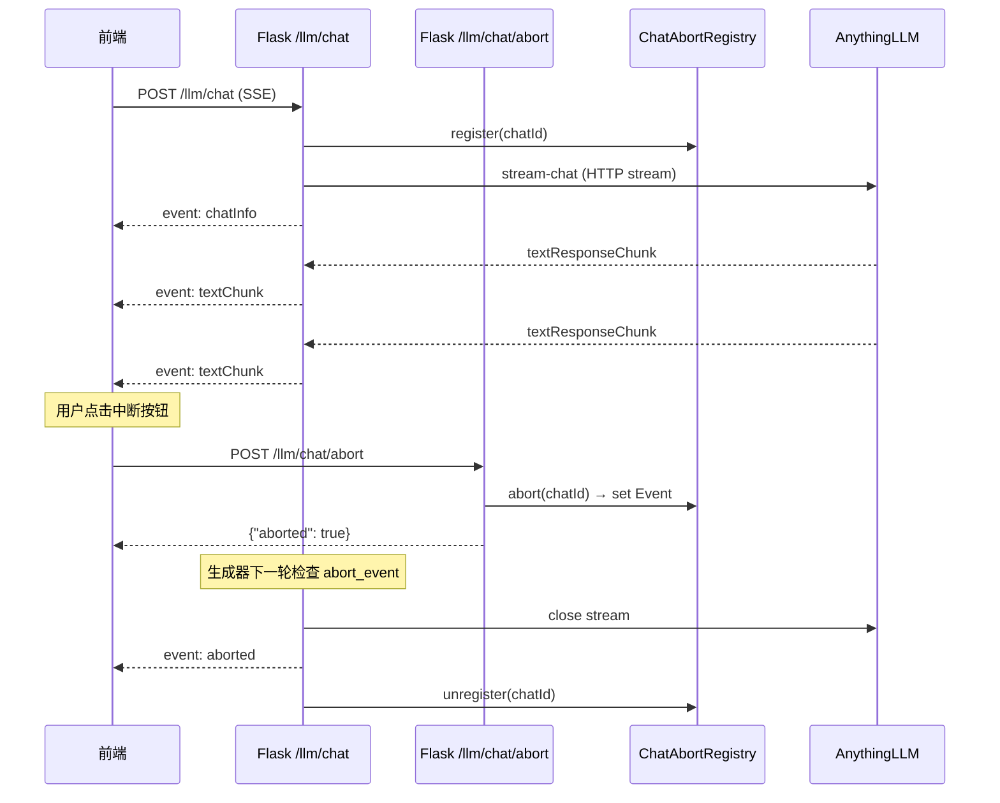

# 文件对话新增接口 —— 后端实现计划

本文档为 `POST /llm/chat/title`（生成对话标题）和 `POST /llm/chat/abort`（中断流式对话）提供后端实现方案，对应接口规范见 [文件对话新增接口.md](接口文档/文件对话新增接口.md)。

---

## 一、生成对话标题 `/llm/chat/title`

### 1.1 设计思路

对话标题的生成本质上是对对话历史进行一次**独立的大模型总结调用**，不影响对话本身的上下文。流程如下：

1. 根据 `chatId` 从 `ChatDatabaseService` 获取对话记录（`workspace_slug`、`thread_slug`）
2. 通过 `AnythingLLMClient.get_thread_chats()` 获取完整对话历史
3. 将历史消息拼装为紧凑文本，构造一个标题总结 Prompt
4. 通过 AnythingLLM 的**独立**同步问答获取标题（不能使用对话 Thread，否则会污染历史）
5. 返回标题字符串

### 1.2 Prompt 设计

```text
请根据以下对话内容，用不超过20个字总结对话主题，直接输出标题文字，不要包含任何额外内容或标点符号。

对话内容：
用户：请总结这两份文件的核心观点
助手：根据文件内容，核心观点包括：1. ...... 2. ......
用户：第一份文件的结论是什么？
助手：第一份文件的结论主要集中在......
```

- 对话历史**截断策略**：仅取最近 5 轮对话内容，每条消息截取前 200 字符，以控制 Token 消耗。
- **标题后处理**：对大模型返回的文本做 `strip()` 清理，去除引号和多余标点，截断至最大 50 字符。

### 1.3 代码层级分布

| 层级 | 文件 | 改动 |
|------|------|------|
| 接口层 | `app/blueprints/llm.py` | 新增 `@llm_bp.post("/llm/chat/title")` 路由 |
| 业务层 | `app/services/llm_service/chat_service.py` | 新增 `generate_chat_title()` 函数 |
| Prompt 层 | `app/services/core/prompts.py` | 新增 `CHAT_TITLE_PROMPT_TEMPLATE` 常量 |

### 1.4 关键设计决策

#### 为什么不复用对话的 Thread？

如果向对话 Thread 发送"请总结标题"的消息，该消息本身会被记录为对话历史的一部分，污染对话上下文。因此应使用独立于对话 Thread 的方式调用大模型。

可选实现方式（实现时根据 AnythingLLM API 可用性选择）：

- **方案 A（优先）**：使用 Workspace 级别的 `chat` API（不经过 Thread），当前 `AnythingLLMClient` 需要新增该方法的封装
- **方案 B（备选）**：创建临时 Thread → 发送总结请求 → 获取结果 → 删除临时 Thread

#### 标题不由后端持久化

标题由调用方自行管理。`chat_sessions.sqlite3` 的 `chats` 表不新增 `title` 列。

### 1.5 伪代码

```python
def generate_chat_title(
    *,
    chat_db: ChatDatabaseService,
    client: AnythingLLMClient,
    chat_id: str,
) -> str:
    chat_record = chat_db.get_chat(chat_id)
    if chat_record is None:
        raise ChatNotFoundError(chat_id)

    raw_history = client.get_thread_chats(
        chat_record["workspace_slug"],
        chat_record["thread_slug"],
    )

    # 构造紧凑对话摘要（最近 5 轮，每条 ≤ 200 字）
    conversation_text = _build_conversation_summary(raw_history, max_turns=5, max_chars=200)
    if not conversation_text.strip():
        raise ValueError("对话历史为空，无法生成标题")

    prompt = CHAT_TITLE_PROMPT_TEMPLATE.format(conversation=conversation_text)

    # 使用独立问答获取标题（方案 A 或方案 B）
    answer = client.chat_to_workspace(
        chat_record["workspace_slug"],
        prompt,
        mode="chat",  # 不检索文档，纯对话
    )

    title = _clean_title(answer.text, max_length=50)
    return title
```

### 1.6 路由伪代码

```python
@llm_bp.post("/llm/chat/title")
def llm_chat_title():
    services = _services()
    chat_db = services.chat_db
    anythingllm_config = services.anythingllm_config
    payload = request.get_json(silent=True) or {}

    if payload.get("businessType") != "chat":
        return jsonify({"error": "businessType必须为chat"}), 400

    params = payload.get("params")
    if not isinstance(params, dict):
        return jsonify({"error": "params不能为空"}), 400

    chat_id = params.get("chatId")
    if not isinstance(chat_id, str) or not chat_id.strip():
        return jsonify({"error": "chatId不能为空"}), 400
    chat_id = chat_id.strip()

    client = AnythingLLMClient(anythingllm_config)
    try:
        title = generate_chat_title(chat_db=chat_db, client=client, chat_id=chat_id)
        return jsonify({"chatId": chat_id, "title": title})
    except ChatNotFoundError:
        return jsonify({"error": "对话不存在"}), 404
    except ValueError as e:
        return jsonify({"error": str(e)}), 400
```

---

## 二、中断流式对话 `/llm/chat/abort`

### 2.1 需求合理性分析

**该需求完全合理且常见。** 在所有提供流式输出的 AI 应用中（如 ChatGPT、Claude、DeepSeek），中断/停止生成都是标准功能。当用户发现回答方向错误或不需要继续等待时，应能随时中断。

### 2.2 技术方案分析

当前的 SSE 流式架构链路如下：

```text
前端 fetch() → Flask Response(generator) → handle_chat_stream()
  → _filter_think_stream() → client.stream_chat_to_thread()
    → threads.stream() → transport.stream_sse() → requests.iter_lines()
```

关键技术约束：

- Flask 的 SSE `Response(generator)` 是**同步阻塞式生成器**，在 `for chunk in generator` 循环中逐个 `yield`
- 前端使用 `fetch()` + `response.body.getReader()` 消费 SSE，而非 `EventSource`
- 前端无法直接通过关闭连接来可靠通知后端停止（HTTP 单向性；Flask 侧的生成器不会立即感知客户端断连）

因此，**最可靠的方案是通过独立 HTTP 请求设置进程内中断标志**，让 SSE 生成器在每次 yield 前检查该标志。

### 2.3 核心机制：进程内中断注册表

新增 `ChatAbortRegistry` 类，作为应用级线程安全的中断信号管理器：

```python
# app/services/llm_service/chat_service.py

import threading

class ChatAbortRegistry:
    """进程内对话流中断注册表（线程安全）。"""

    def __init__(self):
        self._active: dict[str, threading.Event] = {}
        self._lock = threading.Lock()

    def register(self, chat_id: str) -> threading.Event:
        """为新流式请求注册中断 Event，返回该 Event 供生成器轮询。"""
        abort_event = threading.Event()
        with self._lock:
            self._active[chat_id] = abort_event
        return abort_event

    def abort(self, chat_id: str) -> bool:
        """设置中断信号。返回 True 表示确实存在活跃流并已设置信号。"""
        with self._lock:
            event = self._active.get(chat_id)
        if event is None:
            return False
        event.set()
        return True

    def unregister(self, chat_id: str) -> None:
        """流结束时清除注册。"""
        with self._lock:
            self._active.pop(chat_id, None)
```

工作原理：

1. **注册阶段**：`handle_chat_stream()` 在流开始时调用 `register(chat_id)` 获得一个 `threading.Event`
2. **轮询阶段**：生成器在每次 yield `textChunk` 前调用 `abort_event.is_set()` 检查中断信号
3. **中断触发**：`/llm/chat/abort` 路由调用 `abort(chat_id)` 设置 Event，中断请求立即返回
4. **清理阶段**：生成器无论正常结束、中断还是异常，在 `finally` 中调用 `unregister(chat_id)` 清除注册

### 2.4 代码层级分布

| 层级 | 文件 | 改动 |
|------|------|------|
| 接口层 | `app/blueprints/llm.py` | 新增 `/llm/chat/abort` 路由；修改 `/llm/chat` 路由传入 `abort_registry` |
| 业务层 | `app/services/llm_service/chat_service.py` | 新增 `ChatAbortRegistry` 类；`handle_chat_stream()` 增加 `abort_registry` 参数和中断检查逻辑 |
| 装配层 | `app/container.py` | `ApplicationServices` 新增 `chat_abort_registry: ChatAbortRegistry` 字段 |

### 2.5 SSE 生成器改造

`handle_chat_stream()` 新增中断检查（改动集中在流式对话循环部分）：

```python
def handle_chat_stream(
    *,
    chat_db: ChatDatabaseService,
    kb_service: DatabaseService,
    client: AnythingLLMClient,
    chat_id: str,
    file_names: List[str],
    file_original_names: List[str],
    message: str,
    abort_registry: ChatAbortRegistry,   # ← 新增参数
) -> Generator[str, None, None]:
    abort_event = abort_registry.register(chat_id)
    try:
        # ... 前置逻辑（新/旧对话判断、文件引用）不变 ...

        yield _format_sse_event("chatInfo", {"chatId": chat_id, "isNewChat": is_new_chat})

        # ── 流式对话（加入中断检查）──
        raw_stream = client.stream_chat_to_thread(...)
        for chunk in _filter_think_stream(raw_stream):
            if abort_event.is_set():
                # 关闭上游 AnythingLLM 流式连接
                raw_stream.close()
                yield _format_sse_event("aborted", {"chatId": chat_id})
                return
            yield _format_sse_event("textChunk", {"content": chunk})

        yield _format_sse_event("done", {"chatId": chat_id})

    except GeneratorExit:
        # 客户端断连时 Flask 会触发 GeneratorExit
        logger.info("客户端断开连接: chat_id=%s", chat_id)
    except Exception as e:
        logger.exception("对话流处理异常: chat_id=%s, error=%s", chat_id, e)
        yield _format_sse_event("error", {"error": f"大模型服务响应异常: {e}"})
    finally:
        abort_registry.unregister(chat_id)
```

### 2.6 路由伪代码

```python
@llm_bp.post("/llm/chat/abort")
def llm_chat_abort():
    services = _services()
    payload = request.get_json(silent=True) or {}

    if payload.get("businessType") != "chat":
        return jsonify({"error": "businessType必须为chat"}), 400

    params = payload.get("params")
    if not isinstance(params, dict):
        return jsonify({"error": "params不能为空"}), 400

    chat_id = params.get("chatId")
    if not isinstance(chat_id, str) or not chat_id.strip():
        return jsonify({"error": "chatId不能为空"}), 400
    chat_id = chat_id.strip()

    aborted = services.chat_abort_registry.abort(chat_id)
    if aborted:
        return jsonify({"chatId": chat_id, "aborted": True, "msg": "已发送中断信号"})
    return jsonify({"chatId": chat_id, "aborted": False, "msg": "当前无进行中的流式响应"})
```

### 2.7 中断后对话历史的处理

**结论：被中断的不完整回答不需要保留在对话历史中，后续新对话不受影响。**

原因分析：

1. **AnythingLLM Thread 行为**：流式对话通过 `stream-chat` API 进行。当我们在中途关闭 HTTP 连接（`raw_stream.close()`）时，AnythingLLM 一般不会将不完整的回答保存为历史记录。Thread 历史只记录完整完成的问答对。
2. **本地数据库行为**：`ChatDatabaseService` 的 `append_file_original_names` 在流式开始前调用，记录的是"本轮引用了哪些文件"而非回答内容。对话内容的权威来源是 AnythingLLM Thread 历史。中断不会在本地数据库产生不一致。
3. **用户体验**：中断后用户可以直接发送新消息。新消息进入同一 Thread，大模型会基于之前完整的历史（不含被中断的那条）继续对话。

> 注意：需要在实际集成时验证 AnythingLLM 在流式连接被中途关闭时是否确实不保存不完整历史。如果某些版本会保存，则需要增加中断后调用 Thread 删除最后一条消息 API 来清理。

### 2.8 时序图



---

## 三、验证计划

### 自动化测试

- 为 `ChatAbortRegistry` 编写单元测试，覆盖 register → abort → unregister 完整生命周期
- 为 `generate_chat_title` 编写单元测试（mock AnythingLLM 返回）
- 为两个新路由编写参数校验的单元测试

### 手动验证

1. 启动服务后通过 `/debug/chat` 页面发起对话，验证 `/llm/chat/title` 返回合理标题
2. 在流式输出过程中调用 `/llm/chat/abort`，验证 SSE 流中出现 `aborted` 事件后关闭
3. 中断后再次发送消息，验证对话历史不含被中断的不完整回答
4. 验证在无活跃流时调用 `/llm/chat/abort` 返回 `aborted: false`
