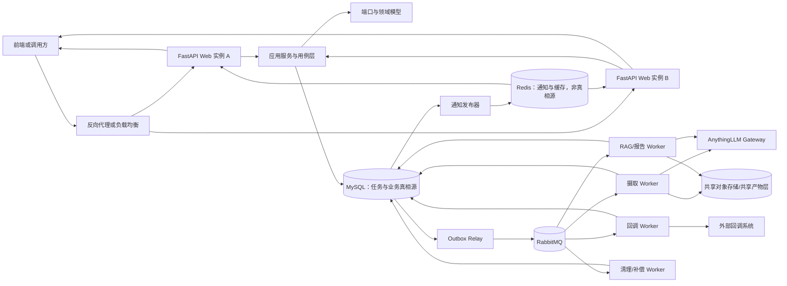

# 低耦合、高并发、任务隔离与可靠队列改造总计划

## 0. 文档信息

| 项目 | 内容 |
| --- | --- |
| 编写日期 | 2026-07-15 |
| 适用基线 | `main@0023c47` |
| 文档状态 | 实施中；阶段 0 已有条件关闭，阶段 1 的波次 1A、1B-1 与 **1B-2 Progress 控制面迁移**已于 2026-07-16 完成并通过全面审查修正，下一实施波次为 1C；check-task 仍待阶段 3～6 可靠链路和生产切换；真实性能基线按批准延期 |
| 目标系统 | 以 AnythingLLM 为外部 RAG 能力核心的 DocSense LLM 后端 |
| 关联计划 | `260703-AnythingLLM低耦合改造总计划.md`、`260707-文件对话功能改造计划.md`、`260715-其余业务分层统一改造实施计划.md`、`260716-阶段1C至11滚动实施计划.md` |
| 执行级设计 | `260715-阶段0契约容量与基础设施决策清单.md`、`260715-统一任务最小契约与Progress语义预设计.md`、`260715-阶段1A-1B文件级实施设计.md`、`260716-阶段1C报告生成文件级实施设计.md` |
| 接口影响 | 已确认定向调整：report 活动任务及 callback outcome unknown 冻结返回 409；三类受理成功 202 空响应体；check-task 成功 200 空响应体；check-task/Progress 严格 `params` 元素校验；Progress 显式 action 返回错误消息、保持连接且无 ack；reportId 入站接受 JSON 整数或十进制整数字符串、不设业务数值范围并按整数值规范化，输出仍为 JSON number；reassign 的外部 `false`、目标创建失败和本地条件更新失败按既有 500 结构处理。check-task 未来直接异步化后，200 表示恢复命令已在 MySQL 事务中可靠登记，而不表示回调已在请求返回前完成；不增删参数，接口文档措辞仍须在生产路由切换前单独确认 |
| 数据迁移 | SQLite 历史数据仅用于测试，无需迁移；阶段 3 初始化共享 MySQL Schema、测试数据和唯一写路径 |

本文把既有低耦合计划、文件对话阶段计划、其余业务结构统一，以及关于 FastAPI、并发、任务隔离和可靠队列的讨论统一为一条可执行路线。项目正式采用“模块化单体 + 按业务聚合 + 模块内分层 + Ports/Adapters”的目标结构。若本文与接口文档在公开行为上存在冲突，**始终以 `docs/接口文档/` 为准，并立即停止实现、发起确认**。2026-07-15 已确认成功空响应体、report 409、严格 `params` 元素校验和 Progress 控制消息处理变化；2026-07-16 又确认 check-task 回调恢复直接采用可靠队列异步方案，不实施同步并行或总超时过渡方案，并确认 reportId 入站兼容整数与整数字符串且不设置业务数值范围。上述决定不授权增删请求参数、改变既有输出字段类型、错误字段、Callback 载荷或 chat 契约；接口文档的异步完成时点说明必须在路由切换前再次确认后落档。

---

## 1. 执行摘要

本轮改造不采用“先整体迁移 FastAPI，再重写业务”的大爆炸方式，而采用以下主线：

1. 冻结外部接口并建立契约测试和性能基线。
2. 保留 Flask 入口，先按 analysis、report、weaponry、reassign、chat、tasks 等业务模块完成结构统一；模块内部使用 domain、application、ports、adapters 分层。
3. 将异步业务拆成 `SubmitXxxTask` 与 `RunXxxTask(task_id)`，再建立统一任务模型、任务级资源边界、租约与 fencing token，消除进程内线程和全局可变状态造成的串扰。
4. 用共享 MySQL 替换三套 SQLite 的生产持久化边界，建立多实例一致性基础；当前 SQLite 测试数据不做历史迁移。
5. 以事务 Outbox 连接“数据库事实”和“消息发布”，再接入 RabbitMQ + Celery 可靠队列。
6. 先迁移回调、清理和非流式后台任务；保留 `/llm/reassign` 当前同步契约。
7. 在业务与任务基础设施稳定后迁移 FastAPI Web 适配层；普通 JSON 接口先迁移，WebSocket 次之，SSE 最后迁移。
8. 最后完成文件对话跨进程唤醒、Worker 化、多实例部署和不少于 50 并发的分层验收。

核心结论如下：

- **可靠队列可以且应当先于 FastAPI 落地。** 队列属于应用与基础设施层，不应依赖 Web 框架。
- **FastAPI 不是可靠性方案。** 它解决 Web 适配、异步 I/O 和长连接承载问题，不能替代持久化、幂等、租约、Outbox 和消息确认。
- **业务服务不需要为了 FastAPI 全部改成 `async`。** 同步 SDK、Celery Worker 和 CPU/阻塞型流程可继续保持同步，通过清晰边界和专用执行资源隔离。
- **“并发不少于 50”必须分层定义。** API/SSE/排队任务达到 50，不等于同时运行 50 个模型推理或 AnythingLLM 文档摄取任务。
- **AnythingLLM 第一阶段继续保留。** 先用端口和网关隔离其 API、命名、限流和错误语义，未来替换 RAG 引擎时不向业务层扩散。
- **采用模块化单体而不是纯全局分层或微服务。** 业务规则按模块高内聚，数据库、消息、存储和外部系统通过端口适配；模块边界成熟后再评估独立部署。
- **阶段 1 与阶段 6 职责分离。** 阶段 1 完成业务代码结构迁移和 Worker-ready 入口；阶段 6 只把已稳定的执行入口从兼容 Dispatcher 切换到可靠队列。
- **check-task 不建设同步恢复过渡路径。** 阶段 1 保留已完成的类型、Task Read、应用编排和测试资产，但不实现生产 `LegacyCallbackRecoveryAdapter`、有界同步并行或批次总超时；阶段 4～6 完成 MySQL Outbox、RabbitMQ 和 callback Worker 后一次性切换为可靠异步恢复。

---

## 2. 改造目标与非目标

### 2.1 改造目标

1. **低耦合、高内聚**
   - Web 框架只负责协议解析、鉴权、调用应用服务和响应呈现。
   - 业务编排不依赖 Flask/FastAPI 请求上下文、全局对象或具体数据库实现。
   - analysis、report、weaponry、reassign、chat、tasks 按业务模块聚合，模块内部维持清晰分层和数据所有权。
   - AnythingLLM、数据库、消息队列、对象存储和通知机制均通过端口隔离。

2. **不少于 50 的并发承载能力**
   - Web 接入层可稳定承载不少于 50 个并发请求和长连接。
   - 至少 50 个任务可同时处于已受理、排队或执行状态，且互不串扰。
   - 重任务并行度按下游容量独立配置，不以盲目增加线程实现表面并发。

3. **任务隔离**
   - 每个任务拥有独立输入快照、临时目录、产物命名空间、日志上下文和状态推进权。
   - 同一业务键的并发提交有明确去重/串行规则。
   - Worker 崩溃或超时后，任务可以被安全接管，不会由旧 Worker 回写覆盖新结果。

4. **可靠队列**
   - API 受理成功后，任务事实持久化；进程退出不会让任务静默丢失。
   - 消息采用至少一次投递，消费者通过幂等实现业务上的“有效一次”。
   - 具备确认、重试、退避、死信、超时、租约回收和人工补偿能力。

5. **多实例与一致性基础**
   - Web、调度、Worker 可以独立扩缩容。
   - 数据库是任务真相源，Redis/进程内存只做通知和加速。
   - 所有实例共享任务状态、对话数据和产物访问能力。

### 2.2 本计划的非目标

- 本轮不直接将 AnythingLLM 替换为 RAGFlow、vLLM 或自研 RAG 引擎。
- 不增删任何前后端请求参数；除 2026-07-15 已批准的成功空响应体、report 409、严格 `params` 元素校验和 Progress 显式控制消息处理外，不借重构或框架迁移改变响应格式或非法输入策略。
- 不以 FastAPI `BackgroundTasks`、守护线程或进程内队列冒充可靠任务系统。
- 不承诺在未评估 GPU、模型服务、AnythingLLM 和文档处理器容量前，同时运行 50 个重任务。
- 不在第一阶段一次性移动全部目录或重命名全部模块；先修正依赖方向，再做安全的物理整理。
- 不在当前阶段拆分微服务或引入插件系统；先在模块化单体内证明边界、事务和运维能力。

---

## 3. 当前基线与主要问题

### 3.1 已具备的基础

当前项目已经存在 `domain`、`application`、`ports`、`gateways` 等分层雏形，分析和文件对话部分能力已开始通过应用服务和端口隔离。文件对话阶段 1～12 已建立本地持久化、运行租约、事件账本、清理闭环和单实例内联调度基础，因此本计划是在现有成果上演进，而不是推倒重来。其余接口的详细盘点、模块归属和七个迁移波次见 `260715-其余业务分层统一改造实施计划.md`。

### 3.2 需要解决的结构问题

- `app/blueprints/llm.py` 同时承担协议解析、校验、业务编排、线程启动、进度推送和响应转换，职责过重。
- 部分报告、武器谱和重新分配流程仍直接依赖旧的 `AnythingLLMClient`，网关隔离尚未完全收口。
- Flask 的 `current_app`、进程内进度中心和守护线程仍进入了生产路径，限制了测试、任务恢复和多实例部署。
- 分析、报告、武器谱等任务使用进程内 daemon thread；Web 进程重启后任务与状态可能分离。
- 三套 SQLite 数据库无法作为多实例共享一致性基础，写竞争和跨实例可见性有限。
- 文件对话目前仍是单实例 SQLite + 内联调度；已有事件账本不等同于已完成事务 Outbox 和跨进程消息投递。
- AnythingLLM Document Processor 当前具有已知并发脆弱性，文档摄取限流为 1；不能把 API 并发指标直接传导为下游并行度。
- 回调、清理、补偿、业务任务和长连接通知尚未形成独立资源池，容易相互饥饿。

### 3.3 为什么不先整体迁移 FastAPI

若先把上述混合职责原样搬到 FastAPI：

- 业务层仍会依赖 Web 框架，只是依赖名称从 Flask 变成 FastAPI。
- 进程内线程、SQLite、内存进度和任务丢失问题仍然存在。
- SSE/WS、错误响应和测试需要在基础设施改造后再次调整，造成重复工作。
- 同步阻塞调用若直接放入事件循环，反而可能降低并发稳定性。

因此，FastAPI 迁移应发生在“业务边界基本稳定、可靠任务主链路可用”之后，在“最终长连接和多实例压测”之前。

---

## 4. 不可突破的设计原则

### 4.1 接口契约冻结

- 请求路径、HTTP 方法、参数位置、参数名、必填性和默认行为保持不变；参数类型只允许
  已批准的 reportId 入站整数/整数字符串兼容扩展。
- 除已确认的 report 活动任务重复提交 409、三类任务受理成功空响应体、check-task 成功空响应体、check-task/Progress 严格 `params` 元素校验、Progress 显式 action 错误后保持连接且无 ack，以及 reportId 入站接受整数/整数字符串外，HTTP 状态码、JSON 字段、输出字段类型、错误信息语义、SSE 事件顺序和结束行为保持不变。
- 不向外暴露内部 `task_id`、`run_id`、租约、attempt、消息 ID 或队列名称。
- 现有不同业务的公开状态码/状态值不强行统一；内部统一状态由 Presenter 映射回现有外部值。
- `/llm/reassign` 保持当前同步完成/失败语义，不能未经确认改成“受理后异步返回”。
- `/llm/chat/delete` 保持现有同步清理完成语义。
- 任一实现若需要进一步修改接口文档或任何公开参数，必须停止开发并先向负责人确认。

### 4.2 数据库是真相源

任务是否存在、当前状态、输入快照、执行权、产物和回调结果必须可以从数据库恢复。RabbitMQ、Redis、Celery backend、Web 进程内存和日志均不得成为唯一事实来源。

### 4.3 至少一次投递 + 幂等消费

分布式系统无法仅凭消息确认同时保证数据库提交和外部副作用的绝对原子性。目标语义为：

- 消息允许重复投递，但不允许静默丢失。
- Worker 必须以任务 ID、attempt、步骤和幂等键判断是否可执行。
- 数据库写入采用条件更新；外部副作用应提供去重、结果探测或人工确认路径。
- 对结果未知的外部调用不得盲目自动重试。
- 外部回调接收方的幂等和结果查询能力已明确为“无法确认”，因此按最保守边界处理：发送后结果未知不自动重试，只允许现有 `/llm/check-task` 显式补发或人工处置。

### 4.4 任务传 ID，不传可变大对象

队列消息只携带稳定标识、任务类型、版本和必要追踪信息。文件、对话内容、配置快照和业务输入在提交事务中持久化，Worker 按 ID 读取，避免消息过大、序列化漂移和请求对象泄漏。

### 4.5 资源隔离优先于盲目并行

短请求、SSE/WS、文档摄取、模型/RAG、报告生成、回调、清理分别使用不同并发限制和队列。任何单一慢任务都不应占满全部 Worker。

### 4.6 可回滚、可观测、可分批

每个阶段必须有兼容路径、开关、指标、验收和回滚条件。新旧实现并存时只允许一个明确的写入权威路径，避免长期双写。

---

## 5. “并发不少于 50”的验收口径

“50 并发”不是单一数字。2026-07-15 已确认采用以下分层口径：

| 层级 | 验收目标 | 说明 |
| --- | --- | --- |
| 短请求接入 | 至少 100 个并发请求，且 50 并发为稳定基线 | 健康检查、查询、任务提交等不应被重任务阻塞 |
| 长连接 | 至少 50 条同时在线的 SSE 连接；WebSocket 按实际接口补充 | 连接不串流、不丢终态，断连可释放资源 |
| 在途任务 | 至少 50 个任务可同时处于 accepted/queued/running 等内部状态 | 重点验证隔离、持久化与调度，不要求全部同时占用模型 |
| Worker 执行 | 按任务类型和依赖容量分别配置 | 例如回调可高并发，模型与文档摄取需限流 |
| AnythingLLM 摄取 | 初始并发保持 1，基准测试后尝试 2、4 | 每次提升都需要错误率和数据完整性证据 |
| 模型/RAG 重任务 | 由 GPU/模型服务/AnythingLLM 容量测试确定 | 不把“50 个在途”误写成“50 个同时推理” |

通用性能验收还应包含：

- 成功率、P50/P95/P99 延迟、队列等待时间和任务总时长。
- 数据库连接池等待、锁等待、死锁和慢查询。
- RabbitMQ ready/unacked 数量、重投递、死信和发布确认延迟。
- Worker CPU、内存、线程、文件句柄、临时磁盘和下游限流错误。
- 在 30～60 分钟稳态压测和故障注入后，不出现任务串扰、重复终态或无法恢复的任务。

若业务要求实际含义是“50 个模型/文档重任务同时执行”，则需要单独确认硬件、模型服务与 AnythingLLM 集群容量，并重新制定成本和压测方案；不能仅通过修改 Worker 并发参数承诺。

---

## 6. 推荐目标架构



### 6.1 基础设施职责

| 组件 | 推荐选择 | 唯一职责 | 不承担的职责 |
| --- | --- | --- | --- |
| Web 适配层 | FastAPI + Uvicorn | HTTP/SSE/WS、鉴权、校验、调用用例、响应映射 | 长时任务执行、任务事实保存 |
| 共享数据库 | MySQL 8.4 | 任务、对话、业务状态、租约、Outbox 的真相源 | 高频广播总线 |
| ORM/迁移 | SQLAlchemy 2 + Alembic；第一版统一同步 Repository，FastAPI 通过受控线程池调用 | 持久化适配和可审计 Schema 迁移 | 领域规则 |
| 消息代理 | RabbitMQ | 可靠传输、确认、路由、重投递和死信 | 任务最终状态真相 |
| Worker | Celery | 消费、执行、重试调度、并发池管理 | 对外接口契约 |
| Redis | Redis | 跨实例进度通知、短期缓存、可选分布式限流 | 唯一任务状态和永久事件记录 |
| 共享产物 | MinIO | 输入文件、报告和中间产物的跨实例访问 | 任务调度 |
| RAG 外部能力 | AnythingLLM Gateway | 隔离上游接口、错误、重试、限流和命名 | 业务状态机 |

目标生产已确认为单台物理服务器，并允许通过 Docker Compose 部署 MySQL、RabbitMQ、Redis、MinIO 和应用组件。具体版本、资源规格、备份监控和责任人仍需在阶段 0/11 的部署 Runbook 中落档；完整计划实现前，开发阶段保持当前环境，不提前切换运行基础设施。

### 6.2 目标依赖方向

```text
Flask / FastAPI / Celery / Scheduler Adapters
                    ↓
             Business Module
        Application Commands/Queries
                    ↓
          Domain Models and Policies
                    ↑
     Module Ports ← Integration/Infrastructure Adapters
```

约束如下：

- 模块 domain 不导入 Flask、FastAPI、Celery、SQLAlchemy、Redis、RabbitMQ 或 AnythingLLM 客户端。
- 模块 application 只依赖本模块领域对象、明确的共享契约和端口，不读取请求上下文，不自行创建线程。
- Web 与 Worker 调用相同应用用例；异步执行入口只接收持久化任务 ID。
- 模块不能直接导入其他模块的 Adapter 或数据表实现；通过应用接口、只读查询契约或领域事件协作。
- 数据库、消息、对象存储、时钟、ID 生成器和外部 API 都通过端口注入。
- 依赖容器由进程入口组装，业务模块不得通过隐式全局单例取得依赖。

### 6.3 目录结构选型决议

| 方案 | 结论 | 原因 |
| --- | --- | --- |
| 传统 controllers/services/repositories 技术分层 | 不作为目标结构 | 同一业务散落多个全局目录，容易继续形成巨型 Service |
| 纯全局 Clean Architecture | 只采用其依赖规则 | 全局 domain/application 随业务增多容易成为新的大杂烩 |
| 纯按业务聚合 | 作为基础但不足够 | 高内聚，但若无统一边界会重复数据库、消息、日志和外部 Client |
| 垂直切片 | 用于模块 application 内部 | 适合 command/query/execute，不单独承担全局架构 |
| 插件化或微服务 | 当前不采用 | 生命周期、分布式事务、部署和运维成本过早放大 |
| **模块化单体 + 业务聚合 + 模块内分层 + Ports/Adapters** | **正式采用** | 兼顾高内聚、低耦合、渐进迁移、Web/Worker 双入口和未来可拆分性 |

现有 chat 是业务聚合参考，但不机械复制其 SQLite、locking 和内联 Dispatcher。目标是在模块内保留业务规则、应用用例、Port 和专属数据映射，同时由统一 infrastructure 提供连接池、消息、存储、日志等平台能力。

### 6.4 建议逻辑目录

```text
app/
├── modules/
│   ├── analysis/
│   │   ├── domain/                  # 解析、匹配、映射和领域错误
│   │   ├── application/
│   │   │   ├── commands/            # 提交和取消等写用例
│   │   │   ├── queries/             # 查询用例
│   │   │   ├── executors/           # RunXxxTask(task_id)
│   │   │   └── dto/                 # 框架无关 DTO
│   │   ├── ports/                   # 本模块拥有的能力需求
│   │   └── adapters/                # 本模块专属 Repository/映射适配
│   ├── report/
│   ├── weaponry/
│   ├── reassign/
│   ├── chat/                        # 由现有 services/chat 渐进演进
│   └── tasks/                       # 统一任务领域，不等同于 Celery
├── shared/
│   ├── domain/                      # 极少量稳定值对象/领域事件基类
│   └── application/                 # Clock、ID Generator 等通用协议
├── ports/                           # 迁移期保留的跨业务稳定端口
├── integrations/
│   ├── anythingllm/                 # 已有 Transport/Gateway/Factory
│   ├── callback/
│   ├── translation/
│   └── document_processor/
├── infrastructure/
│   ├── database/                    # Engine、Session、Alembic
│   ├── messaging/                   # Outbox、RabbitMQ、Celery、Redis
│   ├── storage/                     # 本地/MinIO
│   └── observability/               # 日志、指标和 Trace
├── adapters/
│   ├── web/
│   │   ├── flask/                   # 过渡期入口
│   │   └── fastapi/                 # 目标入口
│   └── workers/
│       └── celery/                  # Celery task 薄适配器
└── bootstrap/                       # 配置、依赖装配、进程生命周期
```

该目录是目标形态，不要求第一阶段机械搬迁全部文件。先用导入边界测试和小步重构修正职责，再在测试保护下移动模块。`shared` 只接纳至少两个业务语义完全一致、已经稳定的能力，禁止成为新的 `utils`。详细放置和迁移规则见 `260715-其余业务分层统一改造实施计划.md`。

---

## 7. 统一任务模型与隔离设计

### 7.1 建议持久化实体

| 实体/表 | 核心内容 | 目的 |
| --- | --- | --- |
| `tasks` | 内部任务 ID、类型、内部状态、业务键、版本、当前 attempt、终态摘要 | 统一任务事实和状态机 |
| `task_inputs` | 不可变输入快照、配置版本、文件/对象引用、内容摘要 | Worker 重放时不依赖原请求对象 |
| `task_attempts` | attempt、lease owner、lease 到期时间、fencing token、心跳、错误分类 | 崩溃恢复与旧 Worker 防覆盖 |
| `task_steps` | 步骤状态、幂等键、外部引用、开始/结束时间 | 细粒度重试和补偿 |
| `task_events` | 单调序号、事件类型、公开/内部载荷、创建时间 | 审计、进度恢复和 SSE 回放基础 |
| `outbox_events` | 聚合 ID、事件类型、消息体、发布状态、重试次数 | 数据提交与消息发布可靠衔接 |
| `callback_deliveries` | 目标、task ID、attempt、触发来源、投递阶段、内部 outcome、响应摘要、下次重试时间 | 区分明确未送达、失败和结果未知，使回调不阻塞主任务且可审计 |
| `cleanup_jobs` | 资源引用、清理状态、补偿原因、重试信息 | 资源清理闭环 |

表名和字段名属于内部实现建议，不构成接口参数。正式建表前需结合现有三套 SQLite Schema 形成 Alembic 迁移设计。

### 7.2 内部状态与公开状态分离

内部可采用更完整的状态，例如：

```text
accepted → queued → leased → running → succeeded
                               ├──────→ failed
                               ├──────→ cancelling → cancelled
                               └──────→ outcome_unknown
```

但外部接口继续返回当前接口文档规定的状态值。每个业务由独立 `TaskStatusPresenter` 完成映射，禁止直接把内部枚举序列化给前端。

### 7.3 提交事务

任务提交的标准流程为：

1. Web 适配层按现有规则解析、校验和鉴权。
2. 应用服务在同一数据库事务内写入任务、不可变输入快照和 Outbox 事件。
3. 事务提交成功后，按照现有接口契约返回；提交失败则不得返回成功。
4. Outbox Relay 使用数据库锁安全领取事件并发布至 RabbitMQ。
5. 发布确认后标记 Outbox 已发布；若“已发布但标记前崩溃”，允许重复发布，由消费者幂等化处理。

### 7.4 执行权、租约与 fencing

- Worker 领取任务时通过条件更新取得租约和递增 fencing token。
- 长任务定期续租；心跳失败时停止继续推进可停止的步骤。
- 所有关键状态写入必须携带当前 token，并满足“非终态、版本匹配、token 匹配”。
- Reaper 只回收租约已过期且不在终态的任务。
- 旧 Worker 即使恢复，也不能用旧 token 覆盖新 Worker 的状态和产物引用。
- 对不可安全重试的外部操作，将任务置为 `outcome_unknown`，由结果探测或人工补偿处理。

### 7.5 任务级资源隔离

每个任务必须具备以下隔离边界：

- 任务专属临时目录或对象存储前缀，禁止使用共享固定文件名。
- 任务专属日志上下文：`task_id`、业务键、attempt、step、trace ID、Worker ID。
- 任务专属 AnythingLLM workspace/thread/document 命名策略，且名称映射持久化。
- 依赖对象按任务或进程安全范围创建；已知非线程安全对象禁止做可变全局单例。
- 进度回调不得依赖全局可变函数；使用任务作用域的 Progress Reporter。
- 队列消息不得携带 Flask/FastAPI request、数据库 Session 或打开的文件句柄。
- 同一业务键的活动任务通过数据库唯一约束或事务锁执行明确的拒绝、复用或串行策略。

现有查询接口若按业务键查询“最新任务”，由内部投影层维持兼容，不能把业务键直接当作不可扩展的任务主键。

---

## 8. 队列与 Worker 资源规划

### 8.1 建议队列划分

| 队列 | 任务示例 | 初始并发策略 | 可靠性策略 |
| --- | --- | --- | --- |
| `ingest` | 文件上传、AnythingLLM 文档摄取 | 从 1 开始，压测后小步提升 | 长超时、低 prefetch、严格幂等、独立死信 |
| `rag` | 分析、对话 RAG、武器谱相关重步骤 | 按模型/AnythingLLM 容量配置 | 租约、限流、可重试错误分类 |
| `report` | 报告生成与产物落盘 | 独立 Worker 池 | 产物临时写入后原子提交引用 |
| `callback` | 业务结果回调 | 较高并发、短超时 | 仅明确未送达错误有限退避重试；发送后超时进入 `delivery_outcome_unknown`/人工处理 |
| `cleanup` | 文件、workspace、thread、过期状态清理 | 低优先级独立池 | 可重复执行、持久化清理状态 |
| `reconcile` | 租约回收、Outbox 补发、数据核对 | 单独调度 | 分布式选主/数据库抢占、完整审计 |

队列名称是内部建议，可在部署设计中调整；不能进入公开接口。

### 8.2 Celery 初始策略

- RabbitMQ 开启持久化消息、durable queue、publisher confirms 和死信路由。
- 长任务采用 late acknowledgement，并在数据库提交终态后确认消息。
- 长任务初始 `worker_prefetch_multiplier=1`，避免单 Worker 预取大量慢任务。
- 自动重试只覆盖经过错误分类且可安全重放的瞬态错误；callback 因接收方幂等未知，只允许 DNS/连接建立阶段等明确未送达错误有限重试，发送后超时、非 2xx 和连接中断均不自动重试。
- 参数错误、业务冲突和不可判定外部副作用不得无限重试。
- 重试采用指数退避、随机抖动和上限；超过次数进入死信并触发告警。
- Celery result backend 不作为业务真相源；业务状态仍写 MySQL。
- Worker 任务函数只做反序列化、依赖装配、调用应用服务和错误分类，禁止复制业务编排。

### 8.3 背压与准入

- Web 可靠受理能力、持久化积压量和下游执行能力分别度量。
- analysis/report/weaponry 已确认不设置业务积压数量上限，不因正常积压返回 503/429；
  待处理事实进入数据库/Outbox，Worker 按资源许可持续处理。
- 不允许用无界线程、无界进程内 Queue 或 RabbitMQ 溢出丢弃模拟“无限积压”。内存只保留
  有界唤醒，数据库/Broker/磁盘无法完成可靠写入时不得返回成功。
- 对每类任务配置执行并发、速率、超时和外部资源配额，避免一种任务拖垮全局；这些限制
  只控制消费速度，不丢弃已可靠受理的任务。
- 数据库连接池大小按“每进程并发 × 实例数”统一预算，不能各组件独立设置后超过 MySQL 上限。

---

## 9. 分阶段实施路线

每个阶段必须满足“代码完成、自动化验证通过、文档记录完整、可回滚”后才能进入下一阶段。阶段编号表示依赖关系，不代表必须一次上线所有内容。

### 实施粒度与滚动细化规则

本计划采用三级文档，避免总计划过粗，也避免在关键决策尚未确认时一次性写出容易失真的全部文件级方案：

- **L1 总计划**：定义阶段 0～11 的目标、依赖、门禁、回滚和最终验收口径，即本文。
- **L2 专项/波次计划**：定义某一业务域或阶段内的垂直切片、先后顺序和完成定义，例如阶段 1 的 1A～1G。
- **L3 执行设计**：在对应阶段开工前冻结到文件、类/端口、事务、状态、失败矩阵、测试、日志指标、发布和回滚步骤。

不要求现在把阶段 0～11 全部细化到文件级。阶段跨度较长，MySQL Schema、队列拓扑、FastAPI 中间件等设计都依赖前一阶段的真实结果；过早冻结会制造返工。每份 L3 执行设计必须在该阶段编码前评审通过，且至少包含：范围与非目标、到期决策、现状证据、目标调用链、文件变更表、内部契约、并发/幂等/事务边界、失败恢复、契约与性能测试、日志指标、灰度回滚和完成门禁。

| 开工范围 | 必须预先形成的 L3 设计 |
| --- | --- |
| 阶段 0 | 契约矩阵、容量/SLO、基础设施、数据处理和安全决策清单；当前见 `260715-阶段0契约容量与基础设施决策清单.md` |
| 阶段 1A～1B | 首个切片文件级落点与 Task/Progress 最小契约；当前见 `260715-阶段1A-1B文件级实施设计.md` 与 `260715-统一任务最小契约与Progress语义预设计.md` |
| 阶段 1C～1G | 每个业务垂直切片各自的文件/端口/失败补偿设计；1C 已见 `260716-阶段1C报告生成文件级实施设计.md`，1D～1G 最晚在对应波次开工前补齐 |
| 阶段 2～4 | 统一任务状态机与隔离、MySQL Schema/空库切换、Outbox/Relay 一致性设计 |
| 阶段 5～7 | RabbitMQ/Celery 队列拓扑、重试/DLQ、逐业务切换和跨实例 Progress 设计 |
| 阶段 8～9 | FastAPI 路由/中间件/流式协议等价设计，以及 chat Worker 化和多实例闭环设计 |
| 阶段 10～11 | 容量/故障演练方案、生产灰度 Runbook、回滚判据和旧路径删除证据 |

### 阶段 0：确认口径、冻结契约与建立基线

**目标**

明确成功标准，避免在实现中临时改变接口或容量定义。

**主要工作**

- 逐项固化现有 HTTP、SSE、WebSocket 的请求、响应、状态码和错误行为。
- 将接口文档中的示例转化为黑盒契约测试；分别保存当前实现基线与 2026-07-15 已批准的目标黄金样例，未授权部分只验证现有行为。
- 建立单实例基线采集工具和指标定义：吞吐、延迟、任务耗时、内存、线程、SQLite 锁和 AnythingLLM 错误率；真实采集经批准延期到首次完整集成环境。
- 第 5 节的并发定义和目标单服务器环境已经确认；P95/P99、成功率和压测时长在首次完整集成环境冻结，最迟阶段 10 完成。
- MySQL、RabbitMQ、Redis、MinIO 和 Docker Compose 已获准作为目标生产基础设施；继续补齐版本、资源、备份、监控和责任边界。
- SQLite 历史数据无需迁移；确认空库初始化、测试种子、切换和回滚步骤。

**交付物与门禁**

- 接口契约测试清单和基线报告。
- 容量口径、SLO、基础设施和迁移窗口的确认记录。
- 未完成数值 SLO、真实基线和稳态压测前，不进入生产容量承诺。
- 2026-07-15 已批准以“有条件完成”关闭阶段 0：真实基线不阻塞阶段 1，但转为首次完整集成环境补测和阶段 10 生产验收硬门禁，不能被后续阶段再次静默延期。

### 阶段 1：框架无关的低耦合重构（继续使用 Flask）

**目标**

采用模块化单体结构完成其余业务分层统一，让 Flask 蓝图成为薄适配层，并为本地执行器、Celery Worker 与 FastAPI 共享同一业务内核。波次范围以 `260715-其余业务分层统一改造实施计划.md` 为准；1A～1B 文件级步骤见 `260715-阶段1A-1B文件级实施设计.md`，1C 见 `260716-阶段1C报告生成文件级实施设计.md`。

**实施波次**

| 波次 | 范围 | 核心结果 |
| --- | --- | --- |
| 1A | 全接口契约与模块骨架 | 冻结“当前实现基线”和“已批准目标契约”，建立模块、黄金样例和架构边界测试 |
| 1B | `/llm/check-task` 内部边界、`/llm/progress` 生产切换 | **已完成**：1B-1 固定可靠恢复命令 DTO/批量 Port/Application/Presenter/Fake，不接同步生产 Adapter、不切 check-task 路由；1B-2 已将 Progress 切为无 action 协议、类型化应用服务、单写入连接缓冲和线程安全单实例 Adapter。check-task 待阶段 4～6 直接切可靠异步恢复 |
| 1C | `/llm/generate-report` | `SubmitReportTask`、`RunReportTask(task_id)`、成功 202 空响应体、活动/unknown 409、追加式 execution、持久化积压、有界唤醒和多文档 RAG/File/Callback Port |
| 1D | `/llm/weaponry` | 成功 202 空响应体、检索编排、字段/表格/来源领域规则、Worker-ready 执行入口 |
| 1E | `/llm/reassign` | 保持同步契约的 `DocumentReassignmentService` 与可补偿 Saga |
| 1F | `/llm/analysis` 二次收口 | 成功 202 空响应体；保留既有 Gateway，拆分任务、进度、翻译、回调、预处理和纯领域规则 |
| 1G | Debug、组合根和遗留清理 | Debug Adapter、框架无关 Bootstrap、薄蓝图和旧路径清理证据 |

**主要工作**

- 把 `llm.py` 中的业务编排迁移到相应模块的 commands、queries、executors 和领域服务。
- 异步业务统一拆成 Submit 用例与只接收持久化 task ID 的 Run 用例；同步 reassign 维持当前请求内 Saga。
- 建立框架无关 DTO、领域错误和 Presenter；Web 层集中完成当前错误映射。
- 清除应用服务对 `current_app`、request、Response、线程、具体数据库和进程内进度实现的依赖。
- 引入 `TaskDispatcher`、Task Read、Callback Recovery Command、Progress、Callback、File、Artifact、Translation 等端口。除 check-task 回调恢复外可按风险提供兼容 Adapter；check-task 禁止新增同步生产恢复 Adapter。
- 将报告、武器谱、重新分配等遗留路径收敛到现有 AnythingLLM Port/Gateway；analysis 只做二次内聚，不重写已稳定 Gateway。
- 用框架无关 Bootstrap 显式装配 Repository、Gateway、Clock、ID Generator 和 Progress Reporter。
- 加入模块和架构边界测试，阻止 domain/application 反向导入 Web、Celery 和基础设施实现。

**验收**

- Flask 契约测试全部通过；只允许对应波次切换已批准目标契约，其余公开行为无变化。
- 应用服务可在没有 Flask application/request context 的单元测试中运行。
- 已迁移蓝图只保留协议处理、用例调用和响应呈现，不再创建后台线程；check-task 旧同步
  handler 作为明确例外保留到阶段 6，禁止在阶段 1 假装已经完成薄适配层切换。
- analysis、report、weaponry、reassign、tasks 和 chat 的模块边界、数据所有权和依赖方向明确。
- report、weaponry、analysis 的执行入口只接收持久化任务 ID，可由兼容本地执行器和未来 Celery 共同调用。
- `/llm/check-task` 的请求、Task Read、可靠恢复命令和空响应 Presenter 已形成 Worker-ready 边界，但生产路由继续留在旧实现直到阶段 6；`/llm/progress` 通过 Progress Port 工作；`/llm/reassign` 继续保持同步。

**回滚**

按波次、按用例逐个切换并保留短期兼容 Adapter；出现契约回归时只回滚该用例的组合根绑定，不回滚无关模块。禁止新旧执行器同时拥有同一任务的执行权，也不保留长期双写。

### 阶段 2：统一任务语义与进程内隔离

**目标**

在阶段 1 已完成业务分层和 Submit/Run 边界的前提下，引入分布式队列前先证明统一任务状态机、幂等和资源隔离正确。

**主要工作**

- 建立统一内部任务/attempt/step/event 模型和公开状态映射。
- 为所有任务建立输入快照、任务目录、产物引用和结构化日志上下文。
- 移除全局可变进度回调和不可控共享客户端；按线程/任务安全范围创建依赖。
- 将阶段 1 中分析、报告、武器谱等仍需兼容运行的 Dispatcher 收敛为有界、可关闭、可观测的本地执行器，并保持现有接口返回时机；待处理事实保存在数据库，内存只保存常量/有界唤醒，不设置业务积压数量上限。该适配器只用于这些业务任务过渡。**check-task 回调恢复明确排除在外**，不得进入本地线程池或同步并行过渡实现。
- 建立幂等键、条件状态更新、终态不可逆和同业务键并发规则。
- 补齐取消、超时、结果未知、清理和补偿的领域语义。
- 让 analysis、report、weaponry 与 chat 复用统一任务基础能力，但保留各自领域状态机和公开状态 Presenter，禁止建立第二套互不兼容的任务内核。

**验收**

- 50 个本地并发测试任务的输入、进度、文件和终态互不串扰。
- 重复派发同一任务不会重复推进已完成步骤。
- 任何任务异常不影响其他任务，且日志可按任务完整追踪。
- 50 个任务可同时处于持久化在途状态，实际重任务并发受限后仍按稳定顺序持续排空；
  Web 进程内存不随积压数量线性增长。

### 阶段 3：迁移至共享 MySQL 与 Alembic

**目标**

消除 SQLite 的单机边界，为队列和多实例建立一致的持久化基础。

**主要工作**

- 为任务、知识库和文件对话梳理统一 Schema、索引、唯一约束和外键策略；同时建立 `callback_recovery_requests`、`callback_deliveries` 与 Outbox 所需表/索引，使 check-task 能在 MySQL 事务内可靠登记恢复命令。
- 通过框架无关 Repository Port 同时支持 SQLite 过渡适配和基于 SQLAlchemy 的 MySQL
  目标 Adapter；SQLAlchemy 类型不得泄漏到 Domain/Application。
- 第一版统一采用同步 SQLAlchemy Engine/Session/Repository：Flask 与 Celery 直接调用，
  阶段 8 FastAPI 通过受控线程池执行短数据库事务。只有压测证明线程池成为瓶颈时才增加
  AsyncSession Adapter；两种实现共享 Schema/契约但绝不共享 Session 实例。
- 使用 Alembic 管理所有生产 Schema 变更，禁止应用启动时隐式改表。
- 根据查询路径建立组合索引，重点覆盖业务键、状态、租约到期时间、事件序号和 Outbox 状态。
- 为高竞争领取使用短事务、条件更新或 `SELECT ... FOR UPDATE SKIP LOCKED`；不得在事务内执行 AnythingLLM/模型调用。
- 建立空 MySQL 初始化、测试种子、Repository 等价验证和唯一写路径切换方案；不开发无业务需求的 SQLite 历史行迁移工具。
- 阶段 3 起允许使用测试专用 Docker Compose 只启动 MySQL、RabbitMQ、Redis、MinIO；
  应用仍从 `/venv` 运行，不进入容器且不启动 `run.py`。
- MinIO Schema/Adapter 先保存 retention class、引用和可空删除资格；具体期限未确认前不
  启用自动 TTL，排队/运行/恢复/待 callback 对象不得按创建时间删除。

**切换门禁**

- 使用全新 MySQL 测试库执行 Alembic 从零升级，并用受控测试种子覆盖所有公开状态和关键查询。
- Repository 契约、并发唯一性、事务回滚和查询结果在 SQLite 兼容实现与 MySQL 目标实现间保持等价。
- 切换前排空开发测试任务并保留 SQLite 文件作为短期回滚证据，不做历史数据导入。
- MySQL 成为唯一写路径后禁止长期双写；发生问题优先前向修复，或在尚无需要保留的新写入时回切旧 Adapter。

**验收**

- Repository 契约测试同时覆盖 SQLite 过渡实现和 MySQL 实现。
- 并发写入不丢状态、不出现重复活动任务，死锁可观测且可安全重试。
- 备份恢复演练和 Alembic 升级/降级演练通过。

### 阶段 4：事务 Outbox 与可靠派发

**目标**

关闭“数据库已提交但消息未发出”的任务丢失窗口。

**主要工作**

- 在同一业务事务内写任务事实和 Outbox 事件；check-task 对每个符合条件的 TaskId 原子创建/复用唯一活动恢复请求，并写入 `trigger=check_task` 的 Outbox 事件。
- 同一 TaskId 在 `pending/queued/running` 阶段最多存在一个活动恢复请求；重复 check-task 调用复用该请求，不重复放大待发送回调。前一请求形成终态后，后续显式调用才可创建新的恢复 attempt。
- 实现可多实例运行的 Outbox Relay，使用安全抢占、发布确认、重试和告警。
- 规定事件版本、恢复请求 ID、expected TaskId、幂等键、触发来源、追踪字段、最大载荷和敏感信息脱敏规则；消息不得携带业务正文或公开协议之外的数据。
- 实现 Relay 崩溃恢复、重复发布和毒消息隔离测试。
- 建立 Outbox 积压、最老事件年龄、发布失败率和死信告警。

**验收**

- 在“提交前、提交后、发布前、发布后、标记前”等故障点强制终止进程，任务最终仍可被派发。
- 重复消息不会造成重复业务终态或重复不可逆副作用。
- 数据库中不存在长期无解释的未发布事件。

### 阶段 5：接入 RabbitMQ 与 Celery Worker

**目标**

把执行生命周期从 Web 进程剥离，建立可独立扩缩容的可靠 Worker 池。

**主要工作**

- 按第 8 节建立队列、路由、死信和 Worker 池。
- analysis/report/weaponry 队列不配置业务积压数量上限或溢出丢弃；队列持久化积压，
  Worker 按 AnythingLLM/模型资源配额持续处理。磁盘水位与 Broker flow control 只做告警
  和基础设施保护，不把已受理任务静默丢弃。
- Celery task 仅接收内部 ID，调用与 Flask 相同的应用服务；callback recovery 消息只携带 recovery request ID，由 Worker 回查 expected TaskId、业务键和持久化载荷。
- 实现 late ack、错误分类、退避重试、租约续期、fencing 和 Reaper。
- 建立发布、消费、执行、回写、确认的全链路 trace。
- 通过配置开关按任务类型从本地 Dispatcher 切到队列 Dispatcher；check-task 不提供本地/同步 Dispatcher 选项，只允许“旧路由尚未切换”或“可靠队列路径已启用”两种状态。
- 对 RabbitMQ 不可用、Worker 退出、网络分区、消息重复和数据库暂时不可用进行故障注入。

**验收**

- Web 进程在任务受理后立即退出，任务仍可被其他 Worker 完成。
- Worker 在执行中被终止，租约到期后任务可被安全接管。
- 同一消息重复投递不会产生两个成功终态或覆盖新 attempt。
- 队列不可用时任务保留在 Outbox，恢复后自动补发。

### 阶段 6：按风险切换可靠任务执行适配器

**目标**

业务代码结构迁移已经在阶段 1 完成。本阶段从副作用边界清晰的任务开始，逐类把兼容本地 Dispatcher 切换为 RabbitMQ/Celery 可靠执行适配器，不再从蓝图或巨型 Service 中重新提取业务流程。

**建议顺序**

1. **check-task 可靠恢复与回调任务一起首次切换**：Web 请求仅校验、读取并在 MySQL 事务中登记/复用恢复请求和 Outbox，提交成功后返回 HTTP 200 空响应体；Outbox Relay 发布到 RabbitMQ，callback Worker 在同业务键 Guard 内执行 latest-wins 校验、外发、条件持久化和 ACK。不存在同步 `LegacyCallbackRecoveryAdapter` 或同步并行回退路径。
2. 清理/补偿任务：设计为可重复执行，验证死信和人工重放。
3. 分析任务：切换已经稳定的 `RunAnalysisTask(task_id)`，验证受理、进度、结果和失败映射。
4. 报告生成：切换 `RunReportTask(task_id)`，验证长耗时步骤和产物原子提交。
5. 武器谱任务：切换 `RunWeaponryTask(task_id)`，验证检索限流、输入快照和回调。
6. 文件对话重步骤：在现有阶段 1～12 基础上进入后续 Worker 化。

**特殊边界**

- RabbitMQ 暂时不可用但 MySQL/Outbox 事务成功时，check-task 仍视为可靠登记成功；Relay 恢复后补发。MySQL 事务未提交时不得返回成功。
- callback Worker 只对能够确认请求尚未送达的错误有限自动重试；非 2xx 和发送后结果
  未知不自动重试。已确认同业务键 Guard：新任务先提交则旧 callback stale；旧 callback
  先取得发送权则新提交最多等待当前 callback timeout；`delivery_outcome_unknown` 或等待
  到期仍被占用时返回既有 409，直至内部人工解除。
- latest-wins 由 expected TaskId、同业务键 Guard/租约和持久化条件写共同保证；过期恢复请求记录 stale/skipped 后 ACK，禁止调用甲方 URL。
- `/llm/reassign` 当前是同步接口，可在内部使用持久化 Saga、步骤幂等和补偿，但对外仍需等待并返回当前契约规定的结果。
- `/llm/chat/delete` 的同步清理承诺保持不变；可异步执行不影响契约的兜底清理，但不能提前返回虚假成功。
- AnythingLLM 摄取保持独立限流，初始并发为 1。

**验收**

每切换一类任务，都需分别完成契约回归、重复投递、进程终止、下游超时、回调失败和资源清理验证，再切换下一类。若此时仍需修改业务 DTO、领域规则或公开 Presenter，应停止切换并退回阶段 1 补齐结构。

### 阶段 7：跨实例进度通知

**目标**

让任意 Web 实例都能向客户端提供正确进度，而不依赖任务在哪个进程执行。

**主要工作**

- Worker 先将任务事件和终态提交到 MySQL，再发布 Redis 通知。
- Web 收到通知后按任务/对话 ID 查询数据库并向本机连接推送。
- Redis 消息只作为唤醒信号；通知丢失时通过数据库轮询或连接恢复逻辑补齐。
- 事件采用任务内单调序号，SSE Presenter 保持现有事件格式和终止语义。
- 连接断开时取消本机订阅并释放资源，不能取消后台任务事实。

**验收**

- Worker 与 SSE 客户端连接在不同实例时，仍能收到完整终态。
- Redis 重启或丢通知不会造成数据库任务丢失，客户端最终可查询到正确状态。
- 50 条 SSE 同时连接时不串流、不泄漏订阅和数据库连接。

### 阶段 8：迁移 FastAPI Web 适配层

**目标**

在不改变业务服务和外部契约的前提下替换 Web 框架，提升异步 I/O 和长连接承载能力。

**迁移顺序**

1. 应用工厂、依赖装配、健康检查和只读 JSON 接口。
2. 普通提交/查询接口。
3. WebSocket 进度接口。
4. SSE 文件对话接口。
5. 保留的 debug 接口按既有环境规则处理。

**关键兼容点**

- FastAPI 默认校验错误通常为 422，必须通过自定义解析/异常映射保持当前 400/错误体行为。
- 不因 Pydantic 模型自动生成能力改变字段必填性、类型强制或未知字段处理。
- SSE 使用 `StreamingResponse` 保持当前媒体类型、事件格式、顺序、心跳和结束规则。
- WebSocket 保持当前路径、消息结构、关闭行为和鉴权方式。
- 同步 SDK/业务服务不得直接阻塞事件循环；使用受控线程池或同步 Worker，且设置容量上限。
- 连接级数据库 Session 不得跨并发任务共享；异步 Session 每请求/每任务独立。
- 进程生命周期统一初始化和关闭连接池、Redis、HTTP 客户端与监控，不使用请求时隐式全局初始化。

**灰度与回滚**

- Flask 与 FastAPI 短期并存，反向代理按路由或实例权重灰度。
- 两套 Web 适配层调用同一应用服务和同一数据库，不复制业务逻辑。
- 任一接口契约不一致时将流量切回 Flask，修复后再灰度。
- Flask 移除前必须完成全接口差异测试和至少一个稳定观察周期。

**验收**

- Flask 与 FastAPI 的黑盒契约快照一致。
- 业务/application 测试无需修改或仅修改装配测试。
- 50+ 长连接和 100 并发短请求下，事件循环无明显阻塞，连接和 Session 无泄漏。

### 阶段 9：文件对话 Worker 化与多实例闭环

**目标**

承接 `260707-文件对话功能改造计划.md` 的后续阶段，实现可靠执行、跨实例实时通知和共享产物。

**主要工作**

- 将内联 Dispatcher 替换为可靠队列 Dispatcher。
- 复用统一租约、attempt、fencing、Outbox 和事件通知机制，不建立第二套任务内核。
- 对话执行结果、消息历史、取消、清理和终态写入保持同一事实链路。
- 将本地文件适配器切换为 MinIO，并验证多实例一致可见、对象生命周期和备份恢复。
- 验证任意 Web 实例接入、任意 Worker 执行、任意实例查询的完整闭环。

**验收**

- 多实例下同一对话不会被两个 Worker 同时合法推进。
- 中断、删除、断连、Worker 崩溃和实例重启均符合现有接口契约。
- 历史消息、文件原名、引用和终态与现有文档一致。

### 阶段 10：容量、故障与稳定性验收

**目标**

以可重复的数据证明系统达到已确认的 50+ 并发目标，而不是仅证明“请求能发出”。

**测试矩阵**

- 不少于 50 个并发短请求，验证吞吐、P95/P99、错误率和连接池等待；是否提高到 100 由
  首次完整集成环境资源基线决定。
- 不少于 50 条并发 WebSocket/SSE 长连接，混合进行任务提交、查询和取消。
- 50 个混合在途任务，分别覆盖摄取、分析、报告、回调和清理。
- RabbitMQ 重启、Redis 重启、MySQL 短暂不可用、单 Worker 强杀、单 Web 实例下线。
- 重复消息、乱序通知、过期租约、超时回调、AnythingLLM 429/5xx/超时。
- 长时间 soak test，观察内存、线程、连接、临时文件和队列积压趋势。
- 验证大量积压不会触发业务数量阈值拒绝，且资源恢复后能够持续排空；若 MinIO 保留期
  仍未确定，容量验收按“不自动删除”的最坏情况计算。

**发布门禁**

- 在完整集成环境冻结并达成数值 SLO，且无任务串扰、静默丢失、重复终态和不可解释积压。
- 所有故障均能自动恢复、进入明确死信/人工处理状态，或触发有效告警。
- 运维手册、仪表盘、告警阈值、备份恢复和回滚演练完成。

### 阶段 11：生产灰度与旧路径下线

**目标**

在完整观测和可回滚前提下分批启用新架构，最后移除不再使用的旧实现。

**主要工作**

- 按任务类型、租户或实例权重灰度，避免一次性切换全部流量。
- 灰度期间重点比较契约差异、任务成功率、时延、重复执行和资源使用。
- 达到稳定观察周期后，依次删除 daemon thread、本地 Dispatcher、Flask 入口和 SQLite 生产写路径。
- 删除前用静态搜索、运行指标和部署配置三方证明无调用方。
- 更新运行、部署和故障处理文档；若需要修改接口文档，必须先单独确认。

---

## 10. 接口兼容性检查表

除 2026-07-15 已批准的成功空响应体、report 活动任务 409、严格 `params` 元素校验，以及 Progress 显式 action 错误后保持连接且无 ack 外，本计划只改变内部实现。每个阶段必须按以下维度做差异测试：

| 接口类别 | 必须保持的内容 | 主要迁移风险 |
| --- | --- | --- |
| 分析/报告/武器谱提交 | 路径、方法、请求参数、成功 202 空响应体、既有错误；report 活动重复提交固定为 409 | 队列化后误改返回时机、状态值或重复提交原子性 |
| 任务状态检查 | 参数集合、业务键语义、成功 200 空响应体、非对象 params 整次 400、其他 400/404 错误；目标 200 表示恢复命令已在 MySQL/Outbox 事务中可靠登记或复用，不等待外部回调完成 | 内部统一状态泄漏到响应、非法元素被部分处理、DB 未提交却返回成功、重复请求放大回调、RabbitMQ 暂停时误丢恢复命令 |
| `/llm/reassign` | 同步完成/失败语义和现有响应 | 误改为异步受理接口 |
| 文件对话创建/查询/标题/中断 | 全部现有参数、`chatId` 类型、响应字段 | 内部任务 ID 或 attempt 外泄 |
| 文件对话 SSE | 事件字段、顺序、终态、错误和断连行为 | FastAPI 流式实现差异、跨实例丢通知 |
| `/llm/chat/delete` | 同步清理和现有错误语义 | 把必要清理完全异步化后提前成功 |
| WebSocket 进度 | 路径、无 action 订阅、进度消息、鉴权和关闭语义；显式 action/非对象 params 返回 error 后保持连接，无 ack | 非法消息被部分处理、实例切换、Redis 通知和连接生命周期 |
| Debug 接口 | 当前环境限制和行为 | 框架迁移时被误暴露到生产 |

出现以下任一情况，必须立即停止并向负责人确认：

- 需要新增、删除、重命名、改变类型或改变必填性的接口参数。
- 需要发生已确认 report 409 之外的 HTTP 状态码、错误体、公开状态值、SSE/WS 消息或结束行为变化。
- 现有接口没有可表达队列过载、结果未知或迁移期错误的兼容语义。
- 数据迁移发现无法无损映射的旧数据，或需要清空生产数据。
- `/llm/reassign` 或 `/llm/chat/delete` 无法在现有同步语义内实现可靠性。

只有在确认后，才可另行修改接口文档；**任何确认都不自动授权增删接口参数**。

---

## 11. 数据迁移、发布与回滚

### 11.1 SQLite 至 MySQL 空库切换

1. 冻结当前 SQLite Schema 和数据所有权，用其建立 MySQL Schema、约束、索引及 Alembic 基线。
2. 当前 SQLite 历史数据只用于测试，允许清空且不开发生产历史数据转换/导入流程。
3. 在全新 MySQL 测试库从零升级，写入版本化测试种子并执行 Repository、事务和并发契约测试。
4. 切换前排空开发测试任务，备份 SQLite 仅用于回滚和问题比对。
5. 切换 MySQL 为唯一写路径；本地 SQLite Adapter 在观察期只作为可回切实现，不双写。
6. 观察期内发现问题优先前向修复；只有在 MySQL 尚无必须保留的新写入时才允许整体回切。

不建议长期双写。若为了极短灰度必须双写，需要单独设计写入顺序、失败补偿、对账和唯一权威源，并经过负责人确认。

### 11.2 队列切换

- 以任务类型为粒度配置 Dispatcher，默认一次只迁移一类。
- 切回本地执行前先停止该类新消息发布，并处理 ready/unacked/死信任务，避免两套执行器同时消费。
- 已进入新队列的任务不得简单丢弃；应完成、取消或通过受审计工具重放。
- 关闭 RabbitMQ 不等于回滚数据库，Outbox 中未发布事件必须保留。

### 11.3 Flask 至 FastAPI

- 通过反向代理切换流量，不在同一路由内写两套业务逻辑。
- 灰度期间两套适配层共享相同应用服务和 MySQL 数据。
- FastAPI 异常时可快速把流量权重切回 Flask；后台 Worker 不受 Web 框架回滚影响。
- Flask 下线前保留至少一个可部署版本和对应配置，直到稳定观察期结束。

---

## 12. 测试与验证策略

### 12.1 测试分层

| 层级 | 重点 |
| --- | --- |
| 领域单元测试 | 状态机、终态不可逆、幂等、租约、fencing、取消和错误分类 |
| 应用服务测试 | 编排、事务边界、端口调用、补偿、无 Web 上下文运行 |
| Repository 契约测试 | SQLite/MySQL 行为一致、并发条件更新、锁和分页 |
| 消息契约测试 | 事件版本、重复/乱序/毒消息、Outbox 发布和反序列化 |
| Web 契约测试 | Flask/FastAPI 的路径、参数、状态码、JSON、SSE、WS 完全兼容 |
| 端到端测试 | Web → DB → Outbox → RabbitMQ → Worker → DB → 通知 → 客户端 |
| 故障注入 | 进程强杀、网络中断、依赖重启、超时、重复投递和磁盘/连接压力 |
| 性能测试 | 短请求、SSE、混合任务、稳态和峰值测试 |

### 12.2 运行约束

- 自动化验证优先运行单元、契约和独立集成测试，不执行主进程 `run.py`。
- Python 命令应使用项目约定的 `/venv` 环境；若当前操作系统路径映射不同，先确认实际解释器路径。
- 需要 MySQL、RabbitMQ、Redis、MinIO 或 AnythingLLM 的测试必须使用明确的测试环境和隔离命名空间。
- 任何可能触发真实外部回调、删除真实文档或清理共享资源的测试必须先确认并使用替身或专用测试租户。

### 12.3 静态质量门禁

- 检查 domain/application 不导入 Web、Celery、数据库实现和 AnythingLLM 客户端。
- 检查 Web 适配层不创建线程、不直接执行长任务、不直接操作具体 Repository 实现。
- 检查日志无敏感输入全文、密钥、Authorization 和大模型原始私密内容。
- 检查新增代码具备通俗、准确的中文注释；关键状态转换、重试和补偿有结构化日志。

### 12.4 当前可执行的离线验证命令

以下命令只覆盖当前已有的离线回归边界，不启动 `run.py`，也不连接真实 AnythingLLM、模型或回调服务。每个实施阶段还需在当期更新记录中补充其新增测试命令和实际结果。

```bash
# 正式路由、任务状态检查、任务服务和依赖装配的离线回归
/venv/bin/python -B -m unittest \
  tests.test_routes \
  tests.test_progress_and_check_task \
  tests.test_task_service \
  tests.test_dependency_container -q

# 文件对话既有契约、状态机、持久化和调度边界回归
/venv/bin/python -B -m unittest discover -s tests -p "test_chat*.py" -q

# AnythingLLM 文件对话网关与依赖装配边界回归
/venv/bin/python -B -m unittest \
  tests.test_anythingllm_chat_gateway \
  tests.test_dependency_container -q

# 工作区差异的空白和补丁格式检查
git diff --check
```

若开发环境不是 Linux，应先确认 `/venv` 在该环境中的实际解释器映射，不得改用来源不明的全局 Python。MySQL、RabbitMQ、Redis、MinIO 和容量压测命令应在阶段 0 确定测试编排工具与隔离环境后落档，不能在开发机上直接指向生产服务。

---

## 13. 可观测性与运维要求

### 13.1 结构化日志

关键日志统一包含：

- `trace_id`、内部 `task_id`、业务键、任务类型、attempt、step。
- Web/Worker/Relay 实例 ID、队列、消息 ID、fencing token。
- 状态变更前后值、耗时、重试次数、错误分类和下次重试时间。
- 外部调用目标、HTTP 状态和耗时，但不记录密钥和敏感正文。

日志应描述“发生了什么、影响哪个任务、系统将如何处理”，避免只输出无上下文异常堆栈。

### 13.2 指标

至少建立：

- API 请求量、成功率、P50/P95/P99、活动 SSE/WS 连接。
- 各状态任务数、排队时长、运行时长、成功/失败/取消/未知结果率。
- Outbox 未发布数、最老事件年龄、发布确认延迟和失败次数。
- RabbitMQ ready/unacked、重投递、死信、消费者数量和消费速率。
- Worker 活跃数、租约续期失败、任务重试、强制终止和内存趋势。
- MySQL 连接池、慢查询、锁等待、死锁、复制/备份状态。
- AnythingLLM 调用量、429/5xx、超时、摄取失败率和限流等待。
- 回调积压、成功率、最终失败和清理遗留资源数。

### 13.3 告警与运维工具

- 对任务长期 queued/running、Outbox 堆积、死信增长、租约频繁过期和 SSE 异常断连告警。
- 提供受审计的任务查询、重试、标记结果未知、补发 Outbox、重放死信和触发清理工具。
- 运维工具只操作内部标识，不改变或扩展公开接口。
- 所有人工动作记录操作者、原因、时间、前后状态和关联工单。

---

## 14. 主要风险与控制措施

| 风险 | 可能后果 | 控制措施 |
| --- | --- | --- |
| 框架迁移时默认校验行为变化 | 前端收到 422 或不同错误体 | 契约快照、自定义异常映射、逐路由灰度 |
| 重复消息执行外部副作用 | 重复文档、重复回调、重复报告 | 步骤幂等键、条件更新；回调接收方幂等未知时隔离 `delivery_outcome_unknown`，不做后台盲重试，必要时人工/check-task 显式补偿 |
| Worker 崩溃后旧实例回写 | 新结果被覆盖 | 租约、attempt、fencing token、终态条件更新 |
| 数据库与消息非原子 | 任务静默丢失 | 事务 Outbox、发布确认、积压告警 |
| Redis 被误用为真相源 | 重启后进度或任务丢失 | 事件先落 MySQL，Redis 只通知，轮询兜底 |
| MySQL 空库初始化或切换不一致 | 状态约束、查询或测试种子与旧实现不等价 | Alembic 从零升级、Repository 契约、并发测试和 Adapter 回切演练 |
| AnythingLLM 过载 | 摄取失败或数据损坏 | 独立队列、初始并发 1、限流和小步压测 |
| 长任务占满 Worker | 短任务和回调饥饿 | 队列/Worker 池隔离、低 prefetch、容量配额 |
| 同步调用阻塞 FastAPI 事件循环 | 长连接抖动、吞吐下降 | 同步 Worker/受控线程池、阻塞检测、容量上限 |
| 多实例使用本地文件 | Worker 找不到输入/产物 | MinIO、持久化对象引用和任务级对象命名空间 |
| 长期新旧双写 | 数据分叉、难以回滚 | 单一写权威、短期灰度、对账、尽快下线旧路径 |
| 追求“50”而放开重任务 | 下游雪崩 | 分层指标、准入、背压、资源实测后调参 |

---

## 15. 完成定义（Definition of Done）

只有同时满足以下条件，才可宣告本总计划完成：

- 外部 HTTP/SSE/WS 契约除 2026-07-15 已批准的定向调整外与改造前一致，无请求参数增删。
- 项目以模块化单体组织 analysis、report、weaponry、reassign、chat 和 tasks；模块内部依赖方向和数据所有权清晰。
- 模块 domain/application 不依赖 Web、Celery、SQLAlchemy 实现或供应商 Client，模块之间不直接导入对方 Adapter 或跨模块写表。
- Web 入口中不存在生产用 daemon thread 或直接长任务执行。
- 业务核心可同时被 Flask/FastAPI 适配层和 Celery Worker 调用，不依赖请求上下文。
- analysis、report、weaponry 具备 Submit/Run 分离，Worker 入口只接收持久化任务 ID；reassign 保持同步 Saga。
- MySQL 成为生产共享真相源，SQLite 不再承担多实例生产写入。
- 任务提交通过事务 Outbox 可靠派发；消息重复、Worker 崩溃和 Broker 暂停均可恢复。
- 每个任务具备输入、文件、进度、日志、租约和状态隔离；旧 Worker 无法覆盖新 attempt。
- RabbitMQ/Celery 队列、重试、死信、补偿和运维手册可用。
- Redis 丢失不导致任务事实丢失；跨实例长连接能获得正确终态。
- 至少两个 Web 实例和多个 Worker 实例完成多实例验证。
- 达成阶段 0 确认的 50+ 分层并发口径及阶段 10 冻结的数值 SLO，并通过稳态与故障注入测试。
- 备份恢复、MySQL 空库初始化与切换、灰度和回滚演练完成。
- 旧线程、旧 Flask 入口、SQLite 生产写路径和无调用适配器在证据充分后清理。

---

## 16. 实施前必须确认的事项

以下事项不会阻止本文作为总方案落档，但会阻止相关阶段进入编码或生产承诺：

**已经确认**

1. 采用第 5 节的分层并发定义，不要求 50 个模型/AnythingLLM 重任务同时执行。
2. 目标生产为单台物理服务器，允许部署 MySQL、RabbitMQ、Redis、MinIO，并最终采用 Docker Compose；完整计划实现前开发阶段保持当前环境。
3. SQLite 历史数据仅用于测试，无需迁移；阶段 3 使用空 MySQL Schema 和版本化测试种子。
4. 报告、上传文件和中间产物统一使用 MinIO。
5. 同一 `reportId` 已有活动报告任务时返回 HTTP 409；已授权同步更新接口文档，但不得增删参数。
6. 外部回调接收方的幂等和结果查询能力无法确认；系统按“不保证幂等、不可查询”设计，发送后结果未知不自动重试。
7. check-task 回调恢复直接采用 MySQL Outbox + RabbitMQ + callback Worker，不建设同步
   Adapter、有界同步并行或其他过渡执行路径；生产路由在阶段 6 一次性切换。
8. 阶段 3 起允许测试专用 Docker Compose 只启动 MySQL、RabbitMQ、Redis、MinIO；应用
   继续使用 `/venv`，不进入容器且不启动 `run.py`。
9. analysis/report/weaponry 不设置业务积压数量上限；正常积压持久化并持续处理，不返回
   503/429，重任务执行并发仍按资源限流。
10. `/llm/reassign` 的外部 `false`、目标 workspace 创建失败和本地条件更新失败均按业务
    失败处理，执行补偿并返回既有 HTTP 500 结构。
11. 同业务键 callback 使用 Guard；发送后结果未知冻结新提交并返回既有 409，直至内部
    人工解除。
12. report 源文件由 Worker 执行时下载；202 只表示任务可靠受理，不表示文件字节已固定。
13. MySQL 第一版统一采用同步 SQLAlchemy Repository；FastAPI 使用受控线程池，是否增加
    AsyncSession Adapter 由阶段 8 压测决定。
14. 当前受控本地离线拓扑暂不建设 URL 安全策略；拓扑/信任边界变化时重新评审。
15. MinIO 数值保留期批准延期；未确认前不启用自动 TTL，先建立对象类别、引用和删除资格。

**仍需在到期阶段确认**

1. 短请求成功率、P95/P99、最大排队时间、稳态压测时长和资源规格。
2. AnythingLLM 的部署拓扑、速率限制、workspace/document 幂等能力和可观测接口。
3. `/llm/reassign` 在最长处理时间下是否仍必须严格同步；若需改变，必须走单独接口确认流程，且不得擅自增删参数。
4. Docker Compose 各组件的版本、资源、备份、监控、密钥管理和运维责任人。
5. MinIO 各对象类别的具体保留天数及 callback payload 删除后的 check-task 可恢复窗口；
   在启用首条非测试自动删除规则前必须确认，可能影响接口说明时须再次确认。
6. 阶段 6 路由切换前，确认接口文档中“check-task 200 表示恢复命令可靠登记而非
   callback 已完成”的准确措辞；该确认仍不得增删任何请求或回调参数。
7. 当前 report RAG 返回 `None`/空字符串时会生成空 HTML 并按成功处理；1C 开工前需确认
   是保留空报告成功语义，还是改为报告失败。未经确认不得改变 callback status。

---

## 17. 推荐的首个实施切片

在上述事项确认前，可以先完成一个不改变接口、可独立验证的低风险切片：

1. 为当前全部正式接口建立黑盒契约测试基线。
2. 按 `260715-其余业务分层统一改造实施计划.md` 创建 modules/tasks 最小边界和架构导入测试（波次 1A 已完成）。
3. 用兼容 Facade 包装当前 `LLMProgressHub`；Task Read 可保留只读兼容 Facade，但不为 check-task 新增同步 Callback Recovery 生产 Adapter。
4. 保留并修订 `/llm/check-task` 已完成的框架无关 Task Read/应用契约，把同步 `CallbackRecoveryPort` 的生产目标改为可靠恢复命令端口；本切片只完成 Worker-ready 设计和 Fake 测试，不切生产路由。
5. 将 `/llm/progress` 的无 action 订阅、快照和协议映射拆成 Progress Port + WebSocket Presenter；严格拒绝含非对象 params 的整条消息；删除显式 query/unsubscribe/ack 对外分支，收到 action 时返回 error 并保持连接；连接关闭仍幂等释放全部订阅。
6. 建立 Repository/Gateway/Clock/ID Generator 的显式装配方式，并补齐任务日志上下文。
7. 以“当前基线 + 已批准目标黄金样例”证明差异仅限授权范围，再按 report → weaponry → reassign → analysis 二次收口推进。

这个切片能先验证模块边界、任务状态检查命令边界和 Progress Port，不要求启动 `run.py`，也不要求立刻具备 MySQL/RabbitMQ 环境。`/llm/check-task` 不是纯只读查询，因此在 MySQL/Outbox/RabbitMQ 尚未完成前保留旧生产路由；阶段 6 具备可靠登记、幂等消费和 latest-wins Guard 后一次性切换，不建设中间同步实现。

---

## 18. 参考资料

- [RabbitMQ Reliability Guide](https://www.rabbitmq.com/docs/reliability)
- [Celery Optimizing](https://docs.celeryq.dev/en/latest/userguide/optimizing.html)
- [Celery Tasks and Idempotency](https://docs.celeryq.dev/en/v5.5.0/userguide/tasks.html)
- [MySQL 8.4 SELECT / SKIP LOCKED](https://dev.mysql.com/doc/refman/8.4/en/select.html)
- [SQLAlchemy AsyncIO](https://docs.sqlalchemy.org/en/20/orm/extensions/asyncio.html)
- [SQLAlchemy MySQL / asyncmy](https://docs.sqlalchemy.org/en/20/dialects/mysql.html)
- [FastAPI WebSockets](https://fastapi.tiangolo.com/advanced/websockets/)
- [FastAPI StreamingResponse](https://fastapi.tiangolo.com/reference/responses/)
- [FastAPI Background Tasks](https://fastapi.tiangolo.com/tutorial/background-tasks/)

---

## 19. 结论

本项目最稳妥的演进路线是：**先冻结契约，以模块化单体完成全部业务边界和 Worker-ready 用例；再建设统一任务隔离、共享数据库、Outbox 和可靠队列；随后迁移 FastAPI Web 适配层，最后完成文件对话 Worker 化、多实例和 50+ 并发验证。**

这个顺序既允许在 Flask 仍在线时逐业务完成结构收口，也避免在接入 Celery 或迁移 FastAPI 时再次拆分报告、武器谱和任务状态检查。最终系统中，analysis、report、weaponry、reassign、chat 和 tasks 是高内聚业务模块；Web 框架、任务队列、数据库、AnythingLLM 和存储都是可替换适配器；稳定的领域规则、应用用例和公开接口契约保持在架构中心。
