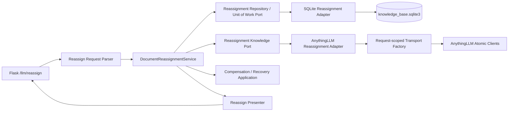

# 阶段 1E：分类节点变更同步 Saga 文件级实施设计

## 0. 文档信息

| 项目 | 内容 |
| --- | --- |
| 文档层级 | L3 文件级实施设计 |
| 文档状态 | 计划已制定，尚未实施 |
| 制定日期 | 2026-07-24 |
| 当前代码基线 | `refactor/concurrency`，基线提交 `2456351` |
| 对应接口 | `POST /llm/reassign` |
| 上位计划 | `260715-低耦合高并发任务隔离与可靠队列改造总计划.md`、`260715-其余业务分层统一改造实施计划.md`、`260716-阶段1C至11滚动实施计划.md` |
| 权威契约 | `docs/接口文档/分类节点变更.md` |
| 接口影响 | **不增删参数，不改变请求、响应字段、HTTP 状态码和同步返回语义；本计划不修改接口文档** |
| 运行约束 | 不启动 `run.py`；优先使用项目 `venv` 完成离线单元、并发和故障注入验证 |

本文只规划阶段 1E 的实现，不代表代码已经具备下述目标能力。任何实现事实必须在完成对应
子波次、通过门禁并写入 `docs/更新记录/` 后才能对外声明。

若本文与 `docs/接口文档/分类节点变更.md` 在公开行为上存在冲突，始终以接口文档为准，
立即停止实现并确认。尤其不得为了获得更“整洁”的领域类型而擅自收紧
`oldArchitectureId`、`newArchitectureId` 的现有入站兼容行为。

---

## 1. 执行结论

阶段 1E 的目标不是把 `/llm/reassign` 改造成异步任务，而是在保留同步 HTTP 契约的前提下，
把当前位于 Flask 蓝图中的跨系统过程重构为：

1. 可独立测试的 `DocumentReassignmentService`；
2. 供应商无关的 Knowledge Port 与本地 Repository/Unit of Work；
3. 写前持久化意图、写后结果探测、逐步审计和可恢复补偿；
4. 基于文档权威行和 fencing token 的同文档并发隔离；
5. `fileName + oldArchitectureId` 条件更新且 `rowcount == 1` 的本地提交点；
6. Parser → Application → Presenter 的薄路由。

1E 不建设后台 Dispatcher、RabbitMQ/Celery、Progress、Callback 或新的任务查询接口。内部
`operation_id`、步骤状态、lease 和审计信息不得进入公开响应。阶段 4～6 接入可靠队列后，
后台恢复器可以复用同一个 Recovery Application Service，但不能改变当前同步入口。

---

## 2. 当前实现基线与结构风险

### 2.1 已核实调用链

当前 `app/blueprints/llm.py::llm_reassign()` 在请求线程内直接完成以下工作：

1. 从 Flask Request 解析参数；
2. 使用 `DatabaseService.get_document_record()` 查询本地记录；
3. 在路由内创建迁移期 `AnythingLLMClient`；
4. 从旧 workspace 删除文档；
5. 查找或创建目标 workspace，并写入本地 workspace 映射；
6. 将文档加入目标 workspace；
7. 调用 `DatabaseService.update_document_architecture()` 更新本地分类；
8. 在路由内组装 JSON 响应。

该接口当前不进入 `llm_tasks.sqlite3`，不创建后台线程，不发送 Progress 或 Callback。

### 2.2 已核实问题

| 编号 | 当前事实 | 风险 |
| --- | --- | --- |
| E-C01 | 路由直接依赖 `AnythingLLMClient` 和 `DatabaseService` | Web、业务编排、供应商协议和存储事务耦合，无法独立故障测试 |
| E-C02 | `update_embeddings_batch()`、`update_embeddings()` 的 `bool` 返回值未检查 | 远端明确失败仍可能继续本地提交并返回 HTTP 200 |
| E-C03 | 目标 workspace 创建结果缺少 slug 时会被静默跳过 | 没有完成目标挂载仍可能继续本地更新 |
| E-C04 | `update_document_architecture()` 不返回或校验 `rowcount` | 0 行更新、并发失效或唯一约束异常不能形成受控业务失败 |
| E-C05 | 旧删除、新加入、本地更新之间没有持久化步骤事实 | 进程退出或连接中断后无法判断哪一步已经产生副作用 |
| E-C06 | 外部写超时后没有精确查回 | 可能把“已写入但响应丢失”误判为可安全重试 |
| E-C07 | 本地更新失败后没有反向补偿 | 文档可能已经迁移到目标 workspace，但本地仍指向旧分类 |
| E-C08 | 同一文档没有持久化执行权 | 并发 reassign 可能交错删除、加入和本地更新 |
| E-C09 | `doc_path` 为空时跳过远端迁移 | 这是现有兼容行为，必须审计但不能在 1E 中擅自改成新错误 |
| E-C10 | 缺少旧 workspace 映射时当前会跳过旧库删除 | 可能保留未知远端绑定；改变该成功/失败边界需要单独确认 |
| E-C11 | `oldArchitectureId` 的 `int(...)` 在业务异常块外执行 | 非法值产生当前未包装 HTTP 500；1E 不得擅自改成新 400 |
| E-C12 | 新旧 ID 使用原始 JSON 值比较 | `1` 与 `"1"` 不会被判定相同；该兼容怪异点已写入接口文档 |

### 2.3 当前可复用能力

1. `AnythingLLMTransport` 和原子 `AnythingLLMWorkspaceClient` 已能严格校验供应商响应。
2. `AnythingLLMWorkspaceClient.find_document()` 可按完整规范化 `doc_path` 精确探测成员关系。
3. `DatabaseService` 已有 `(architecture_id, file_name)` 唯一约束和 workspace 一对一约束。
4. Report/Weaponry 已形成任务级 Transport、写前事实、结果未知、lease/fencing、严格 Fake
   和永久架构门禁的可复用设计经验。
5. 阶段 0 已确认：远端返回 `false`、目标 workspace 创建失败、本地条件更新失败均为业务
   失败，执行补偿并返回既有 HTTP 500 `businessType + msg + data` 结构。

---

## 3. 公开契约冻结与非目标

### 3.1 必须保持的请求行为

| 场景 | 1E 行为 |
| --- | --- |
| `businessType != "reassign"` | 保持 HTTP 400 和既有 `error` 文本 |
| `params` 不是对象 | 保持 HTTP 400 `params不能为空` |
| `fileName` 不是非空字符串 | 保持既有 HTTP 400 |
| 任一 ArchitectureId 为 `null` | 保持既有 HTTP 400 |
| 新旧 ID 原始请求值相等 | 保持既有 HTTP 400 |
| `oldArchitectureId` 无法执行 `int(...)` | 保持当前未包装 HTTP 500，不擅自改成 400 |
| `newArchitectureId` 非 `null` 但不是 Long | 不在 1E 擅自增加严格校验；以接口黄金测试锁定现状 |
| `doc_path` 为空 | 跳过 AnythingLLM 迁移，仅执行本地条件更新 |
| 旧 workspace 映射缺失 | 首版保持当前“跳过旧删除”的兼容语义，同时写入结构化审计和告警 |

### 3.2 必须保持的响应行为

1. 成功仍为 HTTP 200、`businessType="reassign"`、`msg="变更成功"`、
   `data.success=true`。
2. 文档记录不存在仍为 HTTP 500，`data.message="文档记录不存在"`。
3. 防御性分类不一致仍为 HTTP 500，`data.message="分类不一致，变更失败"`。
4. AnythingLLM、本地条件更新或补偿失败均使用已经确认的 HTTP 500
   `businessType + msg + data` 结构；不新增 `operationId`、错误码、步骤或恢复字段。
5. 接口保持同步，不返回 202，不产生公开任务 ID，不接入 `/llm/check-task` 或
   `/llm/progress`。
6. 不触发文件重新解析，不触发 `/llm/weaponry`。

### 3.3 明确不在 1E 内实施

- 不修改 `docs/接口文档/分类节点变更.md`。
- 不收紧 ArchitectureId 类型、范围或规范化规则。
- 不把接口改为异步受理。
- 不新增重试次数、超时参数、幂等参数或恢复接口。
- 不迁移 MySQL/Alembic，不接入 Outbox、RabbitMQ、Celery、Redis 或 MinIO。
- 不删除 `DatabaseService` 和迁移期 `AnythingLLMClient` 的其他调用方；遗留删除归入 1G。
- 不把永久 workspace 当作当前 reassign 独占的临时资源直接删除。

### 3.4 两项实施边界

#### D0-09：上游业务等待无上限，后端技术执行必须有上限

已确认上游不设置 `/llm/reassign` 的业务级最长等待时间，接口继续同步完成或失败；这不等于
后端可以让网络请求或 Flask 请求线程无限等待。1E 必须新增独立的有限内部配置：

- `DOCSENSE_REASSIGN_HTTP_TIMEOUT_SECONDS`：单次 AnythingLLM 请求上限；
- `DOCSENSE_REASSIGN_TOTAL_TIMEOUT_SECONDS`：当前同步 Saga 的硬总预算；
- `DOCSENSE_REASSIGN_COMPENSATION_RESERVE_SECONDS`：总预算内为写后探测和反向补偿保留的窗口。

生产组合根必须拒绝空值、`None`、非有限值和非正数，不能把空
`ANYTHINGLLM_TIMEOUT` 的无超时语义带入 reassign。Application 在
`total_timeout - compensation_reserve` 到达后停止启动新的前向外部写，只在硬总预算内执行
有界探测/补偿；硬预算耗尽则持久化 `recovery_required` 并返回既有 HTTP 500 结构。

具体秒数不是接口参数，也不属于外部契约。1E 离线测试使用显式注入的有限值，首次完整集成
环境校准真实 P95/P99、最坏探测和补偿耗时，阶段 10 前冻结生产配置。

#### 操作顺序

权威接口文档当前明确描述“旧 workspace 删除 → 新 workspace 加入 → 本地条件更新”。
因此 1E 首版按该顺序实施，并通过补偿恢复旧绑定。更低不可用风险的
“先加入目标 workspace，再提交本地映射，最后删除旧绑定”不在本次授权范围；若未来采用，
必须先确认并同步修订接口文档。

---

## 4. 目标架构与依赖方向



依赖规则：

1. `domain` 不导入 Flask、SQLite、requests、AnythingLLM DTO 或 `DatabaseService`。
2. `application` 只依赖 Domain 和 Ports，不读取环境变量，不创建线程或网络 Client。
3. `ports` 只表达业务所需的文档、workspace、步骤事实、探测与补偿语义。
4. `adapters` 负责 SQLite、AnythingLLM、时钟和 UUID 等技术细节。
5. `blueprints` 只执行 Parser → Application → Presenter，不包含 Saga 分支。
6. `container.py` 是生产装配唯一入口；Factory 只保存不可变配置，不保存 HTTP Session。

### 4.1 目标目录

```text
app/
  modules/
    reassign/
      domain/
        errors.py
        models.py
        rules.py
      application/
        reassign_document.py
        recover_reassignment.py
      ports/
        knowledge.py
        repository.py
      adapters/
        anythingllm_clients.py
        anythingllm_knowledge.py
        sqlite_repository.py
      composition.py
      README.md
  adapters/
    web/
      flask/
        reassign_requests.py
  presenters/
    reassign_result.py
```

---

## 5. 领域模型与内部状态

### 5.1 核心不可变对象

| 对象 | 关键字段 | 约束 |
| --- | --- | --- |
| `ReassignDocumentCommand` | `file_name`、外部原始新旧 ID、旧 ID 查询值 | 保留 Web 入站原貌；内部 ID 不对外返回 |
| `ReassignmentDocumentSnapshot` | 本地行 ID、文件名、旧分类、`anything_doc_id`、`doc_path`、原始名 | 受理后不可变，所有 CAS 和补偿以此为依据 |
| `ReassignmentOperation` | operation ID、文档身份、源/目标分类、当前步骤、状态、lease/fencing | 内部持久事实，不属于公开任务 |
| `ReassignmentStep` | 步骤名、幂等键、写意图、状态、外部引用、错误摘要 | 每次外部写必须先持久化再发送 |
| `ReassignmentResult` | 成功/失败分类和公开 message | Presenter 决定 HTTP，不暴露内部错误细节 |

### 5.2 Operation 状态

```text
reserved
  -> running
  -> compensating
  -> compensated
  -> failed
  -> recovery_required
  -> succeeded
```

- `succeeded`：远端目标绑定和本地 CAS 均已确认，旧绑定按现有语义完成或明确跳过。
- `compensated`：业务失败，但可确认已经恢复到调用前权威状态。
- `failed`：明确失败且没有产生需恢复的副作用。
- `recovery_required`：至少一个外部或本地写结果无法确认，禁止自动宣称成功或盲目重放。
- `reserved`、`running`、`compensating` 和 `recovery_required` 都继续占用文档保护权；
  `recovery_required` 虽然没有活跃请求线程，也不能释放唯一保护后允许新 Saga 覆盖现场。
- `succeeded`、`compensated` 和无副作用的 `failed` 才释放活动保护。历史事实不可被普通请求
  覆盖；人工处置只能追加新审计事件并使用 fencing 条件更新。

### 5.3 Step 状态

```text
pending -> mutation_started -> succeeded
                            -> known_failed
                            -> outcome_unknown
                            -> compensating -> compensated
                                            -> compensation_failed
```

固定步骤名：

1. `reserve_document`
2. `detach_source_document`
3. `prepare_target_workspace`
4. `attach_target_document`
5. `commit_local_architecture`
6. `compensate_target_document`
7. `compensate_source_document`
8. `finalize_operation`

步骤幂等键由内部 `operation_id + step_name + 文档外部位置 + 源/目标分类` 计算，不使用
`fileName` 单独充当幂等键，也不作为供应商天然支持幂等的假设。它只用于本地唯一约束、
审计和重复执行识别。

---

## 6. SQLite 事实、Unit of Work 与并发控制

### 6.1 表设计

阶段 1E 使用现有 `knowledge_base.sqlite3`，只增加可回滚的表和索引，不改公开数据格式。
历史 SQLite 数据仍是开发/测试数据，不做跨环境迁移。

#### `reassign_operations`

| 字段 | 说明 |
| --- | --- |
| `operation_id` | UUID，内部主键 |
| `document_row_id` | `documents.id` 权威行身份 |
| `file_name` | 业务键快照 |
| `source_architecture_id` | `int(oldArchitectureId)` 查询值 |
| `source_architecture_raw_json` | 保留原始请求值用于审计，不参与公开输出重写 |
| `target_architecture_raw_json` | 保留原始目标值，禁止无授权规范化 |
| `anything_doc_id` / `doc_path` | 外部文档身份快照 |
| `source_workspace_slug` / `target_workspace_slug` | 已确认的外部引用 |
| `target_workspace_created` | 是否由本 operation 发起创建 |
| `status` / `current_step` | Operation 状态 |
| `lease_owner` / `lease_token` / `lease_expires_at` | 同文档执行权和 fencing |
| `error_code` / `error_detail` | 有界内部诊断，不进入公开响应 |
| `created_at` / `updated_at` / `finished_at` | UTC 时间 |

对 `reserved`、`running`、`compensating`、`recovery_required` 建立
`document_row_id` 部分唯一索引，保证同一文档最多一个未安全关闭的 Saga。不能仅按
`file_name` 加锁，因为当前数据库允许不同 architecture 中存在同名文件。

#### `reassign_steps`

以 `(operation_id, step_name)` 为主键，保存 `idempotency_key`、`state`、
`mutation_started_at`、`external_ref`、`probe_result`、`attempt_count`、`error_code` 和时间戳。
步骤更新必须校验 operation 的 `lease_token`。

#### `reassign_events`

追加式保存状态转换、外部写意图、写后探测、补偿、人工接管和最终结果。事件正文只保存
类型、计数、引用摘要和错误分类，不保存 Authorization、API Key、文档正文或完整供应商响应。

### 6.2 事务边界

1. 使用短 `BEGIN IMMEDIATE` 事务保留同文档执行权，网络 I/O 绝不位于数据库事务内。
2. 每次外部写前单独事务提交 `mutation_started`；提交失败则不发送网络请求。
3. 每次外部写后用 fencing 条件提交结果；lease 已过期时禁止旧请求继续本地写。
4. 本地分类提交与 `commit_local_architecture` 步骤成功必须处于同一事务。
5. 条件更新至少包含 `documents.id + file_name + source_architecture_id`，并复核
   `anything_doc_id/doc_path` 快照；`rowcount` 必须严格等于 1。
6. 目标分类已有同名文档、workspace 映射冲突或权威文档身份变化时，在远端写前尽量失败；
   已经产生远端副作用时进入补偿。

### 6.3 Lease 与接管

- 请求进入后取得短期 lease，并在步骤边界续期。
- lease 有效期必须大于单次供应商 HTTP timeout 与本地提交上界，避免活请求被错误接管。
- lease 过期后的接管必须先探测远端和本地权威状态，不得直接重发上一步写操作。
- 同文档并发请求未取得 lease 时返回既有 HTTP 500 业务失败结构，不新增 409 契约。
- 不同文档可并发执行；每个请求使用独立 Transport，不共享 `requests.Session`。

---

## 7. AnythingLLM Adapter 设计

### 7.1 Port 能力

`ReassignmentKnowledgePort` 只暴露以下供应商无关动作：

1. `prepare_target_workspace(...)`
2. `probe_document_membership(workspace_ref, document_ref)`
3. `detach_document(...)`
4. `attach_document(...)`
5. `pin_document_best_effort(...)`

返回值使用明确分类：

- `APPLIED`
- `ALREADY_IN_DESIRED_STATE`
- `KNOWN_FAILURE`
- `OUTCOME_UNKNOWN`

禁止用空字典、`None` 或未抛异常表示模糊成功。

### 7.2 请求级 Client Factory

- Factory 只保存 `AnythingLLMConfig` 和 Transport 构造器。
- 每次 `create()` 创建独立 `AnythingLLMTransport` 与原子 Workspace Client。
- 正常和异常路径都必须关闭 Transport；关闭失败不能覆盖更早的业务异常。
- Application 和 Domain 不接触 AnythingLLM DTO、URL、Header 或用户参数。
- 当前内部 `user_id=1` 行为保持，不新增公开参数。

### 7.3 目标 workspace 准备

1. 先查询本地 architecture → slug 映射。
2. 映射存在时，读取远端 workspace 并校验 slug 身份；远端不存在不能继续静默创建第二个。
3. 映射不存在时，先持久化创建意图，再按既有确定性名称
   `architectureId-{newArchitectureId}` 创建。
4. 创建返回必须包含有效 slug；本地 workspace 映射与步骤成功在同一事务提交。
5. 创建超时或断连时，按确定性名称查回：
   - 当前 operation 的创建意图只匹配到一个 workspace：登记后继续；
   - 未找到：按明确失败处理；
   - 多个匹配、身份冲突或查回失败：标记 `OUTCOME_UNKNOWN`，进入人工恢复。
6. 已经登记为永久 architecture workspace 后，不因本次文档迁移失败而自动删除。

### 7.4 文档成员关系

- 删除和加入都使用完整规范化 `doc_path`，不得回退到展示名、文件 basename 或模糊匹配。
- 供应商返回成功后仍执行精确成员关系探测。
- 返回 `false`、抛异常、超时或断连后，先探测再分类：
  - 目标状态已经成立：按成功收敛；
  - 明确未发生变化：按已知失败处理；
  - 无法读取或结果矛盾：`OUTCOME_UNKNOWN`，禁止盲目重试。
- 目标加入成功后保持旧 Facade 的 best-effort Pin 行为；Pin 失败记录警告，但不把已经完成的
  workspace 绑定回滚为失败。
- 现有 AnythingLLM Developer API 不支持可靠的上传后业务 metadata 更新；分类权威值仍由
  本地 `documents.architecture_id` 保存，不调用不存在的 metadata 端点。

---

## 8. 同步 Saga 成功路径

### S0：解析与契约校验

Web Parser 精确复现当前请求校验顺序和错误文本。`oldArchitectureId` 的 `int(...)` 转换时点
保持接口文档记录的现状，不在 Application 内重新解释为新 400。

### S1：保留执行权并冻结文档

1. 按 `fileName + int(oldArchitectureId)` 查询权威文档。
2. 未命中返回既有“文档记录不存在”500。
3. 复核记录中的 architecture，异常替身不一致时返回既有“分类不一致”500。
4. 在短事务中创建 operation、冻结文档身份并取得 lease/fencing。
5. 预检目标分类同名文档和 workspace 映射冲突。

### S2：从旧 workspace 删除文档

1. 旧 workspace slug 存在时，先提交删除意图，再调用删除并精确探测“不存在”。
2. 旧 workspace slug 缺失时，按现有兼容语义记录 `skipped_missing_source_mapping`，
   产生告警但不擅自改变 HTTP 成功边界。
3. 删除明确失败且文档仍在旧 workspace 时，结束为业务失败；没有后续副作用需要补偿。
4. 删除结果未知时进入 `recovery_required`，禁止继续加入目标 workspace。

### S3：准备目标 workspace

仅当 `doc_path` 非空时执行。复用或创建目标 workspace，保存有效 slug 和创建意图结果。
S1 可以在旧删除前执行本地映射冲突检查和对已有目标 workspace 的只读探测，但新 workspace
的实际创建仍位于旧删除之后，以保持接口文档记录的现有顺序。任何 `false`、无 slug、映射
冲突或无法确认的创建结果均不得进入目标文档加入或本地提交；若旧绑定已经删除，必须先
执行旧绑定恢复。

### S4：加入目标 workspace

1. 先提交加入意图，再调用加入并精确探测“存在”。
2. 加入成功后 best-effort Pin。
3. 加入明确失败时，立即尝试把文档重新加入旧 workspace。
4. 加入结果未知时先探测；仍无法确认则进入恢复，不继续本地提交。

### S5：本地条件提交

在同一 SQLite 事务中：

1. 使用冻结行身份和 `fileName + oldArchitectureId` 执行 CAS；
2. 要求 `rowcount == 1`；
3. 提交 `commit_local_architecture=succeeded`；
4. 将 operation 标记为 `succeeded` 并追加最终审计事件。

本地事务提交结果异常时重新读取权威文档：

- 已在目标分类：按提交成功恢复 operation；
- 仍在旧分类：执行远端反向补偿；
- 文档缺失、身份变化或落在第三分类：标记 `recovery_required`。

### S6：Presenter 返回

Presenter 只根据 Application 的公开结果分类返回既有 200/400/500 JSON。任何内部
operation ID、lease token、步骤名、探测结果或内部 error code 都不得进入响应。

---

## 9. 补偿与恢复策略

### 9.1 失败点矩阵

| 失败点 | 已产生事实 | 补偿动作 | 无法补偿时 |
| --- | --- | --- | --- |
| 目标 workspace 准备失败 | 旧绑定可能已删除，也可能存在新 workspace | 查回并登记永久 workspace；重新加入旧 workspace，不盲删永久 workspace | 任一现场无法确认时 `recovery_required` |
| 旧删除明确失败 | 旧绑定仍在 | 无需反向写；结束失败 | 记录失败审计 |
| 旧删除结果未知 | 旧绑定不确定 | 只探测，不继续新加入 | `recovery_required` |
| 新加入明确失败 | 旧绑定可能已删除 | 重新加入旧 workspace并验证 | 补偿失败并保留现场 |
| 新加入结果未知 | 新旧绑定不确定 | 探测两侧后决定恢复方向 | `recovery_required` |
| 本地 CAS 为 0 或冲突 | 新绑定已确认，旧绑定已删除或跳过 | 删除目标绑定，再恢复旧绑定并验证 | `recovery_required` |
| 本地提交结果未知 | 远端迁移已完成 | 读取本地权威行后决定成功或补偿 | 状态矛盾则人工恢复 |
| 响应序列化/连接断开 | operation 可能已成功 | 不回滚已确认成功事实 | 后续请求按权威记录处理 |

### 9.2 补偿顺序

本地提交前发生失败时：

1. 若目标绑定已确认存在，先删除目标绑定并验证；
2. 若旧绑定曾确认删除，重新加入旧 workspace 并验证；
3. 两侧恢复到调用前状态后标记 `compensated`；
4. 任一步未知或失败，标记 `recovery_required`，不继续盲写。

已经确认本地提交成功后，普通异常处理不得直接把 operation 回退为旧状态。只有明确执行
受 fencing 保护的反向本地 CAS，并完成对应远端恢复后，才能记录人工补偿成功。

### 9.3 恢复入口

1. 新增内部 `RecoverReassignmentOperation` Application Service，与同步主用例共享同一
   Repository、Knowledge Port、探测规则和 fencing。
2. 同一业务请求遇到匹配的过期 operation 时，可以在当前请求内先执行有界探测和恢复；
   不得对已 `succeeded` 的历史 operation 直接返回缓存成功。
3. 提供只读审计命令和显式人工恢复脚本，默认 dry-run；写操作要求精确 operation ID、
   预期 fencing token、操作者和原因，并追加审计。
4. 1E 不启动后台恢复线程。阶段 4～6 的队列 Worker 未来只调用同一个 Recovery Service。
5. 恢复工具不得启动 `run.py`，不得扫描或修改无关 workspace。

---

## 10. HTTP 失败映射

| 内部结果 | HTTP | 公开结构 |
| --- | --- | --- |
| 参数错误 | 400 | 保持既有 `{"error": "..."}` |
| 文档记录不存在 | 500 | 既有 `businessType + msg + data`，message 不变 |
| 防御性分类不一致 | 500 | 既有结构，message 不变 |
| 同文档已有活动 Saga | 500 | 既有业务失败结构，不新增 409 |
| 远端 `false`、明确拒绝或目标引用缺失 | 500 | 既有业务失败结构 |
| 本地 CAS `rowcount != 1` | 500 | 既有业务失败结构 |
| 补偿完成 | 500 | 请求仍失败，不因补偿成功改成 200 |
| 补偿失败或 outcome unknown | 500 | 既有结构；内部恢复信息只进入日志和审计 |
| 全部步骤确认成功 | 200 | 既有成功结构 |

内部异常不得把 API Key、Authorization、供应商原始正文、数据库路径、operation ID 或堆栈
写入 `data.message`。日志可记录内部错误类型和有界错误码，公开 message 使用兼容文本。

---

## 11. 文件级改造清单

| 文件 | 计划改动 | 子波次 |
| --- | --- | --- |
| `app/modules/reassign/domain/models.py` | 不可变 Command、Snapshot、Operation、Step、Result | 1E-1 |
| `app/modules/reassign/domain/errors.py` | 契约、并发、外部结果未知、补偿和恢复错误 | 1E-1 |
| `app/modules/reassign/domain/rules.py` | 纯状态转换、补偿决策和允许转换规则 | 1E-1 |
| `app/modules/reassign/ports/repository.py` | 文档快照、Operation、步骤、UoW、lease/fencing Port | 1E-2 |
| `app/modules/reassign/ports/knowledge.py` | workspace、成员探测、加入、删除和 Pin Port | 1E-2 |
| `app/modules/reassign/application/reassign_document.py` | 同步 Saga 主用例 | 1E-3～1E-5 |
| `app/modules/reassign/application/recover_reassignment.py` | 探测、补偿、过期 lease 接管和人工恢复用例 | 1E-5 |
| `app/modules/reassign/adapters/sqlite_repository.py` | 三张表、短事务、CAS、部分唯一索引、审计 | 1E-2/1E-4 |
| `app/modules/reassign/adapters/anythingllm_clients.py` | 请求级 Transport 与原子 Client 工厂 | 1E-3 |
| `app/modules/reassign/adapters/anythingllm_knowledge.py` | 目标准备、精确成员探测、外部写与结果分类 | 1E-3/1E-5 |
| `app/modules/reassign/adapters/infrastructure_config.py` | 有限 HTTP/总预算/补偿预留配置及 fail-fast 校验 | 1E-3 |
| `app/modules/reassign/composition.py` | 严格 Fake/生产组合，验证依赖为同一实例 | 1E-2/1E-6 |
| `app/adapters/web/flask/reassign_requests.py` | 保持现有校验顺序和怪异兼容点的请求解析 | 1E-0/1E-6 |
| `app/presenters/reassign_result.py` | 固定 200/400/500 结构，不泄露内部 ID | 1E-0/1E-6 |
| `app/container.py` | 装配 `ReassignApplicationServices`，不保存网络 Session | 1E-6 |
| `app/blueprints/llm.py` | 删除路由内 Saga，只保留 Parser/Application/Presenter | 1E-6 |
| `app/services/core/database.py` | 旧 `update_document_architecture()` 暂保留兼容，1G 再按引用清单删除 | 1E-6/1G |
| `scripts/inspect_reassign_operations.py` | 只读审计与显式 dry-run 恢复入口 | 1E-5 |
| `tests/fakes/reassign.py` | 严格 Repository/Knowledge Fake 和故障注入器 | 1E-1～1E-5 |

---

## 12. 子波次实施顺序

### 1E-0：契约与故障资产

交付：

- 建立 `/llm/reassign` 当前/已批准目标双基线；
- 固化 400、500、200 JSON 黄金样例；
- 固化原始 ID 比较、旧 ID 转换失败、新 ID 非严格校验、空 `doc_path`、缺少旧 workspace
  映射等现状；
- 建立外部 `false`、无 slug、CAS 0 行和补偿失败目标样例。

门禁：

- 不修改接口文档；
- 测试明确区分当前未实现目标，不能让 Fake 默认 truthy 掩盖 `false`；
- D0-09 的业务口径已经确认；离线测试必须使用有限注入值，但不能把假延迟当作生产秒数，
  具体配置仍由集成环境校准。

### 1E-1：Domain 与纯规则

交付：

- 四层模块骨架；
- 不可变 DTO、状态机、错误分类、补偿决策；
- 领域测试覆盖全部合法/非法状态转换。

门禁：

- Domain/Application 无 Flask、SQLite、AnythingLLM、requests 导入；
- 不在领域层重新解释公开 ArchitectureId。

### 1E-2：Ports、严格 Fake 与 SQLite 事实

交付：

- Repository、UoW、Knowledge Port；
- Operation/Step/Event Schema；
- 原子保留执行权、CAS、lease/fencing、审计；
- 严格 Fake 对未声明调用、错误顺序和重复副作用 fail fast。

门禁：

- 50 个同文档并发只允许一个活动 owner；
- 不同 architecture 的同名文件互不串扰；
- 网络 I/O 不在 SQLite 事务中；
- 本地 CAS 与步骤提交同事务回滚。

### 1E-3：AnythingLLM Adapter 与目标准备

交付：

- 请求级 Client Factory；
- 严格有限的 HTTP/总预算/补偿预留配置和单调时钟 deadline；
- 本地映射复用、创建意图、目标 workspace 查回；
- 旧删除、新加入、Pin 和精确成员探测；
- 外部异常/`false`/超时/协议错误的强类型分类。

门禁：

- 每个请求 Transport 独立并可靠关闭；
- `None`、NaN、Infinity、非正数和无法预留补偿窗口的预算配置必须在启动时失败；
- 返回 `false` 或缺少 slug 绝不进入目标文档加入或本地提交；旧绑定已删除时必须补偿；
- outcome unknown 只探测，不盲重发；
- 不调用真实生产 workspace；离线 Fake 覆盖完整协议。

### 1E-4：本地 CAS 与成功路径

交付：

- `DocumentReassignmentService` 正常路径；
- 文档快照、步骤检查点和 `rowcount == 1` 提交；
- 空 `doc_path` 兼容路径；
- 成功结果 Presenter 模型。

门禁：

- 本地行变化、目标同名冲突和 workspace 冲突不会返回成功；
- 成功 operation 的远端与本地权威状态一致；
- 内部 ID 不进入 Presenter。

### 1E-5：补偿、恢复和并发故障

交付：

- 每个崩溃窗口的写后探测；
- 目标解绑、旧绑定恢复、补偿失败隔离；
- 过期 lease 接管、人工恢复审计、只读诊断脚本；
- 同键/不同键并发和慢 I/O 隔离。

门禁：

- 每个外部写后的“调用完成但本地检查点未提交”均有测试；
- 补偿失败不伪装成功；
- 人工操作必须携带预期 token、操作者和原因；
- 无后台线程、无内存恢复队列。

### 1E-6：组合根、路由切换与关闭验收

交付：

- 生产 `ReassignApplicationServices` 装配；
- `/llm/reassign` 切换为薄路由；
- 删除蓝图中的 `AnythingLLMClient` 构造和数据库编排；
- README、模块 README、更新记录和永久 AST 门禁；
- 扩大离线回归与回滚说明。

门禁：

- 公开请求/响应黄金样例逐字节等价于权威契约和已批准目标；
- 路由不创建线程、不创建网络 Client、不直接执行 SQL；
- `rg`/AST 证明蓝图不再引用 `AnythingLLMClient`、
  `update_document_architecture`、`update_embeddings*`；
- 全量安全测试通过；
- 未完成有限 HTTP/总预算/补偿预留的真实校准和故障证明前，不声明 production ready。

---

## 13. 测试与验收矩阵

### 13.1 契约测试

- 所有既有参数错误文本和状态码；
- 文档不存在、分类不一致、成功响应完整 JSON；
- 外部 `false`、无 slug、本地 CAS 失败进入既有 500；
- 原始 `1` 与 `"1"` 比较、旧 ID 转换失败、新 ID 非严格校验等历史兼容；
- `doc_path` 为空和旧 workspace 映射缺失；
- 无内部 operation/lease/step 字段泄漏。

### 13.2 Domain/Application

- 每个 Operation/Step 合法和非法状态转换；
- 所有补偿决策；
- 成功、明确失败、结果未知、stale fencing；
- Fake 返回错误类型、错误顺序、重复结果时 fail fast。

### 13.3 SQLite

- 表初始化幂等；
- 50 同文档并发唯一 owner；
- 50 不同文档可独立保留；
- 同名跨 architecture 不串行到错误记录；
- CAS 0/1/冲突；
- 本地提交与步骤原子回滚；
- lease 续期、过期接管、旧 token 写入拒绝；
- append-only 审计顺序和并发序号唯一。

### 13.4 AnythingLLM Adapter

- HTTP/总预算/补偿预留配置拒绝 `None`、NaN、Infinity、非正数和不可能的组合；
- 使用可控单调时钟验证前向截止、补偿截止和剩余预算裁剪；
- 目标映射复用、创建、缺失 slug、创建超时后单一查回、多重冲突；
- 删除/加入成功后成员探测；
- `false`、HTTP 错误、协议错误、超时、断连；
- 写已发生但响应丢失；
- Transport 正常/异常关闭；
- 精确 `doc_path` 匹配，不使用 basename 或展示名。

### 13.5 补偿和崩溃窗口

在每个以下边界注入进程退出等价故障：

1. 旧删除意图提交后、HTTP 前；
2. 旧删除后、步骤提交前；
3. workspace 创建意图提交后、HTTP 前；
4. workspace 创建后、本地 slug 提交前；
5. 新加入后、步骤提交前；
6. 本地 CAS 提交时连接异常；
7. 目标补偿删除后、检查点前；
8. 旧绑定恢复后、检查点前。

每个场景必须证明：可以确定成功、确定恢复，或保守进入 `recovery_required`；不能出现
无事实的自动重放。

### 13.6 静态与扩大回归

建议离线命令：

```powershell
.\venv\Scripts\python.exe -m unittest `
  tests.test_reassign_contract `
  tests.test_reassign_domain `
  tests.test_reassign_application `
  tests.test_reassign_sqlite_adapter `
  tests.test_reassign_anythingllm_adapter `
  tests.test_reassign_recovery `
  tests.test_routes `
  tests.test_dependency_container `
  tests.test_architecture_boundaries

.\venv\Scripts\python.exe -m unittest discover -s tests

git diff --check
```

真实 AnythingLLM 验证只能使用随机命名的隔离测试 workspace 和测试文档，结束后按审计清单
补偿清理；不得修改现有 workspace 或文档。若环境依赖后台服务，不由本阶段启动 `run.py`。

---

## 14. 日志、指标与安全

### 14.1 结构化日志

关键日志包含：

- `operation_id`（仅内部日志）
- 文档业务键的安全摘要
- source/target architecture
- step、state、attempt
- lease owner/fencing token
- 外部调用耗时、探测结果、补偿结果

常规探测和空扫描使用 `DEBUG`；明确业务失败使用 `WARNING`；持久化损坏、补偿失败和状态矛盾
使用 `ERROR`。禁止记录 API Key、Authorization、文档正文、完整供应商响应和敏感路径。

### 14.2 指标

- `reassign_requests_total{outcome}`
- `reassign_step_duration_seconds{step,outcome}`
- `reassign_active_operations`
- `reassign_compensations_total{outcome}`
- `reassign_outcome_unknown_total{step}`
- `reassign_recovery_required`
- `reassign_lease_conflicts_total`
- `reassign_total_duration_seconds`

阶段 1E 可以先通过内部诊断快照暴露计数，不新增甲方 HTTP 接口。阶段 7 再接统一跨实例
观测体系。

---

## 15. 发布、回滚与后续阶段

### 15.1 发布

1. 1E-0～1E-5 期间新模块不得承接公开流量。
2. 1E-6 一次性切换生产组合根和薄路由，不长期维护双写/双编排路径。
3. 新增 SQLite 表为加法迁移；切换前备份开发数据库并验证初始化幂等。
4. 未完成内部预算真实校准、隔离供应商验证和恢复演练时，只能声明开发分支代码完成。

### 15.2 回滚

- Web 路由可回退到切换前提交，但回滚前必须检查是否存在 active、
  `outcome_unknown` 或 `recovery_required` operation。
- 存在未终结 operation 时禁止直接让遗留路由继续写同一文档，必须先探测和恢复。
- 新增表不自动删除；它们保留审计现场。删除 Schema 需另行迁移计划。
- 不通过“清空表”或“删除 workspace”伪造回滚。

### 15.3 后续衔接

- 1G：删除路由遗留引用、无调用的 `update_document_architecture()` 和旧测试 patch。
- 阶段 3：将 Operation/Step/Event 与文档 CAS Repository 迁移到 MySQL/SQLAlchemy/Alembic。
- 阶段 4～6：Outbox/队列只负责唤醒恢复，仍复用同一 Saga/Recovery Service。
- 阶段 8：FastAPI 通过受控线程池调用同步 Application Service，公开契约不变。
- 阶段 10：校准有限 HTTP/总预算/补偿预留的生产秒数，并补齐 P95/P99、50 并发和故障
  恢复容量门禁。

---

## 16. 必须停止并确认的条件

出现以下任一情况，停止代码实现并向负责人确认：

1. 实现需要取消有限单次 HTTP 超时、硬总预算或补偿预留窗口才能完成；
2. 需要把接口改为 202、增加任务 ID、查询接口或新参数；
3. 需要改变 ArchitectureId 当前校验、类型或规范化行为；
4. 希望改成“先目标加入、后旧库删除”的新操作顺序；
5. 希望把“旧 workspace 映射缺失”从当前兼容成功改为业务失败；
6. AnythingLLM 无法按精确 `doc_path` 探测成员关系；
7. 供应商写结果未知且没有安全查回方式；
8. 补偿要求删除无法证明为当前 operation 独占的永久 workspace；
9. 需要新增或修改接口文档中的响应字段、错误结构或状态码。

---

## 17. 阶段 1E 完成定义

只有同时满足以下条件，1E 才能在开发分支关闭：

- `/llm/reassign` 公开契约和已批准失败判定全部通过黄金测试；
- 路由已变为 Parser → Application → Presenter，不再直连数据库或 AnythingLLM；
- 每次外部写都有持久化意图、严格结果或写后探测；
- 本地分类提交为 `fileName + oldArchitectureId` 条件 CAS，`rowcount == 1`；
- 同文档并发只有一个 owner，不同文档互不共享 Transport 或可变状态；
- 所有失败点可确认无副作用、完成补偿或进入可审计 `recovery_required`；
- 补偿失败、结果未知和人工恢复均有 fencing 与追加审计；
- 没有新增后台线程、内存队列或公开内部 ID；
- 定向测试、架构门禁和全量安全回归通过；
- 更新记录明确区分“开发分支完成”“真实供应商已验证”和“生产 ready”；
- D0-09 的业务决策已经关闭；有限技术预算的具体生产秒数若尚未完成真实校准，继续作为
  阶段 10 生产启用硬门禁，不得把“上游业务等待无上限”描述成“后端可无限阻塞”。
