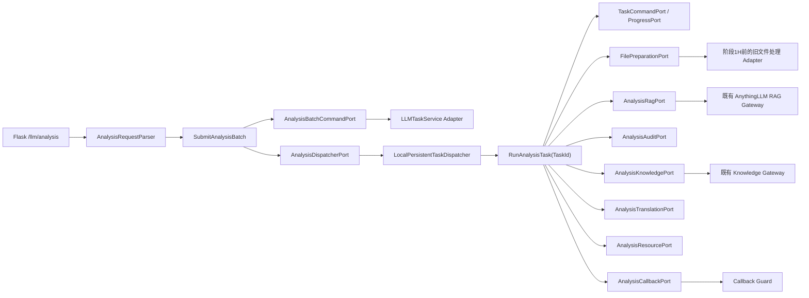

# 阶段 1F 文件分析高内聚收口文件级实施设计

> - 文档状态：1F-0、1F-1、1F-2、1F-3、1F-3R、1F-3S、1F-4、全面审查修复、1F-6、1F-7A、1F-5A、1F-5B 及 1F-7B 的代码/离线验收已完成；真实目标库的 1F-5B 发布仍待负责人确认并通过只读门禁
> - 制订日期：2026-07-26
> - 基线分支：`main`
> - 基线提交：`a6c1332`（PR #79 已合并）
> - 前置条件：阶段 0～1E 主线集成完成；项目虚拟环境 `venv/` 已部署
> - 公开契约唯一权威：`docs/接口文档/`
> - 本阶段性质：内部架构重构，不增删任何前后端接口参数；2026-07-27 经确认仅同步 GJB 兜底语义文案

## 1. 结论摘要

阶段 1F 不重写文件分析算法，也不改变分类、抽取、翻译、回调或 Progress 的公开语义。它要完成的是：

1. 把当前集中在 `app/services/llm_service/analysis_service.py` 和公开路由中的文件分析职责，
   收口为 `app/modules/analysis/` 垂直业务切片。
2. 把路由中的校验、SQLite 受理、Progress 发布和 `threading.Thread` 调度拆开，使公开路由只负责
   `Parser -> SubmitAnalysisBatch -> Presenter`。
3. 每个文件形成一条不可变 execution 事实；Worker 只接收内部 `TaskId`，执行时重新加载输入快照，
   使用独立任务目录、任务级 RAG/资源/回调上下文，不再持有 Flask 请求对象或可变请求字典。
4. 保留一个请求内最多 32 个文件的原子受理与顺序执行语义；用 SQLite 持久积压、全局
   `dispatch_sequence` 和单执行 Analysis Worker 代替“一个请求一个后台线程”。
5. 复用现有 `llm_task_executions`、`llm_tasks` 最新投影、Callback Guard、通用
   `LocalPersistentTaskDispatcher`、共享 FIFO `UploadTaskLimiter` 和 AnythingLLM Gateway，
   不创建第二套任务事实或供应商协议实现。
6. 把 Analysis 的 RAG、永久知识库、交互审计、翻译、资源恢复和回调定义为业务 Port；
   对外部副作用结果不确定时一律保留现场并进入人工恢复，禁止盲目补偿。
7. 当前运行模式仍明确为 SQLite `single_instance`。1F 不宣称已经实现可靠消息队列、多实例、
   `running` 任务自动接管、生产 50 个重任务并行或数据库最终一致性。

1F 的推荐实际执行顺序是：

```text
1F-0 -> 1F-1 -> 1F-2 -> 1F-3 -> 1F-3R -> 1F-3S -> 1F-4 -> 审查修复
     -> 1F-6 -> 1F-7A -> 1F-5A -> 1F-5B -> 1F-7B
```

其中 `1F-5B` 才允许切换公开 `/llm/analysis` 与 file 类型 `/llm/check-task` 生产接线。
编号保留滚动计划原有责任划分；把资源、回调闭环前置，是为了避免先切路由再补偿安全边界。

## 2. 目标、非目标与完成口径

### 2.1 必须完成

- 建立 Analysis 的 `domain/application/ports/adapters/composition` 四层结构。
- 抽离并保持现有范围默认值、领域树校验、召回、分类、身份重选、结果映射和 Prompt 规则。
- 建立不可变 `AnalysisTaskInputV1` Codec，保留完整请求语义和未知扩展字段。
- 建立批量原子受理 Command；同一请求任一文件冲突或持久化失败时整批不受理。
- 建立只接收 `TaskId` 的 `RunAnalysisTask`，按当前顺序编排所有阶段。
- 建立有界唤醒、SQLite 持久扫描、单执行 Worker 和跨进程单实例锁。
- 移除公开路由对 `threading.Thread`、`task_service`、`progress_hub`、RAG/Knowledge Factory 的直接依赖。
- Progress、终态、结果和回调全部使用 expected `TaskId` 条件写，旧 Worker 不能污染新任务。
- file 回调复用 latest-wins Callback Guard，并由 `/llm/check-task` 同步触发恢复。
- 为新 Analysis execution 建立独立资源恢复事实，明确临时文档、永久文档和结果未知时的所有权。
- 建立永久 AST/依赖/配置门禁、50 并发隔离用例、故障注入矩阵和安全全仓回归口径。
- 新运行链不得再引用 `analysis_service.py` 的旧执行入口；兼容实现及其删除清单保留到 1G 在引用清零后统一物理删除。

### 2.2 明确不做

- 不修改 `/llm/analysis`、`/llm/check-task`、Progress、回调的路由、参数、字段、Header 或状态码。
- 不调整分类模式、候选集算法、Prompt 内容、最大模型调用次数、字段默认值和宽松降级规则。
- 不重写 MHTML、MinerU、OCR、Office、PDF 或 Translator 的文档转换实现；这些属于阶段 1H。
- 不迁移到 MySQL，不引入 RabbitMQ、Redis、Kafka、Celery 或 Outbox 消费链。
- 不实现多实例 Worker 竞争、Task Attempt、heartbeat、Reaper 或运行中任务自动重放。
- 不启动 `run.py`，不在本阶段计划制订或离线验收中连接真实后台服务。
- 不删除旧兼容模块；物理删除由 1G 在引用清零后执行。

### 2.3 完成定义

必须同时满足以下条件，才可将 1F 标记为关闭：

1. 公开契约黄金测试逐字节通过，接口文档未被擅自修改。
2. 新路由不存在后台线程、直接数据库、直接 Hub、直接供应商 Gateway 调用。
3. 新 Worker 只接收 `TaskId`，且 50 个任务不存在输入、目录、Progress、资源、翻译或回调串扰。
4. 批量受理具备整批事务原子性和稳定顺序，唤醒失败不丢失已受理任务。
5. Callback outcome unknown 和永久知识库/清理 outcome unknown 均 fail closed。
6. 旧文件分析执行函数在生产运行链中的引用为零，兼容导出只服务旧测试或过渡调用。
7. 容器启动、就绪、停止、部分启动回滚和显式 Fake 注入全部通过。
8. 定向回归、安全全仓回归和迁移/回退演练均通过，并报告发现、排除、执行和失败数量。
9. 文档明确标注当前仍是 SQLite 单实例过渡实现，不使用“可靠队列已完成”或
   “多实例 ready”等超出证据的表述。

## 3. 开工时实现基线与主要风险（历史）

本节记录 1F-0 开工前的基线和风险，不代表 1F-7B 后的当前运行链；最新关闭状态、引用盘点和生产边界见第 15.11 节。

| 位置 | 开工时事实 | 1F 风险 |
| --- | --- | --- |
| `app/blueprints/llm.py` | `/llm/analysis` 同时做请求读取、限制校验、领域树校验、旧任务预查、原子受理、Progress 发布和 daemon Thread 创建 | 路由与业务、数据库、并发模型强耦合；进程退出后内存线程不可恢复 |
| `app/services/llm_service/analysis_service.py` | 约 5,900 行，混合纯规则、Prompt、文件处理、RAG、审计、知识入库、翻译、任务状态、回调和批处理 | 无法独立测试边界；任何局部修改都可能影响完整链路 |
| `run_file_analysis_task` | 接收请求参数和多项基础设施依赖，而不是只接收 `TaskId` | 请求快照、执行身份和依赖生命周期都可能跨任务泄漏 |
| `run_file_analysis_batch_task` | 在一个路由创建的后台线程中顺序循环多个文件 | 受理事实与内存执行绑定；无法靠持久积压恢复 accepted 任务 |
| `LLMTaskService.create_file_tasks_if_available` | 能整批操作 `llm_tasks`，但未为 file 建立完整 `llm_task_executions` 事实 | file 与 report/weaponry 的统一任务模型断裂 |
| `llm_task_executions` | 已具备不可变输入、全局调度序号、accepted/running/terminal 状态和调度退避字段 | 1F 应复用而不是新增平行任务表 |
| `callback_delivery_guards` | 已具备 sending、outcome_unknown、lease token/version 和人工解除审计 | file 旧回调尚未统一走这条闭环 |
| `RagResourceLeaseService` | 能持久保存 RAG 引用和审计状态，但资源所有权、清理 outcome、CAS 和有界恢复不足 | 不能直接把开放租约当作“可安全自动重试” |
| `get_translation_service()` | 返回全局单例；1F-2 已移除可变任务 callback，并在服务内对真实翻译调用加进程内串行锁 | 单实例内避免共享 MinerU 输出目录和 Translator 调用交错；仍不是多实例锁、可靠队列或吞吐证明 |
| `services/core/prompts.py` | Analysis Prompt 构造反向导入 `analysis_service.build_effective_analysis_ranges` | 出现跨层反向依赖和潜在循环导入 |
| `app/container.py` | 已组合 report、weaponry 的 Dispatcher 和共享 limiter，但 Analysis 仍暴露旧 Factory | Analysis 未进入统一生命周期、readiness 和停止回滚 |
| `tests/architecture/import_rules.py` | 已限制模块 domain/application/ports 依赖方向 | Analysis 新模块必须使用本地 Port，不得从 Application 直接导入 `app.ports` 或供应商实现 |

### 3.1 开工时已验证的离线基线

2026-07-26 使用仓库 `venv/Scripts/python.exe`、未启动 `run.py`，得到：

- Analysis 纯规则、Prompt、领域树、召回、双阶段、范围保护、身份重选、配置：259 项通过。
- 路由、容器、TaskService、RAG/Knowledge Gateway、架构门禁和阶段 0 契约：201 项通过。
- 合计 460 项通过，0 失败、0 错误。

上述结果只是 1F 开工前的离线回归基线，不是生产环境、真实供应商或多实例能力证明。

## 4. 不可改变的公开契约

实施前由 1F-0 把下表固化为黄金资产。代码观测若与接口文档不一致，应立即停止并确认，
不得自行选择“兼容代码”或“修正文档”。

| 契约面 | 1F 固定要求 |
| --- | --- |
| 路由 | 保持 `POST /llm/analysis` 和既有 file 类型 `/llm/check-task` |
| 业务类型 | `businessType=file` |
| 请求大小 | 保持当前 64 MiB 请求体限制和 413 行为 |
| 批量上限 | `params` 最多 32 项；同一请求按原顺序串行处理 |
| 整批校验 | 任一参数、`fileName`、`filePath` 或领域树无效，返回既有 400，且不创建任何任务 |
| 业务键 | `fileName` 是公开任务键；analysis 受理仍按既有规则校验，file check-task 请求内重复键稳定合并为首次出现项 |
| 领域树 | 保持 10,000 节点、最大深度 128、ID/重复/文本等既有限制 |
| 分类与抽取 | 保持当前模式默认值、候选上限、Prompt 32,000 字符、每阶段最多 2 次、单文件最多 4 次模型调用 |
| 冲突 | 同 `fileName` 活动任务、callback sending/outcome unknown 等按既有规则返回 409 |
| 数据库繁忙 | 保持当前已定义的 503 及响应内容 |
| 成功受理 | 严格空响应体，HTTP 202；不向前端暴露 TaskId、batchId、lease 或 execution 状态 |
| Progress | 仍以 `fileName` 为公开身份，状态、消息、结果和事件形状保持不变 |
| 回调 | URL、请求体、成功判定和 latest-wins 不变；outcome unknown 后台继续冻结，新的 file check-task 可明确按至少一次语义补发 |
| check-task | file 查询时同步尝试既有回调恢复；请求内重复键只处理一次，恢复成功保持严格空 200 |

### 4.1 接口文档门禁

本计划不修改 `docs/接口文档/`。实施中若出现以下任一情况，必须停止并向负责人确认：

- 需要修改接口文档中的实现状态说明。
- 需要修改错误文本、状态码、空响应体、回调体或 Progress 事件。
- 需要增加、删除、改名、改变类型或改变必填性的任何请求/响应参数。
- 代码现状与接口文档存在无法通过内部适配消除的冲突。

其中最后一类也不得通过新增“内部可选前端参数”绕过；增删接口参数在任何情况下均不属于 1F。

## 5. 目标架构

### 5.1 依赖方向



硬规则如下：

- Domain 只依赖 Python 标准库和 Analysis Domain。
- Ports 只依赖 Analysis Domain/Ports 及已批准的通用 Task Domain/Ports。
- Application 只依赖 Analysis Domain/Ports/Application 和通用 Task 契约。
- Adapters 可以依赖 Flask、SQLite、文件系统、Translator、AnythingLLM Gateway 和旧兼容服务。
- Composition 是唯一允许把实现注入 Application 的位置。
- `app/integrations/anythingllm/` 继续拥有供应商 HTTP/协议；Analysis Adapter 只翻译业务语义，
  不复制 URL、请求结构、错误码或 Session 管理。

### 5.2 目标目录

```text
app/modules/analysis/
├── README.md
├── domain/
│   ├── models.py
│   ├── errors.py
│   ├── ranges.py
│   ├── architecture_tree.py
│   ├── architecture_recall.py
│   ├── classification_rules.py
│   ├── result_mapping.py
│   ├── prompts.py
│   └── callback_payloads.py
├── ports/
│   ├── batch_commands.py
│   ├── files.py
│   ├── rag.py
│   ├── knowledge.py
│   ├── audit.py
│   ├── translation.py
│   ├── resources.py
│   ├── callbacks.py
│   └── dispatcher.py
├── application/
│   ├── submit_analysis.py
│   ├── run_analysis.py
│   ├── ordered_batch.py
│   ├── recover_callback.py
│   └── recover_resources.py
├── adapters/
│   ├── task_codec.py
│   ├── task_commands.py
│   ├── file_preparation.py
│   ├── anythingllm_rag.py
│   ├── knowledge_index.py
│   ├── interaction_audit.py
│   ├── translation.py
│   ├── resource_store.py
│   ├── callback_guard.py
│   ├── local_dispatcher.py
│   └── infrastructure_config.py
└── composition.py

app/adapters/web/flask/
├── analysis_requests.py
└── analysis_submission.py
```

文件可以在波次内按单一职责合并或拆分，但不得破坏上述层级方向。若实现发现一个文件必须同时
导入 Flask、SQLite 和 AnythingLLM，说明边界仍未收口，应暂停重新设计。

## 6. 内部领域模型与任务快照

### 6.1 `AnalysisTaskInputV1`

每个文件形成一个不可变任务输入，至少包含：

- `schema_version=1`
- `batch_id`：内部 128 位随机身份，不对外暴露
- `batch_sequence`：从 1 开始的请求内顺序
- `file_name`：公开业务键的原始语义值
- `original_file_name`：保留缺失、空值和显式值之间的既有行为
- `file_path`
- `raw_params`：对该 `params` 项做 JSON 安全的深冻结快照，保留未知扩展字段
- `effective_ranges`：当前默认范围规则计算后的不可变快照
- `policy_snapshot`：分类模式、范围保护、数据标准、身份重选、模型调用预算等内部策略
- `accepted_at` 与内部 trace 信息

禁止把 Flask Request、可变 dict/list、Factory、数据库连接、线程对象或回调函数放入快照。

### 6.2 Codec 规则

- 编码前深复制并验证 JSON 可序列化；禁止用 `repr()` 或 pickle。
- JSON 使用稳定键序和明确 Schema Version，便于未来 MySQL/消息队列迁移及取证。
- 解码遇到未知 Schema、缺少必要字段、业务键不一致或非法顺序时，任务失败并记录内部错误；
  不尝试猜测或静默修补。
- `raw_params` 保持语义等价，不为了“类型更整洁”而丢弃未知字段、空值或原始顺序。
- 日志只记录 `task_id`、`batch_id`、序号、阶段和字符数；不记录完整文件 URL、请求体、
  Prompt、模型响应、API Key 或文件正文。

### 6.3 领域纯函数迁移原则

- 先为旧实现建立输入/输出黄金，再移动实现，禁止边迁移边优化算法。
- `build_effective_analysis_ranges`、领域树校验、分类/范围保护、身份重选、结果映射和
  Analysis Prompt 构造从新 Domain 单向导出。
- `services/core/prompts.py` 和旧 Analysis/Architecture 模块暂时反向兼容导出新实现；
  新模块禁止再导入旧 `analysis_service.py`。
- 完成后通过 AST 检查 Domain 中不存在 `flask/sqlite3/requests/fitz/app.services/app.integrations`
  等 I/O 依赖。

## 7. 批量原子受理与数据库设计

### 7.1 单一事实源

- `llm_task_executions`：每次文件执行的不可变事实和执行状态。
- `llm_tasks`：按 `(business_type='file', business_key=fileName)` 保存最新公开投影。
- `callback_delivery_guards`：按 fileName 保存回调投递互斥和 unknown 冻结。
- 不新增 `analysis_tasks` 或第二份最新状态表。

### 7.2 追加式 Schema

在 `llm_task_executions` 只增不删地增加可空列：

```text
batch_id          TEXT
batch_sequence    INTEGER
```

并增加：

```text
UNIQUE INDEX (business_type, batch_id, batch_sequence)
WHERE business_type = 'file' AND batch_id IS NOT NULL
```

约束由 Adapter 双重保证：

- 上述索引只约束 `business_type='file' AND batch_id IS NOT NULL` 的新行，避免影响历史业务。
- Analysis 新 execution 必须同时具备非空 `batch_id` 和 `batch_sequence >= 1`。
- 同一 `batch_id` 的序号唯一、连续，并与受理列表顺序一致。
- report/weaponry 历史行允许保持空值，不执行破坏性回填。

若 SQLite 需要重建表才能表达新的 CHECK/UNIQUE 约束，本波次不直接重建生产表，而使用追加索引、
事务内校验和测试门禁；正式强约束随阶段 3 的 Repository/Schema 迁移落地。

### 7.3 `create_analysis_batch_if_allowed`

新增 Analysis 专用批量 Command Adapter，底层由 `LLMTaskService` 在一个 `BEGIN IMMEDIATE`
事务中完成：

1. 事务外完成请求体、全部 `params`、重复 fileName、领域树和 Codec 校验。
2. 进入写事务后重新检查每个 fileName 的活动 projection 和 Callback Guard。
3. 任一文件为活动状态、sending 或 outcome_unknown，整批返回既有 409，不插入任何 execution。
4. 在同一事务中分配一个 `batch_id` 和连续的全局 `dispatch_sequence`。
5. 为每个文件插入 `llm_task_executions(execution_state='accepted')`。
6. 更新 `llm_tasks` 最新投影：请求内首项保持既有公开处理中状态，后续项保持既有等待状态。
7. 校验插入数、序号连续性和投影 owner；任一步失败整批回滚。
8. 提交后只调用一次 `dispatcher.wake_up()`；唤醒失败只记录错误，不撤销已受理事实，
   由周期扫描最终发现。

删除路由事务前的 `get_task` 预查；它只能作为用户友好提示，不能作为一致性条件，否则会保留
TOCTOU 窗口。

### 7.4 并发与顺序

- 多个请求并发受理时，SQLite 写事务串行分配全局调度序号。
- 同一批次的 execution 占用连续序号，单 Analysis Worker 按 `dispatch_sequence` 扫描，
  因此请求内严格顺序执行。
- Dispatcher 不维护与积压数量线性增长的内存队列；Event 只是有界唤醒信号。
- Analysis Worker 每次只执行一个文件，并在重 I/O 前获取共享 FIFO `UploadTaskLimiter`。
- report/weaponry 可以在共享 limiter 层获得公平执行机会，但不得改变 Analysis 批次内部顺序。
- “50 并发”在 1F 主要验证原子受理、隔离和无丢失，不代表 50 个模型任务同时执行。

### 7.5 历史数据迁移门禁

- 已终态的旧 `llm_tasks` 保持不变，后续重跑时由新 execution 覆盖最新投影。
- 不自动把没有 `llm_task_executions` 的旧活动 file 任务转换为 accepted，更不能自动重放。
- 切换前必须只读确认：
  - file 状态 0/1 的旧活动任务为 0；
  - 没有新批次身份、但处于终态且 Callback 为 pending/failed 的历史任务为 0；
  - 带新批次身份的 running execution 为 0；accepted 仅做显式观测并由唯一新 Dispatcher 消费；
  - file Callback Guard 的 sending/outcome_unknown 为 0；
  - `rag_resource_leases` 的旧开放租约为 0，或已逐项完成人工处置。
- 任一硬阻断项不为 0，停止部署并出具稳定、有界、脱敏清单。外部副作用无法判定时保持冻结。

## 8. `RunAnalysisTask(TaskId)` 执行设计

### 8.1 入口规则

`RunAnalysisTask` 只接收内部 `TaskId`，执行顺序为：

1. 条件领取 accepted execution；已经 running/terminal/stale 时无副作用返回。
2. 加载并严格解码 `AnalysisTaskInputV1`。
3. 校验 execution 的 business type/key、batch identity 和最新投影 owner。
4. 通过 expected `TaskId` 写入初始公开处理中状态并发布受 Guard 保护的 Progress；条件写失败时在
   创建任务目录前停止。
5. 创建 `.runtime/tasks/analysis/<task_id>/` 独立任务目录。
6. 执行文件准备、确定性召回、RAG、分类/抽取、审计、永久知识入库、翻译和结果映射。
7. 通过 expected `TaskId` 收敛一次成功或失败终态。
8. 终态后尝试回调；回调未确认不反向覆盖业务终态。
9. 根据持久资源事实清理或保留现场。

数据库事务不得跨越文件下载、OCR、模型调用、HTTP、翻译或文件系统大 I/O。

### 8.2 与当前算法严格一致的阶段

```text
加载快照
-> 文件下载/规范化/必要的 OCR 或文档读取
-> 构建有效范围与确定性领域召回
-> 持久化召回审计硬前置
-> 创建任务级 RAG Session / 上传 / 绑定
-> 分类第一阶段及有限修复
-> 必要时身份受限重选
-> 抽取第二阶段及有限修复
-> 字段宽松校验、现有回退与结果映射
-> 交互审计硬前置
-> 永久知识库转移
-> 翻译富化
-> expected TaskId 终态
-> latest-wins 回调
-> 资源清理或保留
```

任何“顺便修复 Prompt”“提高分类精度”“统一空值”的修改都必须拆出独立需求，不得混入 1F。

### 8.3 stale 和单终态

- Progress、结果、终态、回调发送前检查 expected `TaskId`。
- 永久知识入库、外部绑定和回调等不可逆副作用前再次确认最新 owner。
- stale Worker 只能结束自己的本地清理；不得更新公开任务、发送回调或删除归属不明的外部资源。
- 成功终态写入后，Factory/transport close 异常只进入资源恢复，不得把成功改写为失败。
- 终态写入结果不确定时不得发送回调；先查回数据库。仍不确定时保留资源并报警。

### 8.4 任务目录

- 根目录固定为 `.runtime/tasks/analysis/<task_id>/`。
- 下载、规范化、OCR、翻译和中间产物必须位于该目录或其显式子目录。
- Adapter 不得使用 `fileName` 直接拼接路径；统一使用安全内部文件名。
- 清理只允许操作已校验位于当前任务根目录内的路径。
- 任务目录清理失败记录结构化日志和恢复事实，不允许宽泛递归删除工作区。

## 9. Port 与生产 Adapter 责任

| Port | Application 看到的能力 | 生产 Adapter |
| --- | --- | --- |
| `AnalysisBatchCommandPort` | 批量受理、查询批次、条件领取、expected 写入 | `LLMTaskService` Analysis Adapter |
| 通用 `TaskCommandPort` | 单 Task 快照、Progress、终态、latest 检查 | 复用现有 Adapter |
| `FilePreparationPort` | 下载、规范化、读取、生成任务内 Artifact | 1F 包装旧文件处理；1H 再替换内部实现 |
| `AnalysisRagPort` | 创建任务级 Session、查询、有限修复、关闭 | 包装现有 Document RAG Gateway/Factory |
| `AnalysisKnowledgePort` | 永久知识写入和三态结果 | 包装现有 Knowledge Gateway |
| `AnalysisAuditPort` | 召回审计、交互审计和查回 | 包装 `LLMTaskService` 现有审计能力 |
| `AnalysisTranslationPort` | 任务级翻译请求和结果 | 包装 `LLMTranslationService`，不暴露可变全局回调 |
| `AnalysisResourcePort` | 创建、推进、CAS 清理、隔离、恢复扫描 | 新 Analysis Resource SQLite Adapter |
| `AnalysisCallbackPort` | Guard acquire/send/complete/unknown/wait/recover | 复用 Callback Guard 与统一 HTTP 分类 |
| `AnalysisDispatcherPort` | 有界唤醒和生命周期 | 通用 `LocalPersistentTaskDispatcher` 薄包装 |

### 9.1 文件处理过渡边界

1F 的 `FilePreparationPort` 只把旧实现隔离到 Adapter，不复制或重写 MHTML、MinerU、OCR、
Office 和 PDF 算法。Adapter 必须接收显式任务目录，并返回不可变的 prepared document 描述。

若旧函数无法在不使用全局目录/全局可变状态的情况下被安全包装，应停止相应子波次并先确认
1H 是否需要提前，不得在 1F 内临时再造一套转换器。

### 9.2 翻译隔离

- Analysis Application 不调用 `get_translation_service().set_progress_callback(...)`。
- 翻译进度由 Application 在调用前后发布粗粒度事件；Translator 不持有任务回调。
- 共享模型资源可以保留缓存，但每次调用的文件路径、输出目录和上下文必须是任务级。
- 1F-2 需要用并发测试验证底层 Translator 是否可重入。若无法证明，先用组合根注入的共享
  执行协调器串行化翻译调用，并记录性能债务；不得依赖全局可变 callback。
- 保持现有翻译失败降级为空内容/任务继续的业务语义，不把可降级失败升级为接口失败。

## 10. RAG、审计、永久知识库与资源恢复

### 10.1 新 execution 的资源事实

新建 `analysis_resource_records`，只服务新 Analysis execution，结构参考 report 资源记录：

```text
execution_id              TEXT PRIMARY KEY
business_type             TEXT CHECK = 'file'
business_key              TEXT
state                     tracking | audit_pending | cleanup_pending | cleaned | quarantined
record_payload            TEXT
version                   INTEGER
recovery_deferral_count   INTEGER
next_recovery_at          TEXT NULL
last_recovery_reason      TEXT
created_at                TEXT
updated_at                TEXT
```

该表以 `execution_id` 外键关联 `llm_task_executions`，并为
`(state, next_recovery_at, updated_at, execution_id)` 建立有界恢复扫描索引。

`record_payload` 的 Version 1 至少记录：

- 任务目录与本地产物引用。
- RAG context、conversation、document 和 external location。
- 交互审计 identity/status。
- 永久知识操作幂等键、外部状态和本地提交状态。
- 文档所有权：`temporary/permanent/released/unknown`。
- 每个清理动作的 `planned/running/confirmed/known_not_applied/outcome_unknown`。
- 最近一次错误类别、阶段和脱敏摘要。

每次推进使用 `execution_id + version + expected state` CAS，清理意图必须在外部删除前持久化。

### 10.2 与旧 `rag_resource_leases` 的关系

- 旧表保留，不删除、不改写历史行。
- 切换前要求旧开放租约清零；不做无依据自动回填。
- 新运行链只写 `analysis_resource_records`，避免同一 execution 双写两份资源事实。
- 兼容诊断同时展示旧表和新表，但明确来源；1G 再决定旧表保留周期。

### 10.3 安全状态规则

- 创建任何远端资源前先创建 `tracking` 记录。
- 取得一个外部引用后立即持久化，不等整个 Session 成功。
- 召回审计和交互审计仍是硬前置；审计失败保留现场，禁止永久入库。
- 永久知识库操作必须使用稳定幂等键，并区分：
  - 已确认未应用：可以按规则清理临时文档。
  - 已确认提交：文档所有权转为 `permanent`，禁止 Session 清理删除。
  - 外部成功、本地提交待恢复：保留文档并只重试可证明幂等的本地提交。
  - 结果未知或明确要求保留：所有权为 `unknown`，进入 `quarantined`，禁止自动删除。
- RAG/文档删除发送后网络结果未知时，不得盲目再次删除；记录 outcome unknown 等待人工查回。
- 只有所有已计划清理事件均为 confirmed/known_not_applied 时，资源记录才能进入 `cleaned`。

### 10.4 有界恢复

- Dispatcher 启动后和周期维护中扫描到期记录，每批数量、单轮时长和失败退避均有上限。
- 恢复只自动执行有幂等查回或明确未应用证据的步骤。
- `quarantined`、outcome unknown、审计失败和所有权 unknown 默认只告警，不自动补偿。
- 恢复线程不得与单执行 Worker 共用同一阻塞循环，停止时必须有明确 timeout。
- 当前不自动把 `running` execution 改回 accepted；只统计运行时长并告警。

## 11. Callback 与 check-task

### 11.1 投递顺序

1. 任务终态已通过 expected `TaskId` 提交。
2. callback URL 为空时记录 skipped，不发送 HTTP。
3. 获取 fileName 对应 Callback Guard lease。
4. HTTP 前再次校验 latest fileName、owner TaskId、lease token/version 和 deadline。
5. 禁止自动重定向，以严格 2xx 作为成功。
6. 按统一分类完成：
   - `delivered`
   - `definitely_not_sent`
   - `rejected`
   - `delivery_outcome_unknown`
7. outcome unknown 冻结业务键，后台 Worker/维护线程不得自动重发；file 允许新的
   `/llm/check-task` 明确授权 at-least-once 补发，接收方须按 fileName 和业务结果幂等，
   report/weaponry 继续按各自已确认规则人工查回/解除。

### 11.2 同步恢复

file 类型 `/llm/check-task` 改为调用 `RecoverAnalysisCallbackSynchronously`：

- 与后台执行使用同一 Callback Port 和 Guard，不保留第二套回调实现。
- 同一 fileName 的 50 个并发恢复最多一个请求进入 HTTP 发送。
- 同步恢复候选携带首次读取的 `callback_attempts`；Guard 在同一写事务中比较快照并递增 attempt，
  等待者不得在前一个 owner 明确失败后把同一并发波次滚动成下一轮投递。
- 同一请求中规范化后重复的 fileName 只处理首次出现项；不同请求间的
  `outcome_unknown` 显式补发属于调用方明确选择的 at-least-once 语义，可能产生重复回调。
- 等待已有发送者时使用有界 wait/poll；超时保持既有公开响应语义。
- 成功恢复保持严格空 200。
- Callback Guard 数据库异常、lease 丢失或 owner 变化时不发送。

切换 check-task 接线与 `/llm/analysis` 生产接线在同一发布波次完成，避免新任务使用旧恢复器。

## 12. Dispatcher、配置与容器生命周期

### 12.1 运行模式

新增并严格解析：

```text
DOCSENSE_ANALYSIS_RUNTIME_MODE=single_instance
DOCSENSE_ANALYSIS_DISPATCH_SCAN_INTERVAL_SECONDS
DOCSENSE_ANALYSIS_DISPATCH_BATCH_SIZE
DOCSENSE_ANALYSIS_DISPATCH_RETRY_BASE_SECONDS
DOCSENSE_ANALYSIS_DISPATCH_RETRY_MAX_SECONDS
DOCSENSE_ANALYSIS_RESOURCE_SWEEP_INTERVAL_SECONDS
DOCSENSE_ANALYSIS_RESOURCE_SWEEP_BATCH_SIZE
DOCSENSE_ANALYSIS_RUNNING_ALERT_SECONDS
DOCSENSE_ANALYSIS_STOP_TIMEOUT_SECONDS
DOCSENSE_ANALYSIS_CALLBACK_HTTP_TIMEOUT_SECONDS
DOCSENSE_ANALYSIS_CALLBACK_LEASE_SECONDS
```

- 当前只接受 `single_instance`；配置成 distributed/multi_instance 时启动失败。
- callback lease 必须严格大于 HTTP timeout 加安全裕量。
- 所有数值做有限范围校验，非法值 fail fast，不静默回退。
- 不用环境变量开启另一条旧线程执行链。

### 12.2 本地 Dispatcher

- 复用 `LocalPersistentTaskDispatcher`。
- 使用独立 `analysis-dispatcher.lock` 做跨进程单实例门禁。
- 单执行 Worker 按 `dispatch_sequence` 扫描 file accepted execution。
- 坏快照/毒任务记录稳定错误并收敛失败，不得阻塞后续积压。
- 调度失败使用持久 `dispatch_failure_count/next_dispatch_at` 退避。
- 内存只有固定数量线程、Event 和当前 TaskId，不复制完整积压。

### 12.3 容器组合

`ApplicationServices` 增加：

- `analysis_submit`
- `analysis_callback_recovery`
- `analysis_dispatcher`
- `analysis_runtime_config`
- 必要的 Analysis diagnostics/readiness 只读能力

生产组合根必须复用容器中已经存在的：

- `task_service`
- `LatestTaskProgressPublisherAdapter`
- `UploadTaskLimiter`
- Document RAG Factory
- Knowledge Factory
- Callback Guard 基础设施

生命周期使用统一的“已启动列表 + 逆序回滚”：

1. 完成所有配置和能力校验。
2. 按固定顺序启动 report、weaponry、analysis Dispatcher。
3. 任一启动失败，只停止本轮已经启动的组件，按逆序回滚。
4. 不把 running execution 自动重置为 accepted。
5. `stop/close` 幂等，且每个组件有超时。
6. 显式注入 Fake/离线服务时不得偷偷启动生产线程。

readiness 必须检查 Analysis runtime mode、Dispatcher 锁/线程状态、共享 limiter 身份和关键 timeout
关系，但不以真实模型调用作为进程就绪检查。

1F-5A 已按本节接入生产组合根；它只完成内部生命周期和持久发现能力，**不**切换公开
`/llm/analysis` 或 file 类型 `/llm/check-task`。因此 1F-5B 前不存在由公开请求触发的新旧链路并行执行。

## 13. 公开路由切换

### 13.1 Parser

`app/adapters/web/flask/analysis_requests.py` 负责：

- Content-Length 和无 Content-Length 流式上限。
- JSON 解析、businessType、params 数量和元素类型。
- fileName/filePath、重复业务键、领域树和文本限制。
- 构造不可变 `SubmitAnalysisBatchRequest`。
- 精确保留既有错误文本、JSON 形状和状态码。

### 13.2 Submit 与 Presenter

`SubmitAnalysisBatch` 只做：

1. 调用批量原子受理 Port。
2. 提交成功后有界唤醒 Dispatcher。
3. 返回内部 outcome。

Presenter 把内部 outcome 映射到既有：

- 严格空 202。
- 精确 400/409/413/503/500。

Presenter 不暴露 TaskId、batchId、调度状态或内部错误堆栈。

### 13.3 永久结构门禁

对 `llm_analysis` 增加 AST 断言：

- 禁止 `threading.Thread`、`task_service`、`progress_hub`。
- 禁止导入旧 `run_file_analysis_task/run_file_analysis_batch_task`。
- 禁止直接引用 RAG/Knowledge Factory、Translator 或 callback HTTP。
- 必须经过 Analysis Parser、Submit Application 和 Presenter。

对新运行链增加反向门禁：`app/modules/analysis` 不得导入 `app.blueprints.llm`。

## 14. 文件级改造清单

### 14.1 新增

| 文件/目录 | 内容 |
| --- | --- |
| `app/modules/analysis/domain/*` | 不可变 DTO、纯规则、Prompt、结果和回调体构造 |
| `app/modules/analysis/ports/*` | Analysis 业务 Port |
| `app/modules/analysis/application/*` | Submit、Run、顺序协调、Callback/资源恢复 |
| `app/modules/analysis/adapters/*` | Codec、SQLite、文件、RAG、Knowledge、Audit、Translation、Callback、Dispatcher |
| `app/modules/analysis/composition.py` | 唯一生产装配入口 |
| `app/modules/analysis/README.md` | 当前边界、运行模式、未来迁移和遗留兼容说明 |
| `app/adapters/web/flask/analysis_requests.py` | Flask 请求适配 |
| `app/adapters/web/flask/analysis_submission.py` | 受理 Presenter |
| `tests/test_analysis_contract_assets.py` | 当前/目标公开契约黄金 |
| `tests/test_analysis_domain.py` | 纯规则、Prompt、映射等价 |
| `tests/test_analysis_ports.py` | Port 契约与严格 Fake |
| `tests/test_analysis_task_adapter.py` | Codec、受理、claim、expected 写入 |
| `tests/test_analysis_application.py` | Run 阶段编排和单终态 |
| `tests/test_analysis_batch.py` | 批量原子性、顺序、50 并发 |
| `tests/test_analysis_production_adapters.py` | 文件/RAG/Knowledge/Audit/Translation 离线 Adapter |
| `tests/test_analysis_resource_recovery.py` | 资源状态、CAS、恢复和 unknown 隔离 |
| `tests/test_analysis_callback_guard.py` | latest-wins、fencing 和 outcome 分类 |
| `tests/test_analysis_dispatcher.py` | 持久扫描、退避、锁和生命周期 |
| `tests/test_analysis_web_adapters.py` | Parser/Presenter 精确映射 |
| `tests/test_analysis_composition.py` | 组合根、Fake 隔离、readiness |

### 14.2 修改

| 文件 | 修改 |
| --- | --- |
| `app/blueprints/llm.py` | `/llm/analysis` 和 file check-task 改走新应用边界，删除路由线程/直连 |
| `app/container.py` | 注入 Analysis 服务、Dispatcher、配置和生命周期 |
| `app/services/llm_service/task_service.py` | 追加批次列、Analysis 批量事务和资源记录持久方法 |
| `app/services/core/prompts.py` | Analysis 构造器改为兼容导出，解除反向导入 |
| `app/services/llm_service/analysis_service.py` | 逐步收缩为兼容层，最终不承载生产执行 |
| `app/services/llm_service/architecture_recall_service.py` | 兼容导出新 Domain 召回 |
| `app/services/core/architecture_tree.py` | 兼容导出新 Domain 树规则 |
| `app/services/llm_service/translation_service.py` | 消除任务可变全局 callback；保持内部调用兼容 |
| `tests/architecture/import_rules.py` | 纳入 Analysis 四层依赖规则 |
| `tests/test_architecture_boundaries.py` | 增加 Analysis 骨架、依赖和路由 AST 门禁 |
| `tests/test_routes.py` | 保留所有公开字节级行为，断言不再创建线程 |
| `tests/test_dependency_container.py` | 增加 Analysis 生命周期/回滚/readiness |
| `tests/test_task_service.py` | 增加批量事务、Schema 兼容和资源 CAS |
| `tests/README.md` | 增加 1F 定向测试、安全全仓排除和执行口径 |
| `docs/重构记录/README.md` | 索引本设计 |

### 14.3 暂不删除

- `app/services/llm_service/analysis_service.py`
- `app/services/llm_service/architecture_recall_service.py`
- `app/services/core/architecture_tree.py`
- `app/services/core/prompts.py` 中仍被外部调用的兼容名字

1G 删除前必须同时满足运行引用、测试引用、配置引用和文档示例引用均为零。

## 15. 分波次实施计划

### 15.1 1F-0：契约、黄金与现状资产

工作：

- 冻结 `/llm/analysis` 全部成功/失败响应、空体、状态码和请求上限。
- 冻结 file Progress、check-task 与 callback 成功/失败体。
- 为范围默认值、领域树、召回、Prompt、分类、抽取、身份重选、字段回退建立黄金。
- 记录当前完整阶段顺序、外部副作用点和遗留引用清单。
- 固化本文件第 3.1 节的 460 项基线。

门禁：

- 不改生产代码。
- 文档与代码若存在契约差异，停止确认。

执行结果（2026-07-26）：

- 已新增独立的 Analysis 契约和算法黄金资产，冻结受理错误矩阵、202 严格空体、
  file check-task、Progress、callback、范围默认值、领域树、召回、分类/抽取 Prompt、
  身份重选和字段回退。
- 已记录当前路由到旧执行器的完整阶段顺序、外部副作用点和遗留引用；资产测试使用临时
  SQLite、显式离线容器和线程替身，不启动 run.py。
- 未修改 app/ 生产源码，也未修改 docs/接口文档/。接口文档 SHA-256 已由资产测试固定；
  发现文档与代码不一致时仍须先停止确认。
- 既有 460 项基线重新验证后，连同 8 项新增资产共 468 项通过；安全全仓动态发现
  1,633 项，逐项排除既定 13 项环境/平台测试后，1,620 项全部通过。

### 15.2 1F-1：Domain 与纯规则迁移

工作：

- 建立模块骨架和架构规则。
- 移动范围、树、召回、分类、结果和 Prompt 纯函数。
- 旧模块只做兼容导出。

门禁：

- 新旧黄金逐字节/逐字段等价。
- Domain 无 I/O 和反向依赖。
- 不改变算法和默认配置。

执行结果（2026-07-26）：

- 已建立 `app/modules/analysis/` 的 Domain、Application、Ports、Adapters 包骨架及各层 README；本波次
  仅实现 Domain，未把生产路由或任务编排切入新模块。
- 已将模型/默认值、范围、领域树、确定性召回、Prompt、分类与身份重选、结果映射和 callback
  投影迁入 `app/modules/analysis/domain/`。领域层只保留确定性规则和既有进程内只读缓存，不依赖
  Flask、SQLite、HTTP、文件解析器、`app.services` 或 `app.integrations`。
- 旧导入路径保持可用：领域树和召回使用同一模块对象别名以保留缓存及测试替身身份；旧
  `analysis_service` 保留任务 I/O、资源/回调编排与兼容导出。结果映射仅在旧服务边界保留原有
  诊断日志，Domain 本身不写日志、不产生外部副作用。
- 已新增 Domain 静态依赖、兼容模块身份和导出委托测试；既有 1F-0 契约/算法黄金继续覆盖公开
  路由及规则输出。本波次未修改 `docs/接口文档/`、路由、请求/响应字段、状态码、任务 Schema、
  callback 或 Progress 格式。
- `py_compile`、145 项迁移组合回归、196 项 Analysis 定向发现回归全部通过；安全全仓动态发现
  1,637 项，排除既定 13 项环境/平台测试后 1,624 项全部通过。未运行 `run.py`，未连接外部服务。

### 15.3 1F-2：Port、严格 Fake、Codec 与未接线 Web Adapter

工作：

- 定义本计划第 9 节 Ports。
- 建立严格 Fake，未配置返回值或未预期调用立即失败。
- 实现 `AnalysisTaskInputV1` Codec。
- 实现未绑定 Parser/Presenter。
- 完成 Translator 线程安全验证并去除可变任务 callback。

门禁：

- 50 个 Codec 并发输入互不污染。
- 未知 Schema fail closed。
- Parser/Presenter 与旧路由黄金等价。
- 生产路由仍不切换。

执行结果（2026-07-26）：

- 已定义文件准备、RAG、永久知识写入、审计、翻译、资源、回调、批量命令和 Dispatcher 九类
  Analysis Port。所有 DTO 均围绕内部 `TaskId`/`AnalysisExecutionRef` 协作，不把 batch、task、
  execution 或 lease 身份映射到公开响应。
- 已建立 `AnalysisSubmissionSnapshot`、`AnalysisTaskInputV1` 与严格 Codec。请求参数、有效范围和
  策略在受理边界深冻结；Codec 对未知 schema、额外/缺少字段、策略键集合和持久化行身份不一致
  均 fail closed，同时保留原始 `params` 的未知扩展字段、空值和插入顺序。
- 已建立严格零 I/O Fake：未配置调用、调用顺序不匹配、错误结果类型和未消费期望均立即失败。它
  覆盖全部九类运行时 Protocol，供后续 1F-3 Application 按步骤补齐编排和故障矩阵。
- 已新增未接线 `analysis_requests.py` 与 `analysis_submission.py`。它们逐项映射既有 400/413、
  202 严格空体、409、503 和未处理异常边界，但 `app/blueprints/llm.py` 未导入或调用它们；生产
  `/llm/analysis` 仍保留原有任务预查、原子受理、Progress 与后台线程路径。
- 已移除遗留翻译服务的全局可变 `_progress_callback` 和 `set_progress_callback`。由于底层
  `DocumentTranslator`/MinerU 会修改共享输出目录，服务内对全文与摘要翻译共用 `RLock`；新
  Analysis Translation Adapter 也要求显式注入串行协调器。该方案只证明单进程内不交错，不等同于
  多实例分布式锁或生产吞吐能力。
- 离线验证已覆盖 50 个 Codec 并发输入、未知 schema/身份 fail-closed、Parser/Presenter 黄金映射、
  当前路由未接线 AST 门禁、严格 Fake 和全文/摘要并发翻译隔离。`py_compile`、170 项 1F 组合回归、
  221 项 `test_analysis*.py` 定向发现回归均通过；安全全仓动态发现 1,662 项，明确排除既定 13 项
  环境/平台用例后，1,649 项以 12 个无重叠批次全部通过。

### 15.4 1F-3：Application 与任务级生产 I/O

工作：

- 实现只接收 TaskId 的 `RunAnalysisTask`。
- 用严格 Fake 验证全部阶段顺序和故障矩阵。
- 实现文件、RAG、Knowledge、Audit、Translation Adapter。
- 每个执行使用独立任务目录与任务级 Factory/Session。
- 旧执行器保持生产接线，新 Application 暂不接路由。

门禁：

- expected TaskId、单终态、stale 无副作用。
- 成功后 close 失败不改写终态。
- 现有算法黄金完全等价。

执行结果（2026-07-26）：

- 已实现只接收内部 `TaskId` 的 `RunAnalysisTask`。它只使用受理时冻结的
  `AnalysisTaskInputV1`，并通过 expected TaskId 条件写领取、Progress 和单终态；stale、缺失或未
  领取均在产生文件/RAG/知识库副作用前停止。
- 已按旧链路的业务顺序编排文件准备、召回 reserve、任务级 RAG、分类/抽取、召回 finalize、交互
  审计、永久知识库、可降级翻译、终态和 RAG close。交互审计未确认时禁止永久入库和自动清理；知识库
  或 close 结果未知时保留文档与 RAG 现场，禁止盲目重放。
- 已补齐任务目录/文件准备、任务级 RAG Factory、永久知识库、SQLite 审计四类遗留 I/O Adapter，并
  复用已有注入式翻译 Adapter。每个 execution 使用独立工作目录和 Factory 作用域；没有按 TaskId
  保存进程全局 Session 映射。文件/OCR 产物越过任务目录会 fail closed。
- 已对齐现有分类策略：JSON repair 消耗阶段调用预算；combined 阶段预算耗尽时不得发送第三次分类
  repair；数据标准强制回退保持旧链路的约束快照，不会被二次约束改写。
- 1F-3 不发送 callback，也不创建 Resource 记录、批量受理、Dispatcher 或生产组合根。旧
  `analysis_service.py` 和 `/llm/analysis` 路由仍是唯一生产执行路径，避免新旧双执行。
- 离线验证通过：15 项 Application/生产 Adapter 严格回归、82 项 1F-3 组合/架构回归、245 项
  `test_analysis*.py` 定向发现；安全全仓动态发现 1,686 项，精确排除 13 项后，1,673 项以 12 个
  无重叠批次通过，0 failure / 0 error / 0 skipped。未启动 `run.py`，未连接真实 AnythingLLM、模型、
  OCR 或 callback 服务。

全面审查修正（1F-3R，2026-07-26）：

- 打开阶段只有 Context 的部分成功也必须持久化失败交互审计；失败审计允许没有完整 Session，但必须
  从有序 lifecycle 恢复已经确认的部分外部引用。成功审计仍强制完整 Session。
- 每次 execute 只允许消费本次新增的原生 attempt；阶段 Conversation 创建失败不得串用上一阶段
  response/sources。活动 Conversation 必须取自最新成功创建事件，不得把共享 trace 的主引用误当作
  活动引用。
- 未分类 RAG 异常必须生成匹配的 outcome-unknown lifecycle；第一次 close 为 unknown 时，进程内
  重复调用只能返回同一 unknown 事实，禁止升级为 known-not-applied。
- 首次 expected TaskId 进度门禁前移到任务目录创建之前；失败来源继续执行文档归属和有限 score
  校验。交互审计恢复改为按唯一幂等键与 execution 精确查回，不再扫描同名文件全部历史。
- 上述修正保持新链路未接线，不修改公开接口、批量 Schema、Callback 或资源记录；1F-6 仍负责将
  已审计的部分资源事实推进为可恢复的 CAS 资源记录。

### 15.5 1F-3S：Application 等价拆分

完成（2026-07-26）：

- 在现有黄金、故障矩阵和严格 Fake 调用轨迹保护下，将 2,162 行 `run_analysis.py` 机械拆分为
  473 行 Facade、`workflow_models.py`、`model_workflow.py`、`audit_lifecycle.py`、
  `knowledge_handoff.py` 和 `failure_convergence.py`。
- `RunAnalysisTask` 的构造签名、`execute(TaskId)`、公开导出及 `_knowledge_idempotency_key` 兼容入口
  保持不变；Prompt、模型预算、审计硬门禁、知识/翻译、expected TaskId、latest-wins 和三态副作用
  均由迁出的唯一实现继续执行。
- 增加结构化成功轨迹资产，冻结 31 个 Port 调用、Prompt digest、recall payload 稳定字段、交互
  attempt、知识库幂等键和文档身份；新增 Facade 规模/依赖/反向循环/真实 Port 算法 AST 门禁。

验证与边界：

- `run_analysis.py` 的 700 行门禁已生效；它不能直接导入 Prompt、分类规则内部函数或结果映射，
  协作器也不能反向导入 Facade。协作器无跨 execution 状态、缓存、锁、重试或线程。
- Application 12 项、1F-3R 联合 196 项、`test_analysis*.py` 发现 253 项均通过；动态安全全仓
  发现 1,696 项，精确排除既有 13 项后 1,683 项以 13 个无重叠批次通过，0 failure / 0 error /
  0 skipped。未启动 `run.py`，未连接真实外部服务。
- `docs/接口文档/`、`app/blueprints/llm.py`、Port、Schema 和配置均为零差异；新链路仍未接入
  生产路由、Container、Dispatcher、Callback 或资源恢复，不代表多实例或生产容量已完成。

详细执行顺序、禁止事项、差分矩阵和回滚要求见
[`阶段 1F-3S 文件分析 Application 等价拆分实施计划`](260726-阶段1F-3S文件分析Application等价拆分实施计划.md)，
实际文件和验证证据见
[`阶段 1F-3S 文件分析 Application 等价拆分执行记录`](../更新记录/260726-阶段1F-3S文件分析Application等价拆分执行记录.md)。

### 15.6 1F-4：批量原子受理与顺序协调

完成（2026-07-26）：

- 为 `llm_task_executions` 追加可空 `batch_id`、`batch_sequence`，并建立仅约束新 file
  execution 的部分唯一索引；历史 report、weaponry 和旧 file execution 保持可读且不重建表。
- 新增 `LLMTaskService.create_analysis_batch_if_allowed`：在事务外完成输入/Codec/投影准备，在同一
  `BEGIN IMMEDIATE` 内重检活动最新投影和 Callback Guard、预留连续 `dispatch_sequence`、插入整批
  execution、条件更新公开投影并回读 owner；任一项失败整批回滚。
- 新增 `SQLiteAnalysisBatchCommandAdapter`、`SubmitAnalysisBatch` 与顺序协调器。新链路没有
  `get_task` 事务外预查或进程内队列；成功提交后只尝试一次 `wake_up()`，失败保留 accepted 事实，
  供后续持久扫描发现。
- 新增对已过期旧 callback 租约的清理条件写，确保新 execution 不继承旧租约身份；有效租约、
  pending/sending/outcome_unknown 均保持拒绝和 fail-closed。
- `docs/接口文档/`、`app/blueprints/llm.py`、公开路由、请求/响应参数、状态码、Header、Progress 与
  Callback 均未修改；遗留 `/llm/analysis` 仍未切换到该内部受理链。

验收：

- `test_analysis_batch.py` 的 13 项离线用例覆盖 32 项整批/回滚、50 同键/不同键并发、顺序、
  Callback Guard、SQLite busy、旧租约清理和唤醒失败后的扫描发现。
- 文件分析定向发现 266 项通过；安全全仓动态发现 1,709 项，精确排除既有 13 项后执行 1,696 项，
  13 个无重叠批次均为 0 failure / 0 error / 0 skipped。
- 本阶段不启动 `run.py`，不连接真实后台服务；SQLite 验证只证明当前 `single_instance` 过渡实现的
  原子性，不代表可靠任务队列、多实例一致性或生产吞吐已经完成。

详细文件、验证命令、公开契约核验和回滚边界见
[`阶段 1F-4 批量原子受理与顺序协调执行记录`](../更新记录/260726-阶段1F-4批量原子受理与顺序协调执行记录.md)。

#### 15.6.1 1F 全面审查修复

完成（2026-07-27）：

- 修复多候选召回审计对不可变二元组错误调用 `.items()`；冻结的 Prompt、基础叶、父候选和模型
  候选阈值全部进入实际 Worker/领域召回路径。
- 永久知识库和 RAG 的“外部调用返回后本地结果不完整”统一收敛为 outcome unknown，禁止误删
  可能已经上传、绑定或永久接管的文档。
- 新增不解码坏 `input_payload` 的 Analysis 毒快照专用条件终态；1F-5A 必须将确定性 Codec
  损坏接到该 Port，不能无限 defer。
- expected 写改用窄控制面身份，Codec 对相同有效范围做无损内部去重；公开 check-task 投影保持
  原结构和原始 params。
- 经负责人确认，接口文档 GJB 兜底改为定向选择“通用要求”，与 README 和现有实现一致；没有
  增删参数、字段、状态码、Header、Progress 或 Callback 结构。
- 文件分析动态发现 274 项通过；安全全仓发现 1,718 项，精确排除既有 13 项后执行 1,705 项，
  0 failure / 0 error / 0 skipped。未启动 `run.py`，未连接真实后台服务。

详细问题、修改文件、故障注入、接口确认和后续门禁见
[`阶段 1F 全面审查修复执行记录`](../更新记录/260727-阶段1F全面审查修复执行记录.md)。

### 15.7 1F-6：资源与 Callback 闭环

工作：

- 建立 `analysis_resource_records` 和 Adapter。
- 完成清理意图、所有权、CAS、退避和隔离。
- 在 Port 与 SQLite 两层执行显式资源迁移矩阵；`cleaned/quarantined` 不可逆。
- 毒化资源记录通过不解析业务 payload 的控制面 CAS 隔离，保留原始 payload/hash 供人工取证，
  单条坏记录不得终止或饿死后续维护扫描。
- 实现统一 Analysis Callback Port 和同步恢复用例。
- 对旧开放 RAG 租约只诊断，不盲目迁移。

门禁：

- unknown 外部副作用不自动重放或删除。
- 50 个并发回调恢复最多一次 HTTP。
- 审计失败、永久知识入库四分类和 Session close 故障全部有持久现场。

完成（2026-07-27）：

- 仅为带 `batch_id`/`batch_sequence` 的新 file execution 新建 `analysis_resource_records`；记录资源引用、
  所有权、close 意图/运行中/三态结果、审计确认和有限恢复延期，并以 `state + version` CAS 推进。旧
  `rag_resource_leases` 仅保留诊断口径，未执行迁移或盲目清理。
- Application 在 RAG Factory 前登记资源、在 Context/Conversation 引用出现后即时持久化；close 前先写
  intent/running，close 结果与审计确认后才收口。任何 unknown、身份不完整或事实写入失败都隔离现场。
- 新 Callback Adapter 在事务外执行 HTTP、严格接受 2xx、空 URL 显式收敛为 `skipped`；未知投递被冻结。
  同步恢复使用 latest 已终态候选及 `callback_attempts` 快照原子授权，复用 Guard，绝不重跑模型、
  RAG 或知识库；恢复窄读不解析请求或 execution 输入。
- 未修改 `app/blueprints/llm.py`、生产 Container、Dispatcher、`/llm/analysis`、file 类型
  `/llm/check-task` 或 `docs/接口文档/`；SQLite 离线验证仍仅说明 `single_instance`，不构成可靠队列或
  多实例就绪声明。

详细文件、离线验证与遗留边界见
[`阶段 1F-6 资源与 Callback 闭环执行记录`](../更新记录/260727-阶段1F-6资源与Callback闭环执行记录.md)。

### 15.8 1F-7A：切换前隔离与故障验收

完成（2026-07-27）：

- `test_analysis_stage1f7a.py` 以一个共享 `RunAnalysisTask`、50 个并发线程和按 `TaskId` 分队列的严格
  Fake，验证输入、任务目录、Progress、RAG、翻译、Callback 与资源 CAS 无串扰；同时以 AST 禁止
  `app/modules/analysis/` 导入旧 `analysis_service` / Worker。
- 复核文件、RAG、模型、审计、知识、翻译、Callback、资源恢复和 SQLite 批量受理的离线故障矩阵；
  unknown 外部结果继续 fail closed，不以成功并发测试替代故障注入。
- 新增 `scripts/inspect_analysis_cutover.py`：默认且唯一模式为 SQLite 只读预检，稳定有界输出旧活跃
  file 任务、历史终态待恢复回调、新 accepted/running execution、sending/outcome_unknown Callback
  Guard 与开放旧 RAG 租约。旧活动任务、历史待恢复回调、新 running、Guard 和旧租约属于硬阻断项；
  新 accepted 只观测。阻断时返回退出码 3；脚本不提供自动清理、重放或 `--apply`。

门禁仍必须在 1F-5B 发布窗口针对经确认的真实目标库实际执行：

- 五类切换前硬阻断项均为 0；非零即停止发布并人工处置。
- 无越权文件清理；unknown、审计不完整或所有权不明一律保留现场。
- 无旧 Worker 污染当前任务；不得以并行双跑新旧链路绕过预检。

详细实现与离线证据见
[`阶段 1F-7A 切换前隔离与只读门禁执行记录`](../更新记录/260727-阶段1F-7A切换前隔离与只读门禁执行记录.md)。

### 15.9 1F-5A：Dispatcher、配置与离线组合根

完成（2026-07-27）：

- 新增 `AnalysisInfrastructureConfig` 与严格 Loader，显式解析 11 个
  `DOCSENSE_ANALYSIS_*` 内部变量；运行模式仅接受 `single_instance`，数值、退避上下界及
  Callback HTTP timeout/lease 严格关系均在副作用前 fail fast。
- 新增 `LocalAnalysisTaskDispatcher` 对通用 `LocalPersistentTaskDispatcher` 的薄包装，使用
  `analysis-dispatcher.lock`、固定 Worker/维护线程和有界内存。它只检查带 `batch_id` 与
  `batch_sequence` 的新 file execution，不领取任何旧兼容任务。
- 调度领取前的普通基础设施失败在一个 SQLite 短事务中递增 `dispatch_failure_count` 并写入
  `next_dispatch_at`，按 base/max 有界指数退避；确定性损坏快照使用专用控制面终态收敛为稳定失败，
  不会无限 defer 或阻塞后续 accepted 积压。
- 新增 `app/modules/analysis/composition.py`，复用既有 `task_service`、latest-wins Progress
  Publisher、共享 `UploadTaskLimiter`、Document RAG/Knowledge Factory、资源恢复和 Callback Guard；
  显式 Fake 组合不启动后台线程。
- `RecoverAnalysisCallbackSynchronously` 对同一容器、同一 fileName 的活跃恢复做有界合并：跟随者不再在
  owner 明确失败后误读新的 `callback_attempts` 并滚入下一轮发送；活跃键在 `finally` 删除，后续独立
  check-task 仍可显式重试。SQLite Callback Guard 保持跨进程唯一发送权的权威，进程内集合不充当分布式锁。
- `ApplicationServices` 已增加 Analysis Submit、同步 Callback Recovery、Dispatcher 与运行配置，
  生命周期按 report → weaponry → analysis 启动，失败时只逆序停止本轮新启动组件；停止/关闭顺序相反，
  不会自动重置 `running` execution。readiness 校验模式、锁/线程快照、共享 limiter 身份和租约预算。
- 1F-5A 当时未修改公开 `/llm/analysis`、file `/llm/check-task`、Progress、Callback、请求/响应字段、
  Header 与状态码。1F 全面审查后，负责人进一步确认 file `outcome_unknown` 可由新的 check-task
  按至少一次语义补发，并确认每次更新均停服清库重建；对应接口说明与发布门禁已在后续修复同步，
  仍禁止新旧双跑。

离线验收覆盖：显式 Fake 不启动后台线程、部分启动失败逆序回滚、毒任务/扫描错误/维护错误不杀死
Dispatcher、持久退避递增、非 `single_instance` fail fast，以及同 file 活跃恢复合并和释放后的独立重试。
`test_fifty_concurrent_rejected_recoveries_do_not_roll_into_new_attempts` 连续重复 10 次全部通过；文件分析
定向发现 305 项、跨 Dispatcher/Container/Progress/TaskService 关联回归 175 项均通过。所有验证仅使用
临时 SQLite 和严格 Fake，未启动 `run.py` 或连接真实后台服务。详细实现、离线命令和剩余边界见
[`阶段 1F-5A Dispatcher、配置与离线组合根执行记录`](../更新记录/260727-阶段1F-5ADispatcher配置与离线组合根执行记录.md)。

### 15.10 1F-5B：唯一生产链切换

工作：

- 停止旧服务进程并完成五类硬阻断项及新 accepted 观测的只读预检。
- 应用追加式 Schema，校验索引和历史读取。
- 同一发布中切换 `/llm/analysis`、file check-task、容器生命周期。
- 删除路由线程和新运行链的旧执行器引用。

门禁：

- 只能存在一个生产执行 owner；禁止双跑、双写和在线影子副作用。
- 契约黄金、路由 AST、容器生命周期和迁移演练全部通过。
- 失败时按第 18 节回退，不边运行边切回旧线程。

代码接线与离线验收完成（2026-07-27）：

- `POST /llm/analysis` 已按 `Parser → SubmitAnalysisBatch → Presenter` 切到新 Application 边界；路由不再
  创建线程、预查 `task_service`、发布 Progress，或直接取得 RAG/Knowledge Factory。
- file 类型 `/llm/check-task` 已只调用 `RecoverAnalysisCallbackSynchronously`；若容器缺少新绑定将显式失败，
  不会回退到遗留 `replay_callback_if_needed`。没有新批次身份的历史终态回调也不会被新恢复器猜测性接管。
- 接口文档、公开参数、响应体、错误文本、状态码、Header、Progress 和 Callback 格式均未修改；202 和
  check-task 成功响应继续为严格空体。
- 已完成路由 AST、契约、容器和离线 SQLite 回归；详情见
  [`阶段 1F-5B 唯一生产链路由接线与离线验收记录`](../更新记录/260727-阶段1F-5B唯一生产链路由接线与离线验收记录.md)。

**生产发布尚未执行。** 当前已确认的发布制度是每次代码更新先停止 DocSense，再由
`clean.py` 完整删除任务库并在新进程中重建空库，因此第 18 节只读预检不作为每次发布的
强制门禁。若未来保留存量数据库、从备份恢复或怀疑清理未成功，仍须在停服窗口运行预检，
确保五类硬阻断项为零并核对 `newAcceptedExecutions`；不得在线双跑或回退到旧线程。

### 15.11 1F-7B：关闭验收

**代码/离线关闭验收已完成；真实生产发布仍未执行。**

2026-07-27 已完成以下工作：

- 执行 1F 定向回归 408 项，全部通过。
- 按 `tests/README.md` 动态发现 1,752 项测试，逐项排除 13 项环境/平台测试后，以六个互斥分组执行其余
  1,739 项；成功 1,739 项，失败 0 项、错误 0 项、跳过 0 项。
- 扫描旧执行器的运行、测试、配置、脚本和文档引用：新公开路由与 `app/modules/analysis/` 运行链引用为零；
  `analysis_service.py`、`task_service.py` 中的兼容实现及其兼容测试/历史文档引用保留，物理删除仍由 1G 在
  引用清零后执行。
- 已编写 `docs/更新记录/260727-阶段1F-7B关闭验收执行记录.md`，并同步更新模块 README、测试说明和索引。

本次未启动 `run.py`、未连接真实后台服务、未操作目标 SQLite，也未修改 `docs/接口文档/`。离线结果只证明
当前 SQLite `single_instance` 边界内的代码与 Fake/临时数据库回归，不构成可靠任务队列、多实例、生产吞吐或
真实外部副作用验证。真实发布仍须在负责人确认目标 SQLite 文件、旧进程控制权和发布窗口后，按第 18 节完成
只读预检和人工发布门禁。

## 16. 测试与故障矩阵

### 16.1 契约

- 64 MiB 边界、无 Content-Length 超限、非法 JSON。
- params 缺失、空、超过 32、元素非法。
- fileName/filePath 缺失、空、重复和类型非法。
- 两类领域树的节点数、深度、ID、重复、文本和形状边界。
- 202 严格空体；400/409/413/503/500 精确体。
- check-task、Progress 和 callback 精确字段/状态。

### 16.2 任务与并发

- 同 fileName 50 并发：1 次受理，其余既有 409。
- 50 个不同 fileName：50 条 execution、50 个独立目录、无丢失。
- 32 项批次第 1/中间/最后一项失败：整批回滚。
- 两个并发批次：各自序号连续，全局顺序稳定。
- 提交成功后 wake 抛错：accepted 仍可由扫描执行。
- 重复 claim：只有一个 Worker 获得执行权。
- owner 替换后旧 Worker 的 Progress、终态、回调均为 0 次有效写。
- 单 Analysis Worker、固定内存队列规模和共享 limiter 公平性。

### 16.3 文件与模型

- 下载前失败、响应中断、大小超限、临时文件残留。
- MHTML/Office/PDF/OCR 正常、降级和失败。
- RAG create/upload/bind/query/repair/close 每个阶段失败。
- 模型非 JSON、修复成功/失败、阶段预算耗尽。
- 单节点、父子节点、范围保护、数据标准、Jane、身份重选各黄金。
- 召回审计失败禁止创建远端 Session。
- 交互审计失败禁止永久入库。

### 16.4 知识、翻译、回调与资源

- 永久知识：committed、confirmed not applied、external succeeded/local pending、
  retention required/outcome unknown。
- 翻译成功、失败降级、50 调用无 callback/输出目录串扰。
- 终态数据库提交成功、失败、提交确认丢失。
- callback：空 URL、2xx、非 2xx、连接前失败、发送后超时、重定向、Guard 失效。
- close 成功、已清理、确定未执行、结果未知。
- 恢复 CAS 冲突、lease 过期、退避、毒记录、quarantine。
- 进程重启后 accepted 可扫描；running 只告警、不自动重放。

### 16.5 测试执行原则

- 统一使用 `venv/Scripts/python.exe -B -m unittest ...`。
- 禁止启动 `run.py`。
- 定向测试先按波次执行，再运行共享 Task/Gateway/Container/Architecture 回归。
- 安全全仓必须按 `tests/README.md` 打印并排除明确的环境/平台模块，不能只写“全量通过”。
- 真实 AnythingLLM/模型/OCR 演练需要单独获得环境授权；没有执行就明确写“未验证”。

## 17. 日志、指标与诊断

### 17.1 中文结构化日志

关键事件至少包含：

- `task_id`、`batch_id`、`batch_sequence`
- `business_type=file`
- 阶段、execution state、公开状态和 progress
- dispatch sequence、failure count、next dispatch time
- Callback Guard state、lease version、outcome
- 资源 state/version、document ownership、cleanup outcome
- 耗时、错误类型和脱敏错误长度

日志消息使用清晰中文，异常路径使用 `logger.exception` 保留堆栈。禁止记录完整 URL 查询参数、
文件正文、Prompt、模型响应、回调请求体、认证信息和数据库 payload。

### 17.2 指标

- accepted/running 数量和最老年龄。
- 受理冲突、数据库 busy、唤醒失败、dispatch 失败/退避。
- 各执行阶段耗时、成功/失败/stale 数量。
- Callback delivered/rejected/unknown/guard wait。
- 资源 tracking/cleanup_pending/quarantined 数量和最老年龄。
- 共享 limiter 等待时间。
- 旧活动任务、旧开放租约和 unknown Guard 数量。

诊断输出必须有数量上限和稳定排序，不提供带副作用的默认命令。

## 18. 发布、回退与数据安全

### 18.1 发布前

1. 停止接收新的 file 分析请求。
2. 等待旧线程任务自然结束。
3. 只读确认旧 file 活动任务、file sending/unknown Guard、旧开放 RAG 租约均为 0。
4. 备份任务 SQLite 文件并记录校验值。
5. 在备份副本上演练追加式 Schema 和旧数据读取。
6. 执行定向、契约、容器、Dispatcher、迁移和安全全仓测试。
7. 检查生产配置只声明 `single_instance`。

### 18.2 切换

- 停止旧进程后切换代码，禁止新旧执行器并行。
- 先完成 Schema 初始化与能力校验，再启动 Dispatcher，最后开放流量。
- 首轮观察 accepted/running、Callback Guard、quarantine 和日志错误。
- 不以手工调用 `run_file_analysis_task` 消化积压。

### 18.3 回退

Schema 为追加式，旧版本可以忽略新列和新表，但代码回退有严格前提：

- 先停止入口和新 Dispatcher。
- 确认 new accepted=0、running=0、callback sending=0。
- 确认没有待恢复的 Analysis 新资源记录；unknown/quarantined 必须先人工处置。
- 只有上述条件全部满足，才允许回退代码并恢复旧版本。
- 若存在 accepted，优先保持新版本离线排障或用新 Dispatcher 排空；不得让旧线程读取不完整事实。
- 若存在 running 或外部副作用未知，保持服务不可写和现场，不得强制改状态、删除资源或重复执行。
- 不删除追加列、索引和资源表；数据库物理回退只允许从已验证备份恢复，并需单独批准。

### 18.4 禁止的“回退”

- 运行时通过环境变量同时开启新 Dispatcher 和旧 Thread。
- 对同一任务做影子模型/RAG/知识/回调双执行。
- 把 running 直接改回 accepted。
- 对 callback outcome unknown 或知识库 outcome unknown 自动重试。
- 为了恢复服务而清空任务表、Guard 或资源表。

## 19. 停止条件与需要确认的事项

实施时出现以下任一情况，应立即停止当前改动并向负责人确认：

1. 任何公开错误文本、状态码、空体、Progress、callback 与接口文档不一致。
2. 任何需求看起来需要增删或改变前后端接口参数。
3. 新旧纯规则/Prompt/分类/抽取黄金出现非预期差异。
4. 旧文件处理无法在任务目录内隔离，需要提前实施 1H。
5. Translator 的共享线程安全无法证明，且串行协调会影响已确认的运行要求。
6. SQLite 迁移需要删列、改表约束、重建生产表或无法兼容历史数据。
7. 永久知识写入、回调发送或资源删除的外部结果无法判定。
8. 切换前存在旧活动任务、unknown Guard 或开放旧租约。
9. 容器无法保证唯一 Dispatcher owner 或部分启动逆序回滚。
10. 需要引入分布式锁、Task Attempt、自动 Reaper 或可靠消息队列才能保证正确性。

## 20. 对后续阶段的责任

### 20.1 交给 1G

- 在运行/测试/配置/文档引用归零后物理删除旧 Analysis 执行器和兼容导出。
- 收口命名、包导出和历史 README。

### 20.2 交给 1H

- 把 MHTML、MinerU、OCR、Office/PDF、Translator 文档转换抽成共享文档处理模块。
- 统一 Artifact/Profile/Lineage 和任务目录生命周期。

### 20.3 交给阶段 2～6

- 正式 Task Attempt、heartbeat、fencing token、Reaper。
- Outbox 和可靠任务队列。
- MySQL Repository/UoW 和数据库时间。
- 多实例 Dispatcher/Worker、分布式协调与 Progress 广播。
- 独立 Worker 进程、背压和生产容量验证。

1F 提供的是可替换的 Port、持久 execution 输入和单实例调度边界；它不能被当作上述能力已经完成。

## 21. 开工检查清单

- [ ] 当前分支和基线提交已确认，工作树无意外修改。
- [ ] PR #79 合并内容及 Analysis 最新功能均在当前主线。
- [ ] `docs/接口文档/` 已重新逐项核对。
- [ ] 1F-0 黄金资产和 460 项离线基线可复现。
- [ ] 每个子波次只修改计划内文件，提交可独立回退。
- [ ] 新代码包含通俗、准确的中文注释和必要日志。
- [ ] 没有运行 `run.py`。
- [ ] 没有新增或删除任何前后端接口参数。
- [ ] 没有在线双执行、双写或影子外部副作用。
- [ ] unknown 副作用保持冻结和现场。
- [ ] 公开路由只在 1F-5B 且所有前置门禁关闭后切换。
- [ ] 关闭时编写更新记录、引用清单、测试计数和生产边界。

## 22. 1F-2R 全面审查后的强制契约校正

1F-2 的首轮实现经全面审查后，后续 1F-3～1F-7B 必须以本节为准，不得退回宽松的最终结果
接口或进程内隐式状态：

1. RAG Port 使用 `open_session → execute → close_session` 显式生命周期。打开成功、打开失败现场、
   查询期间新增资源以及关闭结果都必须携带有序生命周期证据；`OUTCOME_UNKNOWN` 保持现场，禁止
   自动重放删除或永久知识写入。
2. 领域召回审计使用 `reserve_recall/finalize_recall`，任何远端 Session 创建都必须晚于 reserve。
   模型交互必须原子保存 Prompt、所有 attempts、来源和初始生命周期；审计成功后的 close/cleanup
   事件通过 Receipt 幂等追加。
3. Resource Port 的所有状态推进都使用 `expected_state + expected_version` CAS。恢复延期必须同时
   保存递增版本、下次恢复时间和稳定原因；无法判定的外部副作用进入隔离状态。
4. Callback Port 使用 `acquire → wait/deliver → complete`。发送只允许发生在有效 lease 下，完成时
   必须核对 execution、token/version、delivery 与 payload；超时和轮询参数只能是有限正数。
5. `AnalysisExecutionRef`、Task 输入和批量受理统一限制批内序号为 1～32。成功 DTO 不允许空占位，
   非成功外部结果必须携带内部 `detail_code`，且这些内部信息不得投影到公开 HTTP/callback。
6. Codec 拒绝任意层级重复 JSON 键、未知 envelope、身份不一致和损坏的有效范围。Web Parser 只把
   已知领域合同错误映射为既有 400；`RuntimeError` 等编程/基础设施异常继续进入既有统一 500 边界。
7. 严格 Fake 支持按 execution 的线程安全独立期望队列，并对所有返回值重新核对 execution、session、
   operation 和 Receipt。后续 Application 并发测试不得用共享 FIFO 偶然顺序替代任务隔离证明。

上述校正只影响未接线内部边界，不改变 `/llm/analysis` 的请求参数、响应字段、状态码、Header、
Progress 或 callback 格式，也不代表已经实现可靠队列、多实例 Worker 或数据库分布式一致性。
