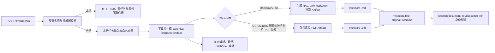

# 文件分析 RAG 内部 Markdown 投影与业务原名上传命名实施计划

## 1. 文档状态

- 文档日期：2026-07-30
- 计划层级：L3 文件级专项实施计划
- 当前状态：P0～P7 已实施并通过既有验收；P8 全局唯一 `fileName` 传输命名已完成代码与
  离线回归，尚待独立受控真实 Provider 复验；尚未部署生产环境
- 适用范围：`POST /llm/analysis` 文件分析链路及其 AnythingLLM 临时/永久文档生命周期
- 目标 Provider 基线：AnythingLLM Desktop `1.15.0`；实测版本为 `1.15.0-r2`
- 公开契约变化：不增删任何请求、响应、Callback、Progress、SSE 或 WebSocket 字段；展示
  标题候选或实际上传所依据的 `fileName` 非法时同步返回对应字段的 HTTP `400`

本文档同时回答 AnythingLLM 1.15.0 的标题、上传文件名、Workspace 展示名和 RAG Chunk
来源字段之间的关系，并记录 P0～P7 的实际实施与验收结果。当前工作树已经完成代码和受控验收，
但尚未经过生产发布窗口，因此“已实施”不等同于“已上线”或“production ready”。

---

## 2. 已确认需求与决策

| 编号 | 已确认决策 |
| --- | --- |
| D01 | 对可文本化的文档生成一份**仅供 RAG 使用的内部 Markdown 投影**；Callback、全文翻译、正文提取和本地原始/规范化 Artifact 不使用该投影替代。 |
| D02 | RAG 投影不携带图片 Base64 正文；保留有界的图片替代说明、alt 文本和内容摘要，禁止把大段 Base64 切块并向量化。 |
| D03 | Markdown 投影上传 AnythingLLM 时，HTTP multipart 文件名为 `<全局唯一 fileName 主干>.md`。只移除 `fileName` 最后一个后缀，例如 `bded...pdf` 得到 `bded...md`。 |
| D04 | `originalFileName` 缺失、为 `null`、空字符串或仅含空白时，仅展示标题回退使用 `fileName`；multipart 名称始终从 `fileName` 派生。该兼容分支不新增公开字段。 |
| D05 | 前端保证 `fileName` 在整个系统中全局唯一。因此同主干或完全同名的业务原文件仍得到不同 multipart 名称；UI 继续分别显示各自 `originalFileName`。远端 UUID/location、DocSense `document_ref` 和任务身份仍负责所有权，传输名只作为供应商降级来源映射键。 |
| D06 | 如果 OCR 与 MinerU 都已明确失败，现有策略允许把真实 PDF 作为 RAG 降级输入，则继续上传真实 PDF，不生成伪 Markdown，也不把 PDF 字节命名为 `.md`。 |
| D07 | 展示标题和 `fileName` 上传候选均不做替换、删字符、Unicode 归一化或截断等“安全化”。任一实际候选非法时，同步返回对应字段的 HTTP `400`，整批不建任务、不下载文件、不调用 AnythingLLM。 |
| D08 | HTTP multipart 文件名与 AnythingLLM `metadata.title` 明确分离：前者使用 `<fileName 主干>.md`（PDF 降级使用 `.pdf`）以控制 1.15.0 的文件类型处理器并提供唯一 hotdir basename；后者使用 `originalFileName` 原值，使 UI、Chunk `sourceDocument` 和模型来源保留原文件名及原后缀。 |
| D09 | 本地 Artifact 的物理存储名保持任务隔离、内容寻址和不透明，不要求改成业务名；业务原名只进入上传描述符的展示标题，`fileName` 只用于业务主键和传输名派生，二者都不承担外部资源所有权职责。 |
| D10 | 不执行 `run.py`。开发验证默认使用项目虚拟环境、严格 Fake、临时 SQLite 和受控 AnythingLLM 1.15.0 实例。 |
| D11 | `originalFileName` 缺失、`null`、空字符串或仅含空白时，`metadata.title` 回退使用 `fileName`；multipart 名称始终使用 `fileName` 主干和实际表示后缀。 |

---

## 3. AnythingLLM 1.15.0 现状结论

### 3.1 “title 被 location basename 改写”到底发生在哪里

结论：**本机 AnythingLLM 1.15.0 没有把处理后文档 JSON 或向量 Chunk 中的
`metadata.title` 覆盖成 location basename。**此前观察到的“title 被改写”，实际是
Workspace REST 记录的形状与 DocSense DTO 兼容回退共同造成的展示结果。

本机只读证据如下：

1. `workspace_documents` 表没有独立 `title` 列，相关列为 `filename`、`docpath` 和
   `metadata`。
2. 对已上传的 `prepared.md`：
   - `workspace_documents.filename` 为
     `prepared.md-<AnythingLLM UUID>.json`；
   - `workspace_documents.docpath` 为
     `custom-documents/prepared.md-<AnythingLLM UUID>.json`；
   - `workspace_documents.metadata` 内的 `title` 仍为 `prepared.md`。
3. `storage/documents/custom-documents/*.json` 的根级 `title` 仍为 `prepared.md`。
4. `storage/vector-cache/*.json` 中每个 Chunk 的 `metadata.title` 仍为 `prepared.md`，
   Chunk 正文头部也包含 `sourceDocument: prepared.md`。

AnythingLLM 1.15.0 的 `/v1/workspace/:slug` 返回 Workspace 关联行，顶层通常有
`filename`/`docpath` 和字符串化 `metadata`，却没有直接展开的顶层 `title`。当前
`AnythingLLMDocument.from_payload()` 按 `title`、`name`、`filename`、`fileName` 的顺序取
展示标题，因此解析这类记录时会退到带 UUID 的 `filename`。这属于 **DocSense DTO 对
Workspace 记录的兼容投影**，不是 Provider 修改了底层 `metadata.title`。

因此后续文档和日志应使用以下准确表述：

- Provider 存储身份：`location/docpath` 与带 UUID 的 `.json` 文件名；
- 业务展示标题：处理后文档 `metadata.title`；
- DocSense 所有权身份：随机 `docSource` 标记、精确 `location`、Provider 文档 ID 和
  `document_ref`；
- 禁止再笼统地说“AnythingLLM 把 metadata.title 改写了”。

### 3.2 大模型收到的文档来源看哪个字段

这不是 `metadata.title` 和 multipart 文件名之间的二选一关系，而是一条派生链：

```text
multipart file name
        │
        ├── 选择 Collector 处理器（.md / .pdf / .docx ...）
        │
        └── 当请求未显式传 metadata.title 时
                ↓
        处理后文档 title
                ↓
        TextSplitter.buildHeaderMeta(metadata)
                ↓
        每个 Chunk 正文头部的 sourceDocument
                ↓
        相似度检索返回的 pageContent
                ↓
        contextTexts → LLM Prompt
```

AnythingLLM 1.15.0 的文本处理器使用 `metadata.title || filename` 生成处理后文档的
`title`；`TextSplitter` 再把这个 `title` 写成每个 Chunk 的
`<document_metadata> sourceDocument: ...` 头部。聊天链把检索结果的 `pageContent`
加入 `contextTexts` 后发送给模型。因此模型实际看到的是 **Chunk 正文中由
`metadata.title` 派生出的 `sourceDocument`**，而不是在生成回答时再读取
`workspace_documents.filename` 或 location basename。

当前 DocSense 上传仅显式传入随机 `docSource`，没有显式传 `metadata.title`，所以
`prepared.md` 的标题事实上来自 multipart 文件名。实施后将格式名与展示标题明确分开：

```text
originalFileName    = Nimitz (CVN 68) class.pdf
multipart file name = Nimitz (CVN 68) class.md
metadata.title      = Nimitz (CVN 68) class.pdf
```

multipart 文件名只负责告诉 Collector“实际上传内容是 Markdown”；`metadata.title` 负责告诉
UI 和模型“这份知识来源于哪一个原始业务文件”。`docSource` 仍保留随机 `docsense_ref`
身份标记，不能替换成业务文件名。

### 3.3 AnythingLLM 前端 UI 显示哪个字段

AnythingLLM 1.15.0 的 Workspace 文档管理界面通过本地文件目录接口读取处理后 JSON，
`fileToPickerData()` 将 JSON 元数据展开为 `item`，`WorkspaceFileRow` 显示
`item.title`。因此该界面显示的是处理后文档的 **`metadata.title`**，不是带 UUID 的
`item.name`/location basename。

带 UUID 的 `name` 仍用于嵌入、删除、Pin、缓存和 Workspace 关联，UI 只是不用它作为主显示
文本。上传后看到 `prepared.md` 是符合 1.15.0 实现的正常现象；按本计划修改后，该处将显示
`originalFileName` 原值，例如 `Nimitz (CVN 68) class.pdf`，而实际被 Collector 解析的
multipart 文件仍是 `Nimitz (CVN 68) class.md`。

### 3.4 是否推荐使用 originalFileName 作为 metadata.title

**推荐。**前提是始终保持“multipart filename 决定实际上传表示，metadata.title 只表达业务
来源”的边界，不得再假设两者后缀相同。

主要收益：

- AnythingLLM UI 不再暴露 `prepared.md` 或其他内部投影名；
- 每个 Chunk 的 `sourceDocument` 保留原文件名，模型回答来源更符合用户认知；
- PDF、DOCX、MHTML 等原始来源即使统一投影为 Markdown，也不会丢失原始格式语义；
- Callback `source`、本地 `documents.original_name`、AnythingLLM UI 和模型引用可以使用同一
  业务名称；
- 无需修改本地 Artifact 名称，也不影响 Collector 根据 multipart `.md` 选择文本处理器。

需要接受并通过测试固定的现象：

- UI 可能显示 `资料.pdf`，但远端实际嵌入的是内部 Markdown 投影；这是“来源格式”而非“嵌入
  载荷格式”；
- 任何内部代码都不得根据 `metadata.title` 的 `.pdf` 后缀选择解析器、下载 Artifact 或执行
  清理；
- Provider 身份校验仍只能使用 `docsense_ref`、精确 location、Provider ID 和
  `document_ref`；
- `metadata.title` 必须复用已经通过入站文件名校验的业务原名候选，不能接受另一份未经校验的
  自由文本。

### 3.5 1.15.0 官方实现依据

- [文档上传接口：originalname、metadata 与 documents 响应](https://github.com/Mintplex-Labs/anything-llm/blob/v1.15.0/server/endpoints/api/document/index.js)
- [Workspace 文档关联：filename 取 location basename](https://github.com/Mintplex-Labs/anything-llm/blob/v1.15.0/server/models/documents.js)
- [文本处理器：title 使用 metadata.title 或 filename](https://github.com/Mintplex-Labs/anything-llm/blob/v1.15.0/collector/processSingleFile/convert/asTxt.js)
- [TextSplitter：title 写入 sourceDocument Chunk 头](https://github.com/Mintplex-Labs/anything-llm/blob/v1.15.0/server/utils/TextSplitter/index.js)
- [Workspace UI：文档行显示 item.title](https://github.com/Mintplex-Labs/anything-llm/blob/v1.15.0/frontend/src/components/Modals/ManageWorkspace/Documents/WorkspaceDirectory/WorkspaceFileRow/index.jsx)

---

## 4. 为什么本地 Artifact 名称与 HTTP 上传名称必须分开

### 4.1 两者表达的是不同事实

本地 Artifact 路径回答的是：

- 这份内容属于哪个 task/execution；
- 它由哪个处理步骤和 profile 生成；
- 内容摘要、表示类型和谱系是什么；
- 哪个 Worker 或恢复器有权读取、保留或删除它。

HTTP 上传名称回答的是：

- AnythingLLM 应选择哪种文件解析器；
- UI 和 Chunk 应显示哪个业务友好名称；
- 本次传输希望给 Provider 的逻辑文件名是什么。

把这两个概念绑定为同一个物理文件名，会让展示信息反过来承担存储身份职责，破坏现有
`task_id + artifact_id + step_key + sha256` 的所有权模型。

### 4.2 安全边界不能由业务显示名承担

`originalFileName` 来自公开请求，即使入站已经按本计划严格校验，任务存储仍不能依赖它：

- 未来可能存在绕过 HTTP Parser 的内部命令、恢复命令或数据迁移；
- Windows、Linux、对象存储和 HTTP multipart 对文件名的约束不同；
- 多个任务可以合法拥有相同业务原名；
- 文件名不是内容完整性证明，也不是删除权限证明。

入站 HTTP `400` 是第一道边界；不透明 Artifact 名称是第二道防线，两者不能互相替代。

### 4.3 避免复制、重命名和生命周期分叉

为了让 multipart 使用 `资料.md`，不需要把任务目录中的
`<artifact_id>` 或 `prepared.md` 重命名。上传客户端可以从一个已校验的 Artifact reader
读取字节，同时在 multipart tuple 中独立指定 `资料.md`。这样：

- 不需要为大文件额外复制一份同内容文件；
- 不会因重命名破坏既有 `prepared_artifact`、翻译或清理引用；
- 上传重试始终读取同一不可变快照；
- Callback 和本地诊断仍可访问原有规范化结果；
- crash recovery 不需要猜测“文件后来被改成了什么名字”。

### 4.4 为可靠队列、多实例和对象存储保留边界

当前 `LocalArtifactStoreAdapter` 使用任务隔离和内容寻址；未来切换到 MinIO/对象存储后，
另一实例可能只拿到 `ArtifactRef` 和对象 key，并不存在可重命名的本地文件。将传输名称
独立为不可变上传描述符后：

- Worker 可在任意实例解析 Artifact reader；
- 对象 key 不需要包含用户文件名；
- 重试与接管只需复用已持久化的命名快照和最终上传描述符；
- 同名上传不会覆盖，外部所有权仍由 location/document_ref 证明；
- 可靠队列消息只携带稳定引用与冻结描述符，不携带宿主机路径。

因此，“不重命名本地 Artifact”不是单纯为了少写几行代码，而是为了守住存储、传输、
展示和外部身份四个边界。

---

## 5. 目标模型

### 5.1 名称与身份四层模型

| 层次 | 示例 | 用途 | 能否作为所有权身份 |
| --- | --- | --- | --- |
| 业务原名/展示标题 | `Nimitz (CVN 68) class.pdf` | 请求语义、Callback source、metadata.title、UI、Chunk sourceDocument | 否 |
| RAG 传输名 | `bded228dc94440519d87f97cfb6b520b.md` | multipart 文件名、Collector 处理器选择、实际载荷表示、唯一 hotdir basename | 否 |
| 本地 Artifact 身份 | `task_id/artifact_id` | 内容完整性、谱系、并发隔离、清理 | 是，仅限本地 Store |
| AnythingLLM 身份 | `location + document_ref + docsense_ref` | 绑定、检索来源校验、Pin、删除、永久转交 | 是 |

### 5.2 新增内部上传描述符

建议新增供应商无关、不可变的内部值对象 `RagUploadDescriptor`，至少包含：

- `artifact`：RAG 实际读取的 `ArtifactRef`；
- `transport_file_name`：冻结的 multipart 文件名；
- `display_title`：冻结的 `metadata.title`；优先为 `originalFileName` 原值，兼容分支回退
  `fileName`；
- `media_type`：`text/markdown; charset=utf-8` 或 `application/pdf`；
- `representation`：`MARKDOWN` 或 `PDF`；
- `content_sha256`：与 Artifact 元数据一致；
- `naming_source`：`original_file_name` 或 `business_file_name_fallback`；
- `projection_profile_id`：Markdown 投影 profile 指纹；PDF 降级为空。

Application、RAG Port 和 AnythingLLM Client 只依赖描述符，不从物理路径反推上传名称。
本地 Adapter 可临时把 Artifact 解析为受控 reader；未来对象存储 Adapter 可直接流式上传。

### 5.3 目标数据流



---

## 6. 文件名派生与非法名称规则

### 6.1 候选选择

按以下稳定规则选择两个职责独立的命名候选：

1. `originalFileName` 是非空字符串：使用其**原值**作为 `display_title`；
2. `originalFileName` 缺失、`null`、空字符串或仅含空白：使用 `fileName` 生成
   `display_title`；
3. `transport_file_name` 始终从全局唯一的 `fileName` 派生；
4. 不修改最终被选中的候选，不执行 trim 后回写、NFKC/NFC、字符替换、截断或 slugify。

`originalFileName` 的 Callback 语义继续严格使用请求原值。本规则只生成内部上传描述符：
`display_title` 保留展示候选的原文件名和原后缀；`transport_file_name` 则依据实际上传
表示替换 `fileName` 的最后一个后缀。

### 6.2 主干和扩展名

- 只移除 `fileName` 最后一个后缀：`hash.v2.pdf` → `hash.v2.md`；
- `fileName` 无后缀：`hash` → `hash.md`；
- 大小写不影响格式判断；
- Markdown/Text RAG 投影统一使用 `.md`；
- 真实 PDF 降级统一使用 `.pdf`，不得让 PDF 字节携带 `.md`；
- 候选主干为空时拒绝。

### 6.3 HTTP 400 非法条件

命名候选符合任一条件即拒绝整批：

- 不是字符串，且不属于“缺失/null 后回退到合法 `fileName`”的兼容分支；
- 包含 `/`、`\` 或任何路径成分；
- 等于 `.`、`..`，或主干为空；
- 包含 ASCII 控制字符、DEL、NUL；
- 包含 Windows 文件名保留字符 `< > : " / \ | ? *`；
- 末尾为空格或句点；
- 主干命中 `CON`、`PRN`、`AUX`、`NUL`、`COM1`～`COM9`、
  `LPT1`～`LPT9`，忽略大小写和后缀；
- 派生后的 UTF-8 文件名超过 255 bytes；
- 无法安全放入 multipart filename，或包含 CR/LF 等 Header 注入字符。

错误响应沿用现有 JSON 错误 envelope，建议稳定文案：

```json
{
  "error": "params[0].originalFileName不是合法文件名"
}
```

若实际 Presenter 的冻结 envelope 与示例不同，以现有 Presenter 结构为准，但状态码固定为
HTTP `400`。同批任一项失败时整批拒绝，校验必须发生在任务持久化、下载、Dispatcher 唤醒和
AnythingLLM 调用之前。

### 6.4 不允许“静默安全化”

以下行为明确禁止：

- `a/b.pdf` 静默改成 `b.md`；
- `a?.pdf` 静默改成 `a_.md`；
- 超长名称静默截断；
- Unicode 归一化后继续受理；
- Provider 返回的 slug 或 UUID 反向覆盖业务上传名。

这样可以确保 UI/Chunk 中的名称要么符合派生规则，要么任务在受理前明确失败，不产生
“请求名与存储展示名悄悄不一致”的中间状态。

---

## 7. RAG-only Markdown 投影规则

### 7.1 输入与输出

- 输入：canonical prepared Markdown/Text Artifact；
- 输出：新的 `ArtifactKind.RAG_PROJECTION`、`DocumentRepresentation.MARKDOWN` Artifact；
- 编码：UTF-8；
- 换行：保持输入现有换行风格或统一为冻结 profile 规定的 LF，必须通过 profile 指纹审计；
- canonical prepared Artifact 字节必须保持不变。

### 7.2 Base64 图片处理

投影器至少识别：

- Markdown 图片：``；
- HTML 图片：``；
- 经 MinerU/OCR 产生的跨行 data URI；
- 大小写、空白、引号和属性顺序变体。

每张图片替换为有界文本，例如：

```text
[图片已移除；说明：舰船侧视图；类型：image/png；sha256：12位前缀]
```

约束：

- 保留经长度限制和控制字符过滤后的 alt/说明；
- 只保存 Base64 解码内容摘要前缀，不保存原始 Base64；
- 无法严格解码时仍移除 payload，并记录 `decode_valid=false` 的脱敏计数日志；
- 不处理 fenced code block 和 inline code 中作为示例出现的 data URI；
- 单个占位符和整份投影均设上限，防止恶意输入扩大；
- 非 data URI 的普通 Markdown 链接不在本阶段重写。

### 7.3 失败策略

- 投影生成、Artifact 发布或完整性复核失败：在创建 AnythingLLM Session 前失败关闭；
- 禁止退回上传含 Base64 的 canonical Markdown；
- 禁止在投影失败时伪装成 PDF 降级；
- 只有现有处理策略明确产生“真实 PDF RAG fallback”时才走 PDF 分支。

### 7.4 可观测性

新增结构化、脱敏日志：

- `task_id`、`projection_profile_id` 前缀；
- 输入/输出 bytes、字符数；
- 发现/移除图片数、无效 Base64 数；
- 移除 Base64 bytes 总量；
- 输入/输出 SHA-256 前缀；
- `transport_extension`、`naming_source`、名称 UTF-8 长度；
- 不输出完整 Base64、完整业务原名、文档正文或完整外部响应。

---

## 8. 分阶段实施计划

### 阶段 P0：合同黄金基线与 Provider 证据固化

#### 目标

把当前 202/400/409、Callback、prepared Artifact 和 AnythingLLM 1.15.0 的字段链冻结，
避免后续把 Provider 存储名、UI 标题和身份字段混为一谈。

#### 主要文件

- `docs/接口文档/文件处理和报告生成.md`
- `tests/test_analysis_web_adapters.py`
- `tests/test_anythingllm_documents.py`
- 新增 `tests/fixtures/anythingllm_v115/` 下的最小脱敏响应夹具

#### 实施内容

1. 保存上传响应、Workspace 详情响应、documents folder 响应、Chunk metadata 的最小夹具。
2. 黄金测试明确：
   - workspace record 的 `filename` 可含 UUID；
   - `metadata.title` 保持 `originalFileName` 原值，不等于 Markdown 投影的 multipart
     文件名；
   - `location/document_ref/docSource` 才是身份字段。
3. 记录当前合法请求、缺失/空 `originalFileName` 与 202 空体基线。

#### 测试与验收

- 现有所有合同黄金测试不变通过；
- 夹具不得含正文、API Key、用户路径或真实业务数据；
- 能通过测试复现“DocSense DTO title 退到 filename，但 metadata.title 未被改写”的差异。

### 阶段 P1：纯名称策略与整批 HTTP 400

#### 目标

在任何任务或外部副作用前完成确定性命名候选校验，并冻结与具体 RAG Provider
无关的命名事实。受理阶段尚不知道文档最终采用 Markdown 投影还是原始 PDF 降级表示，
因此只派生并冻结两种允许表示各自的安全传输名；最终上传描述符由 P3 在表示确定后选择。

#### 主要文件

- `app/modules/analysis/domain/task_inputs.py`
- `app/adapters/web/flask/analysis_requests.py`
- `app/modules/analysis/ports/batch_commands.py`（仅当需要携带冻结命名事实）
- `tests/test_analysis_web_adapters.py`
- `tests/test_analysis_task_adapter.py`
- `tests/test_analysis_batch.py`
- `docs/接口文档/文件处理和报告生成.md`

#### 实施内容

1. 新增纯函数和值对象：
   - `select_rag_business_name(original_file_name, file_name)`；
   - `validate_rag_transport_name_candidate(value)`；
   - `derive_rag_transport_file_name(candidate, representation)`。
2. Parser 按 params 顺序校验；第一个非法项返回稳定 index。
3. 将 `display_title`、`fileName` 传输候选、Markdown/PDF 两种传输名、命名来源和
   两类候选摘要冻结进
   task input snapshot，Worker 不重新读取原始 mutable payload。
4. P1 不提前声明唯一的 `transport_file_name`。P3 根据实际生成的表示类型，从冻结命名
   快照中选择唯一传输名，并在第一次远端上传前连同 representation、media type、
   Artifact identity 和 projection profile 一并写入最终上传描述符及资源事实。
5. 不记录完整非法名称，只记录 index、原因码、长度和摘要。
6. 同步修改接口文档，明确 HTTP `400`、整批零副作用和缺失/空值回退规则。

#### 测试与验收

- 覆盖中文、空值、多后缀、无后缀、同主干、控制字符、路径穿越、Windows 保留名、
  CR/LF、超长 UTF-8 和非字符串；
- 验证一项非法时 `batch_commands`、Dispatcher、下载器和 AnythingLLM Fake 零调用；
- 不新增、不删除、不重命名任何公开参数；
- 合法旧请求继续返回 HTTP 202 空体。

### 阶段 P2：RAG Markdown 投影领域模型与 Processor

#### 目标

生成不可变、可审计、可幂等复建的 RAG-only Markdown Artifact。

#### 主要文件

- `app/modules/document_processing/domain/models.py`
- `app/modules/document_processing/domain/errors.py`
- `app/modules/document_processing/ports/processing.py`
- 新增 `app/modules/document_processing/application/project_for_rag.py`
- 新增 `app/modules/document_processing/adapters/markdown_rag_projection.py`
- `app/modules/document_processing/composition.py`
- `tests/test_document_processing_domain.py`
- `tests/test_document_processing_ports.py`
- `tests/test_document_processing_artifacts.py`
- 新增 `tests/test_document_processing_rag_projection.py`

#### 实施内容

1. 增加 `ArtifactKind.RAG_PROJECTION`。
2. 冻结 projection profile：
   - 算法版本；
   - data URI 识别规则；
   - alt/placeholder 长度上限；
   - 解码与摘要策略；
   - 换行和编码策略。
3. 使用有界扫描器，不用单个灾难性正则一次吞掉整份 Markdown。
4. 通过 `ArtifactStorePort` 原子发布并复核 SHA-256。
5. 相同 source Artifact + profile 幂等得到同一 artifact identity。

#### 测试与验收

- 使用此前出现问题的 `prepared.md` 脱敏/最小复现样例；
- 所有可见 Base64 图片 payload 从输出消失；
- 图片前后正文、表格、标题、代码块和普通链接保持正确；
- canonical prepared 文件 SHA-256 在投影前后不变；
- 10 MiB 以上 Base64 样例保持有界内存和线性时间；
- 50 个任务同时投影同名文档，Artifact 不串任务、不覆盖。

### 阶段 P3：文件分析准备结果与上传描述符

#### 目标

让 Analysis Application 显式获得“分析正文 Artifact”和“RAG 上传 Artifact”，并分开携带
`display_title` 与 `transport_file_name`；不再把 `prepared.upload_path` 同时当作物理路径、
表示类型、上传名和展示标题。

#### 主要文件

- `app/modules/analysis/ports/files.py`
- `app/modules/analysis/ports/rag.py`
- `app/modules/analysis/adapters/legacy_files.py`
- `app/modules/analysis/application/run_analysis.py`
- `app/modules/analysis/application/recover_resources.py`
- `app/modules/analysis/adapters/resource_store.py`
- `tests/test_analysis_service.py`
- `tests/test_analysis_two_stage.py`
- `tests/test_analysis_resources.py` 或对应现有资源测试

#### 实施内容

1. `PreparedAnalysisDocument` 增加明确的 RAG Artifact/representation，不从 suffix 猜测。
2. `AnalysisRagSessionOpenRequest` 接收不可变 `RagUploadDescriptor`。
3. canonical prepared 继续供正文读取、结果映射和翻译使用。
4. Markdown/Text 分支生成投影；真实 PDF fallback 分支复用 PDF Artifact。
5. 在第一次远端上传前把 display title、transport name、representation、media type、
   artifact identity 和 profile 写入资源事实。
6. 资源恢复只校验/清理已登记身份；`outcome_unknown` 禁止按显示名猜测和自动补发。

#### 测试与验收

- 正常 Markdown 分支上传 projection，不上传 canonical Base64 Markdown；
- PDF fallback 上传 PDF bytes、`.pdf` 名称和 `application/pdf`；
- 投影失败发生在 RAG Session 外，任务按既有失败 Callback 合同收口；
- 资源 CAS 失败时禁止继续远端上传；
- crash checkpoint 可证明“尚未上传/已开始但结果未知/已确认上传”三种状态。

### 阶段 P4：AnythingLLM Client 支持“读取路径/Artifact 与 HTTP 名称分离”

#### 目标

在不重命名、不复制本地 Artifact 的情况下，分别冻结 multipart filename 和
`metadata.title`：前者来自全局唯一 `fileName`，后者来自业务原名展示候选。

#### 主要文件

- `app/integrations/anythingllm/documents.py`
- `app/integrations/anythingllm/rag_gateway.py`
- `app/integrations/anythingllm/knowledge_gateway.py`
- `app/integrations/anythingllm/models.py`（仅补充字段语义测试；身份算法不改）
- `tests/test_anythingllm_documents.py`
- `tests/test_anythingllm_rag_gateway.py`
- `tests/test_anythingllm_knowledge_gateway.py`
- `tests/test_anythingllm_transport.py`

#### 实施内容

1. `upload_document()` 增加内部关键字参数 `upload_file_name`，默认值保持当前 path basename，
   以便非 Analysis 调用方兼容。
2. multipart tuple 使用 `upload_file_name`，文件句柄仍来自受控 Artifact/path。
3. RAG Gateway 合并元数据时写入：
   - `title = descriptor.display_title`；
   - `docSource = 随机会话身份标记`。
4. 每次有限重试复用同一文件 bytes、同一 filename、同一 display title 和同一序列化
   metadata。
5. 上传响应继续以真实 `location` 和 Provider ID 生成 `document_ref`；不使用 title 证明身份。
6. `ingested_file_name` 记录实际 transport name，而不是本地 path basename。

#### 测试与验收

- Transport Fake 精确断言 multipart filename；
- 精确断言 Markdown 分支的 multipart filename 为 `<主干>.md`，而 `metadata.title` 为
  带原后缀的 `originalFileName`；
- 精确断言缺失/空 `originalFileName` 时，两者共同使用 `fileName` 作为来源，仍分别生成
  原始展示标题和实际格式传输名；
- 本地 Artifact path 在上传前后不变；
- 两个同名上传得到不同 Provider identity，不发生覆盖；
- 5xx/处理器暂态重试不改变 filename/metadata；
- 4xx、协议错误和读取超时继续按当前 unknown/failed 语义收口。

### 阶段 P5：永久知识库转交、审计与清理一致性

#### 目标

保证临时 Workspace 到永久知识库的转交不丢失上传名，也不把上传名升级成身份。

#### 主要文件

- `app/modules/analysis/adapters/legacy_knowledge.py`
- `app/integrations/anythingllm/knowledge_gateway.py`
- `app/modules/analysis/ports/audit.py`
- `app/modules/analysis/adapters/legacy_audit.py`
- `app/services/llm_service/task_service.py` 中对应 interaction 持久化映射
- 相关 Knowledge/Audit/Resource 测试

#### 实施内容

1. 永久记录中的 `original_name` 继续保存请求业务原值，并与 `metadata.title` 一致。
2. `ingested_file_name` 保存 `<主干>.md` 或 PDF fallback 的 `<主干>.pdf`。
3. 永久转交必须复用已确认的 location/document_ref，禁止重新上传或按标题查找。
4. 审计记录 representation、projection profile、摘要和实际 transport name。
5. 清理仍只依据确切 location 和资源所有权事实，不依据 UI 标题。

#### 测试与验收

- 数据库中 `original_name`、`ingested_file_name`、`document_ref` 三者语义清晰且不互相覆盖；
- 成功任务只转交本次 session 的文档；
- 审计失败时不提前 close/删除外部资源；
- 同名文档的转交、Pin、删除互不串扰。

### 阶段 P6：端到端、并发、恢复与真实 1.15.0 验收

#### 目标

用离线和受控真实 Provider 证据证明功能闭环，不把单实例离线结果夸大成多实例生产能力。

#### 测试矩阵

| 场景 | 预期 |
| --- | --- |
| PDF → MinerU Markdown，含 Base64 图片 | multipart 为 `<fileName 主干>.md`；AnythingLLM UI、Chunk title/sourceDocument 为带 `.pdf` 的 `originalFileName`；Chunk 不含 Base64 payload |
| MHTML → Markdown | multipart 为 `.md`，metadata.title 与 Callback source 均为原 `originalFileName` |
| DOC/DOCX → Markdown/Text | multipart 为 `.md`，UI/Chunk 保留 `.doc/.docx` 原名，本地 OOXML/Markdown Artifact 身份不变 |
| OCR 与 MinerU 均明确失败 | 上传真实 PDF 和 `.pdf` 名称，不生成伪 Markdown |
| `originalFileName` 缺失/空 | display title 回退为 `fileName`；multipart 始终使用 `fileName` 主干和实际表示后缀；请求仍可受理 |
| 非法 `originalFileName` | HTTP 400；任务表、任务目录、下载器、AnythingLLM 均无新增事实 |
| 两种后缀同一主干或完全同名 | UI 按各自 `originalFileName` 展示；全局唯一 `fileName` 使 multipart 名称不同，武器谱可按 hotdir basename 唯一映射 |
| 上传 ReadTimeout | 资源进入 `outcome_unknown`；不按标题自动重传 |
| 50 个同名并发任务 | Artifact、资源、会话、回调和永久文档按 task 隔离 |
| Worker crash/恢复 | 使用冻结描述符和精确外部身份，不依赖宿主路径或重新派生显示名 |

#### 受控真实 1.15.0 验收

1. 使用临时 Workspace 和非生产测试文档；
2. 上传一个含 Base64 图片的 Markdown 投影；
3. 只读检查：
   - processed JSON `title` 等于 `originalFileName`；
   - `workspace_documents.filename/docpath/metadata`；
   - vector-cache Chunk 的 `metadata.title` 和 `sourceDocument` 等于
     `originalFileName`；
   - UI 展示；
   - chat sources 与模型上下文的脱敏诊断；
4. 完成精确 location 清理并确认无孤儿文档、Workspace 和向量；
5. 记录 Provider 版本、向量库、Embedder、测试 profile 和清理结果。

#### 验收边界

真实 1.15.0 单实例验收只能证明该版本和该配置下的协议行为，不能证明：

- 可靠任务队列已经接入；
- MySQL/分布式事务一致性；
- 多实例 Exactly-once；
- 50+ 生产并发容量；
- 所有未来 AnythingLLM 版本都保持相同 UI 字段。

### 阶段 P7：文档收口、灰度与回滚

#### 目标

在代码、合同和运维证据一致后再启用，保留快速回滚但不允许静默恢复 Base64 向量化。

#### 文档范围

- 修改 `docs/接口文档/文件处理和报告生成.md`：
  - `originalFileName` 非法名称的 HTTP 400；
  - 缺失/空值回退；
  - `originalFileName` 作为 AnythingLLM UI 和 RAG Chunk 来源标题，内部 Markdown 投影名
    不作为业务展示标题；
  - 整批零副作用；
  - 不增删任何字段。
- 新增 `docs/更新记录/<日期>-文件分析RAG投影与上传命名执行记录.md`：
  - 实际文件清单；
  - 测试数和排除项；
  - 真实 Provider 证据；
  - 生产边界。
- 更新 `docs/重构记录/README.md` 状态。

#### 灰度建议

1. 先在测试环境强制启用，不提供“投影失败后上传原 Base64 Markdown”的回退；
2. 对比输入/输出 token、Chunk 数、检索命中和模型回答来源；
3. 观察 projection failure、upload rejected、outcome_unknown 和孤儿资源指标；
4. 通过后再在停服窗口发布；
5. 回滚只能回到上一完整版本；若旧行为会重新嵌入 Base64，应停止新任务而不是在线混跑两个
   profile。

---

## 9. 预计修改文件范围

| 范围 | 必改/可能改 | 说明 |
| --- | --- | --- |
| `app/adapters/web/flask/analysis_requests.py` | 必改 | 入站整批名称校验和 HTTP 400 |
| `app/modules/analysis/domain/task_inputs.py` | 必改 | 分别冻结 display title、transport name、来源和派生事实 |
| `app/modules/document_processing/domain/models.py` | 必改 | `RAG_PROJECTION` Artifact/表示约束 |
| `app/modules/document_processing/application/` | 必改 | RAG 投影用例 |
| `app/modules/document_processing/adapters/` | 必改 | Markdown Base64 有界投影器 |
| `app/modules/analysis/ports/files.py` | 必改 | 区分 canonical prepared 与 RAG Artifact |
| `app/modules/analysis/ports/rag.py` | 必改 | `RagUploadDescriptor` 增加 display title 与 transport name |
| `app/modules/analysis/adapters/legacy_files.py` | 必改 | 生成/选择 RAG Artifact |
| `app/modules/analysis/application/run_analysis.py` | 必改 | 传递冻结上传描述符 |
| `app/integrations/anythingllm/documents.py` | 必改 | 本地读取名与 multipart filename 分离 |
| `app/integrations/anythingllm/rag_gateway.py` | 必改 | originalFileName title、docSource、snapshot 和 ingested name |
| `app/integrations/anythingllm/knowledge_gateway.py` | 可能改 | 永久转交和 ingested name 语义 |
| Analysis Resource/Audit Adapter | 可能改 | projection/transport 描述符持久化 |
| `docs/接口文档/文件处理和报告生成.md` | 必改 | 已获确认的 HTTP 400 契约 |
| `docs/更新记录/` | 实施完成后必增 | 只记录真实完成内容与证据 |
| `tests/` 对应模块 | 必改/必增 | 合同、投影、Transport、恢复、并发、真实夹具 |

预计无需修改 Callback payload 字段、Progress 字段、`/llm/check-task` 请求形状或前端接口参数。
实施中若发现必须修改这些公开合同，必须停止并另行确认。

---

## 10. 工作量估算

在“不重命名本地 Artifact、只增加上传描述符”的方案下：

| 工作项 | 预计人日 |
| --- | ---: |
| 合同基线与名称校验 | 0.5～1 |
| 有界 Markdown 投影器与 Artifact 接入 | 1.5～2.5 |
| Analysis/RAG Port 与资源事实接线 | 1～1.5 |
| AnythingLLM 传输名/display title 分离与永久转交 | 0.75～1.25 |
| 定向/并发/恢复测试与真实 1.15.0 验收 | 1～2 |
| 文档与发布收口 | 0.5 |
| **合计** | **5.25～8.75 人日** |

其中“multipart 使用 `<fileName 主干>.md`、metadata.title 使用 `originalFileName`”本身约为
0.75～1.25 人日；较原方案主要增加上传描述符、资源事实和断言中的 display title 字段，不
需要复制或重命名 Artifact。主要工作量仍来自 Base64 投影的正确性、资源恢复事实和
故障/并发验收。若选择物理重命名/复制 Artifact，
不仅增加 I/O 和清理分支，还会扩大资源状态机、崩溃恢复和未来对象存储迁移范围，因此不采用。

---

## 11. 完成定义

只有同时满足以下条件，计划才能标记为完成：

1. 合法 Markdown/Text 文档的 multipart filename 为 `<全局唯一 fileName 主干>.md`，Collector 按
   Markdown 处理；
2. AnythingLLM UI、处理后 JSON、实际 Chunk 的 `metadata.title` 与 `sourceDocument`
   均为 `originalFileName` 原值；缺失/空值时均回退为 `fileName`；
3. Chunk 和向量缓存不再包含被投影移除的图片 Base64 payload；
4. canonical prepared Artifact、正文解析、翻译和 Callback 内容不因 RAG 投影被替换；
5. PDF 明确降级分支上传真实 PDF 和 `.pdf` 文件名；
6. 非法名称同步 HTTP 400，且整批零本地/远端副作用；
7. 缺失/空 `originalFileName` 的展示标题使用 `fileName` 回退；
8. 同主干或完全同名业务文档由全局唯一 `fileName` 形成不同传输名，并继续由
   UUID/location/document_ref/docsense_ref 隔离所有权；
9. ReadTimeout/outcome_unknown 不会按标题自动重传或误删；
10. 所有新增代码有清晰中文注释、必要脱敏日志和稳定错误分类；
11. 定向测试、安全全仓测试、并发/恢复故障矩阵和真实 AnythingLLM 1.15.0 受控验收均有可追溯
    证据；
12. 接口文档、更新记录和实际代码一致，且未增删任何前后端接口参数。

---

## 12. 实施状态与关闭结论

| 阶段 | 状态 | 实际结果 |
| --- | --- | --- |
| P0 | 已完成 | 冻结 AnythingLLM 1.15 响应/Chunk 最小夹具及 Analysis 公开合同黄金资产。 |
| P1 | 已完成 | 在任务受理和外部副作用前完成业务名称校验；非法候选整批同步 HTTP 400，合法请求仍为 202 空体。 |
| P2 | 已完成 | 新增流式、有界的 RAG-only Markdown 投影；canonical Artifact 不变，图片 Base64 payload 不进入投影。 |
| P3 | 已完成 | Analysis 显式区分 canonical Artifact、RAG Artifact 与不可变上传描述符；PDF 明确降级仍上传真实 PDF。 |
| P4 | 已完成 | AnythingLLM 读取路径、multipart filename 与 `metadata.title` 分离；Provider Transport 未获得业务状态机职责。 |
| P5 | 已完成 | 永久知识、交互审计、资源恢复分别保留业务原名、实际传输名和精确 Provider 身份，清理不依赖标题。 |
| P6 | 已完成 | 并发、故障、恢复和受控 AnythingLLM Desktop `1.15.0-r2` 验收通过。 |
| P7 | 已完成 | 权威接口文档、重构索引、更新记录和测试说明完成收口；生产灰度与发布仍须走独立停服发布流程。 |
| P8 | 代码与离线回归完成 | Analysis 输入升级到 Schema v4，传输名改由全局唯一 `fileName` 派生；严格兼容读取 v1～v3，并新增同主干/完全同名到武器谱范围的跨模块回归。真实 Provider 复验与生产发布不在本次离线结论内。 |

P0～P7 的既有受控真实 Provider 使用 `lancedb`、Ollama Embedder
`qwen3-embedding:0.6b` 和临时 Workspace。实测验证：

1. 当时版本的 multipart filename 为 `<业务原名主干>.md`，`metadata.title`、处理后 JSON、
   Chunk `title/sourceDocument` 和 AnythingLLM UI 来源标题均为带原后缀的业务原名；
2. 投影、处理后 JSON 和向量缓存均不含测试图片 Base64 payload；
3. 实际模型问答命中唯一测试标记，返回来源标题与业务原名完全一致；
4. 本地 canonical Artifact 名称和摘要未因 HTTP 上传名变化；
5. 按精确 thread、location 和 Workspace 完成清理，处理后文档与向量标记均无残留。

上述证据不自动证明 P8 的 `<fileName 主干>.md` 已完成真实 Provider 复验；P8 当前只记录
可复现的离线 Codec、上传描述符和武器谱来源边界证据。

自动化关闭证据：

- P5 相关定向回归 170 项通过；
- P6 投影/命名/上传链 31 项通过；
- 架构修正后的相邻联合回归 279 项通过；
- Stage 1H 消费者与架构窄域门禁 43 项通过；
- 安全全仓动态发现 2,189 项，精确排除既有 13 项环境/资产测试，执行 2,176 项，
  失败 0、错误 0、跳过 3。

上述结果只证明当前 Windows 工作树、临时 SQLite/Fake 与受控 AnythingLLM 单实例配置。
它不证明可靠任务队列、多实例数据库一致性、Exactly-once、生产容量、生产部署或未来
AnythingLLM 版本兼容性。
